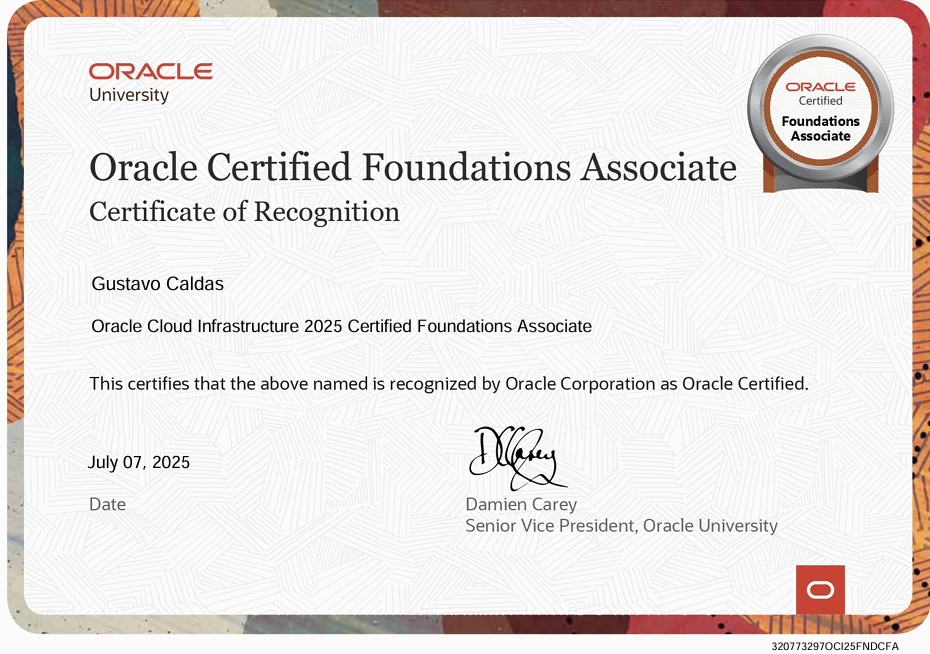
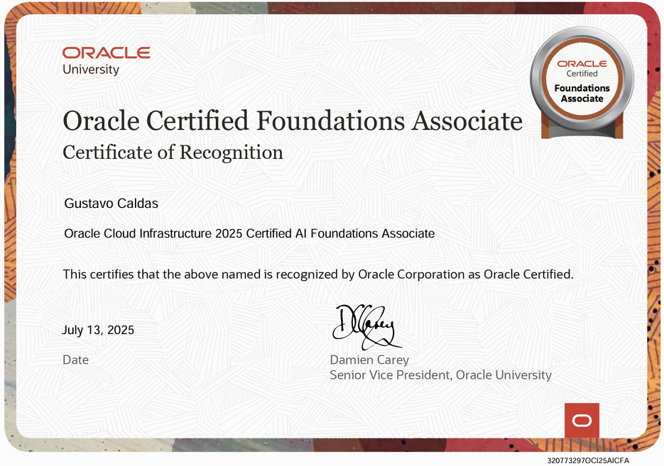

# 🎓 Race to Certification 2025 - Oracle

## 📜 Certificates Earned

This section showcases all certifications I’ve earned as part of the **Race to Certification 2025** initiative by Oracle:

### 🏅 Oracle Cloud Infrastructure Foundations

### 🏅 Oracle Cloud Infrastructure 2025 Certified AI Foundations Associate

---

Welcome to my personal journey toward Oracle Cloud Infrastructure (OCI) certification, as part of the **Race to Certification 2025** program by Oracle — an amazing opportunity to get certified for free between **July 1 and October 31, 2025**.

---

## 📁 Repository Structure

This repository is organized by folders, each representing a different **Oracle certification** I'm working on. Every folder contains:
- 📘 A **Resume.md** file summarizing course material.
- 📚 Supporting notes and references.
- 🧪 Practice tips for the exam.

---

## 💡 Why I'm Doing This

After a long medical recovery from an accident and several surgeries, I'm transitioning back into the workforce. While I already have experience with **Microsoft Azure**, I'm taking advantage of Oracle's free certification initiative to deepen my cloud expertise.

Although OCI isn't the most in-demand cloud platform, the foundational principles apply across all major providers. Once I complete the OCI tracks, I plan to pursue **Azure certifications** as well.

This repo not only tracks my learning but also serves as a **study guide** for others who may find themselves on a similar path.

---

## 🧭 Goals

- ✅ Complete Oracle Cloud Infrastructure Foundations
- ⏳ Enroll and finish more Oracle certifications 
- 📝 Publish clean, concise summaries per course
- 🧠 Gain confidence for the exams
- 💼 Re-enter the job market stronger than ever

---

## 🚀 Join the Race

If you're also working toward Oracle certifications, feel free to fork this repo or reach out with suggestions and feedback!

More info: [Race to Certification 2025](https://education.oracle.com/es/race-to-certification-2025)

---

> “The comeback is always stronger than the setback.” 💪
