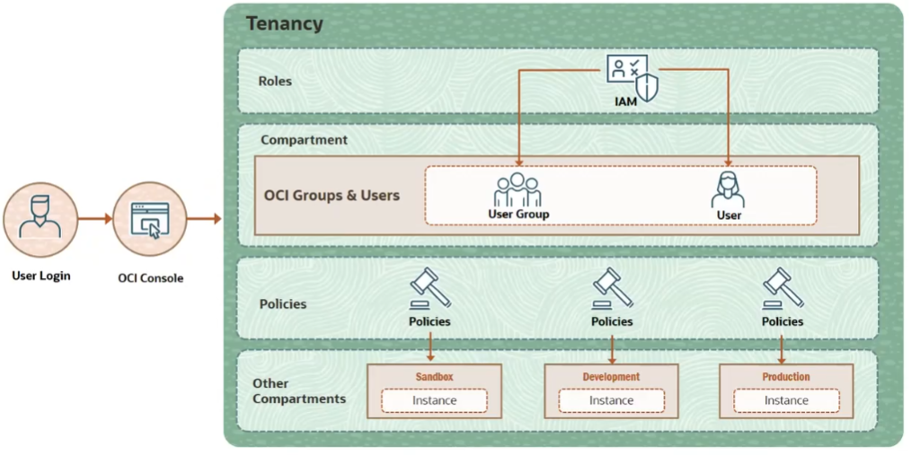
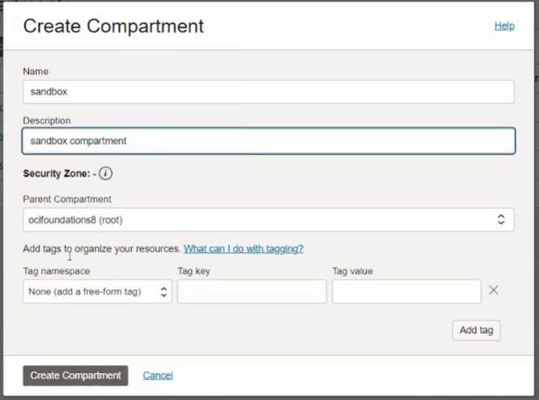
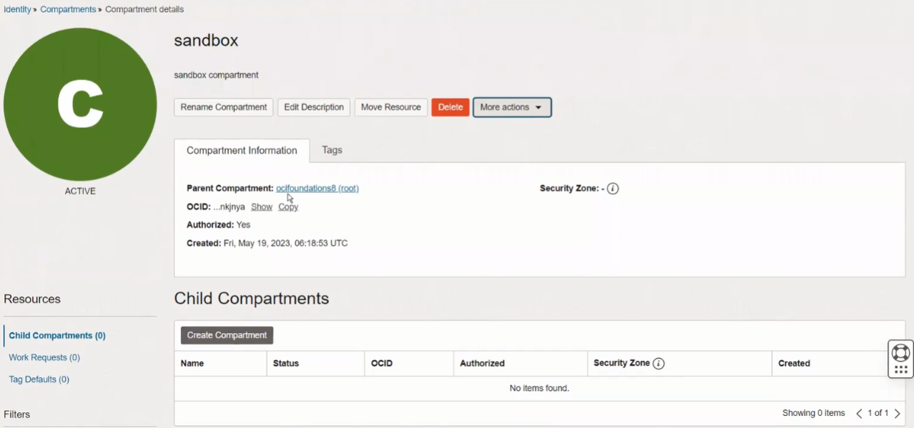
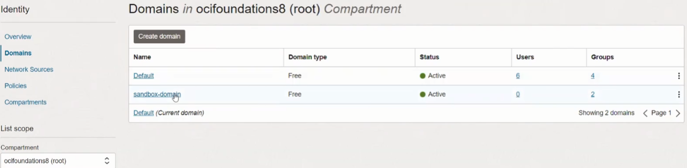
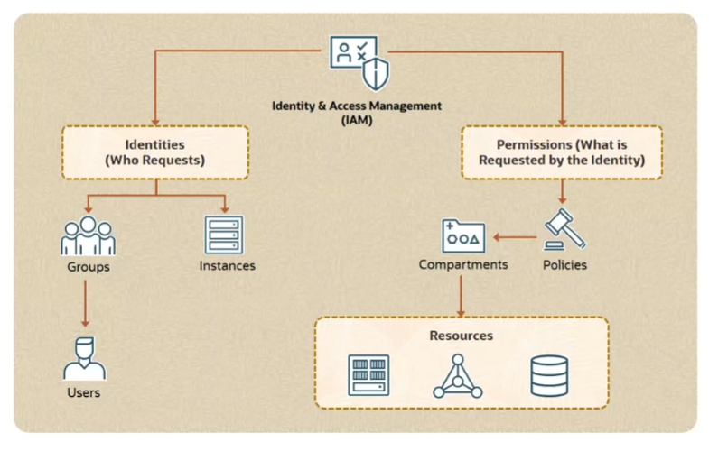
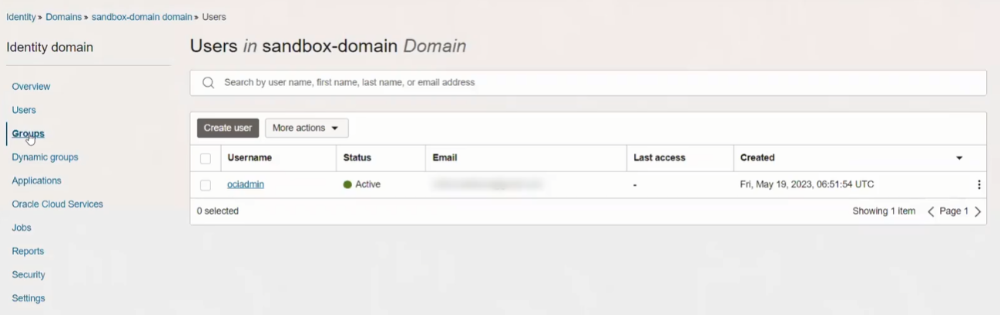
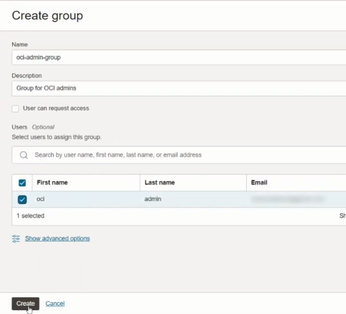
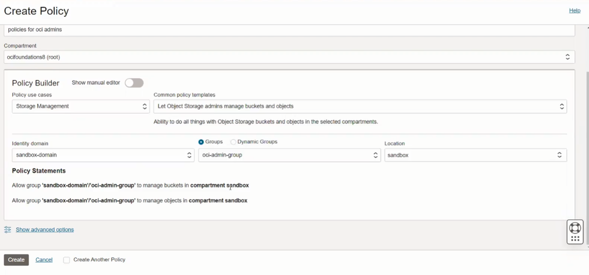

# ☁️ Oracle Cloud Infrastructure (OCI) Foundations  
### Study Notes & Summaries  
_A comprehensive guide based on the official Oracle OCI Foundations Course._

---

## 📘 Course Overview _(To complete after course completion)_

- **Platform:** Oracle Learning
- **Goal:** Understand the core services and architecture of Oracle Cloud Infrastructure
- **Final Test:** Skill Checks after each module (score 80% or higher to pass)

---

## 🧭 Course Structure

### 1. Course Introduction
- [x] OCI Overview *(6 min)* – _No notes_
- [x] Introduction *(2 min)* – _No notes_

### 2. OCI Introduction
- [x] OCI Architecture *(7 min)* – ✅ [See Summary](#oci-introduction--class-oci-architecture)
- [x] Demo: OCI Console Walkthrough *(8 min)* – _No notes_
- [x] Skill Check: OCI Introduction – ✅ [See Answers](#-skill-check-oci-introduction)

### 3. Identity and Access Management (IAM)
- [x] IAM Introduction *(6 min)* – ✅ [See Summary](#identity-and-access-management--class-iam-introduction)
- [x] Compartments *(5 min)* – ✅ [See Summary](#identity-and-access-management--class-compartments)
- [x] Demo: Compartments and Identity Domains *(7 min)* – ✅ [See Summary](#identity-and-access-management--class-demo-compartments-and-identity)
- [x] AuthN and AuthZ *(7 min)* – ✅ [See Summary](#identity-and-access-management--class-authn-and-authz)
- [x] Demo: AuthN and AuthZ *(9 min)* – ✅ [See Summary](#identity-and-access-management--class-demo-authn-and-authz)
- [x] Tenancy Setup *(5 min)* – ✅ [See Summary](#identity-and-access-management--class-tenancy-setup)
- [x] Skill Check: Identity and Access Management (IAM) – ✅ [See Answers](#-skill-check-identity-and-access-management)

### 4. Networking
- [x] VCN Introduction *(5 min)* – ✅ [See Summary](#networking--class-vcn-introduction)
- [ ] Demo: VCN Creation Using Wizard *(6 min)* – _Notes pending_
- [ ] VCN Routing *(6 min)* – _Notes pending_
- [ ] VCN Security *(4 min)* – _Notes pending_
- [ ] Load Balancer *(5 min)* – _Notes pending_
- [ ] Demo: Load Balancing *(10 min)* – _Notes pending_
- [ ] Skill Check: Networking – _Not Attempted_

### 5. Compute
- [ ] Compute Introduction *(5 min)* – _Notes pending_
- [ ] Instance Basics *(4 min)* – _Notes pending_
- [ ] Demo: Getting Started with Cloud Shell *(3 min)* – _Notes pending_
- [ ] Demo: Creating a Compute Instance *(12 min)* – _Notes pending_
- [ ] Scaling *(5 min)* – _Notes pending_
- [ ] Oracle Container Engine for Kubernetes (OKE) *(10 min)* – _Notes pending_
- [ ] Container Workloads in OCI *(3 min)* – _Notes pending_
- [ ] Serverless with Oracle Functions *(5 min)* – _Notes pending_
- [ ] Skill Check: Compute – _Not Attempted_

### 6. Storage
- [ ] Storage Introduction *(5 min)* – _Notes pending_
- [ ] Object Storage *(8 min)* – _Notes pending_
- [ ] Demo: Object Storage *(6 min)* – _Notes pending_
- [ ] Block Volume *(5 min)* – _Notes pending_
- [ ] Demo: Block Volume *(9 min)* – _Notes pending_
- [ ] File Storage *(4 min)* – _Notes pending_
- [ ] Skill Check: Storage – _Not Attempted_

### 7. Security
- [ ] Security Introduction *(9 min)* – _Notes pending_
- [ ] Cloud Guard *(5 min)* – _Notes pending_
- [ ] Security Zones and Security Advisor *(4 min)* – _Notes pending_
- [ ] Demo: Security Zone and Security Advisor *(6 min)* – _Notes pending_
- [ ] Encryption Basics *(11 min)* – _Notes pending_
- [ ] Vault *(8 min)* – _Notes pending_
- [ ] Demo: Vault *(7 min)* – _Notes pending_
- [ ] Skill Check: Security – _Not Attempted_

### 8. Governance and Administration
- [ ] Pricing *(5 min)* – _Notes pending_
- [ ] Cost Management *(4 min)* – _Notes pending_
- [ ] Demo: Cost Management *(9 min)* – _Notes pending_
- [ ] Demo: Cloud Advisor *(7 min)* – _Notes pending_
- [ ] Tagging *(6 min)* – _Notes pending_
- [ ] Support Rewards *(4 min)* – _Notes pending_
- [ ] Skill Check: Governance and Administration – _Not Attempted_
---

## 📂 Lesson Notes

### OCI Introduction → Class: **OCI Architecture**

#### 🧱 OCI Physical Architecture

**Key Concepts:**

- **Region:** A localized geographic area that contains one or more *Availability Domains (ADs)*.  
  Choose based on:
  - Proximity to users (low latency)
  - Data residency/compliance
  - Service availability

- **Availability Domain (AD):**  
  Independent, fault-tolerant data centers within a region.  
  - Do **not share** power, cooling, or network
  - A region typically has 3 ADs

- **Fault Domain (FD):**  
  Logical groupings of hardware within an AD  
  - Each AD contains 3 FDs  
  - Help avoid single points of failure  
  - Only one FD is actively updated at a time

#### 🛠️ Best Practices

- Distribute resources across multiple FDs and ADs
- Use Oracle Data Guard to replicate and sync databases
- Even in single-AD regions, use FDs for redundancy

#### ✅ Summary

- **Region → Availability Domains → Fault Domains**
- Use these constructs to build **highly available**, **resilient** architectures

---
---
---

### Identity and Access Management → Class: **IAM Introduction**

#### 🔐 What is IAM?

**IAM (Identity and Access Management)** is a foundational OCI service that controls:
- **Who** can access OCI resources
- **What** they can access
- **How** they interact with those resources

#### 🧠 Key Concepts

- **AuthN (Authentication):** Who are you?
- **AuthZ (Authorization):** What permissions do you have?

IAM enables users to be assigned **predefined roles**, each containing a set of **permissions**.

#### 🏛️ Identity Domains

An **Identity Domain** is a logical boundary for a user population and related security settings.

**Typical Workflow:**
1. Create an Identity Domain
2. Create **Users** and **Groups** within the domain
3. Write **Policies** targeting those groups  
   _(Policies are scoped to tenancy, account, or compartment)_

#### 📦 Resources and OCID

- A **resource** is any cloud object created in OCI (e.g., compute, storage, databases).
- Each resource is automatically assigned a unique identifier: the **OCID (Oracle Cloud Identifier)**.
- You don’t manage OCIDs manually—OCI handles it.

---
---

### Identity and Access Management → Class: **Compartments**

When you create a tenancy (OCI account), OCI provides a default **Root Compartment**.

**Compartments are:**
- Logical containers to **organize and isolate** cloud resources.
- Useful for enforcing **access control**, **quotas**, and **budgets**.

**Key Points:**
- You can create **custom compartments** under the root.
- Every resource belongs to **one compartment**.
- Resources can be **moved** between compartments.
- **Multi-region resources** can be grouped in a single compartment.

#### 🛡️ Why Use Compartments?

- **Access Control:** Define fine-grained policies per compartment.
- **Environment Isolation:** Separate development, staging, and production.
- **Organization:** Group related resources together (e.g., by project or team).


#### 📌 Example: Access Control Using Compartments

1. Place block storage resources in `Compartment A`.
2. Create user groups: `ComputeAdmins` and `StorageAdmins`.
3. Write policies granting access to each group only for resources in their designated compartment.

---
---

### Identity and Access Management → Class: **Demo: Compartments and Identity**

**Summary:**  
This demo shows how to create a new compartment (`sandbox`) and an identity domain (`sandbox-domain`). It also explores nesting compartments and assigning identity resources like users and groups to separate domains for better management and isolation.

#### 📸 Images









---
---

### Identity and Access Management → Class: **AuthN and AuthZ**

**Summary:**  
This lesson covers the two core IAM concepts in OCI: **Authentication (AuthN)** and **Authorization (AuthZ)**. It introduces key identity types, access control mechanisms, and how policies are used to grant permissions.

#### 🔐 What Is a Principal?

A **principal** is an IAM identity allowed to interact with OCI resources.  
There are two types:
- **User Principal:** A person using the console, CLI, or SDK.
- **Resource Principal:** A cloud resource (like a compute instance) authorized to call OCI services.

Users are grouped into **Groups**, and permissions are assigned to groups — not to individual users.

#### 🔑 Authentication (AuthN)

AuthN answers: **"Are you who you say you are?"**

**OCI supports 3 authentication methods:**
1. **Username & Password** (for console access)
2. **API Signing Keys** (RSA public/private key pairs for CLI/SDK)
3. **Auth Tokens** (used for 3rd-party tools that don't support API signing)


#### 🛡️ Authorization (AuthZ)

AuthZ answers: **"What can you do?"**  
OCI uses **IAM policies** to define authorization rules.

- Policies are **human-readable** statements.
- They grant **permissions to groups**, not individuals.
- Policies can be scoped to:
  - The **tenancy** (all resources)
  - A specific **compartment**

**Policy Syntax:**
```plaintext
Allow group <group_name> to <verb> <resource-type> in <location>
```

---
---

### Identity and Access Management → Class: **Demo: AuthN and AuthZ**

> 🔍 **Summary:**  
> This demo walks through how authentication (AuthN) and authorization (AuthZ) are implemented in OCI using identity domains, users, groups, and policies.  
> It shows how a newly created user can log in but needs specific permissions (via policies) to access OCI resources.

#### 📸 Images

  


  


  


  

---
---

### Identity and Access Management → Class: **Tenancy Setup**

> 📝 **Summary:**  
> This lesson explains how to properly configure your OCI tenancy by following key best practices. It introduces the concept of delegating responsibilities to an **OCI Admin Group** instead of using the tenancy administrator for day-to-day operations.

#### ✅ Best Practices for Tenancy Setup

1. **Do NOT use the tenancy administrator** for regular tasks.  
   → Delegate daily operations to an OCI Admin group.

2. **Create dedicated compartments** to isolate resources:
   - By environment: dev / prod / test
   - By region or business unit
   - Avoid placing all resources in the Root Compartment

3. **Enforce Multi-Factor Authentication (MFA)**  
   → Combines something you **know** (e.g., password) with something you **have** (e.g., phone).

#### 🔐 Required IAM Policies for OCI Admin Group

To allow delegated administrators to function like tenancy admins, apply the following minimum set of policies:

```plaintext
Allow group OCI-admin-group to manage all-resources in tenancy

Allow group OCI-admin-group to manage domains in tenancy
Allow group OCI-admin-group to manage users in tenancy
Allow group OCI-admin-group to manage groups in tenancy
Allow group OCI-admin-group to manage dynamic-groups in tenancy
Allow group OCI-admin-group to manage policies in tenancy
Allow group OCI-admin-group to manage compartments in tenancy
```
---
---
---

### Networking → Class: **VCN Introduction**

> 📝 **Summary:**  
> A **Virtual Cloud Network (VCN)** is a software-defined, private network in OCI that enables secure communication between cloud resources, on-premises systems, and other OCI regions. It is regional, scalable, highly available, and managed by Oracle.

#### 🧱 Key Concepts

- **VCN Addressing:**
  - Defined using **CIDR notation** (e.g., `10.0.0.0/16`)
  - Divided into **subnets** (public or private)
  - Instances are deployed into subnets and get assigned **private IPs**

#### 🌐 VCN Communication Components

| Component           | Purpose                                                                 |
|---------------------|-------------------------------------------------------------------------|
| **Internet Gateway** | Enables bidirectional communication between VCN and the internet        |
| **NAT Gateway**      | Allows **outbound-only** traffic from private subnets to the internet   |
| **Service Gateway**  | Enables access to **OCI public services** (like Object Storage) securely|
| **Dynamic Routing Gateway (DRG)** | Connects VCN to **on-premises networks** or other private destinations |

#### ✅ Recap

- A VCN enables secure, scalable communication in OCI.
- Gateways and routers control how resources communicate externally and internally.
- It is the **foundation** of OCI networking and underpins compute, database, and service access.

---
---
---

## 🧪 Skill Check: OCI Introduction

This section summarizes the questions and correct answers for the Skill Check quiz in Module 2.

### **1. Which statement about regions and availability domains is true?**

**✅ Correct Answer:**  
**An OCI region has one or more availability domains.**

**Explanation:**  
Each region is a localized geographic area with one or more ADs. Fault domains provide protection **within** an AD, not across regions.

### **2. Which capability can be used to protect against failures within an OCI availability domain?**

**✅ Correct Answer:**  
**Fault Domain**

**Explanation:**  
Fault Domains isolate hardware within a single AD. Distributing resources across FDs reduces the impact of failures within that AD.

### **3. Which Oracle Cloud Infrastructure service is NOT intended for a multicloud solution?**

**✅ Correct Answer:**  
**Oracle Roving Edge Infrastructure**

**Explanation:**  
This is used for **edge computing** in remote environments, not for multicloud.  
Multicloud services include:
- Oracle Database Service for Azure  
- Oracle Interconnect for Azure  
- Oracle MySQL HeatWave on AWS

### **4. Which statement about OCI is NOT true?**

**✅ Correct Answer:**  
**A single fault domain can be associated with multiple availability domains within a region.**

**Explanation:**  
Fault Domains are scoped to a **single AD**. They do not span ADs.

### **5. You have subscribed to an OCI region with one availability domain. You want to deploy a highly available application with two servers and a 2-node database. How would you place the components?**

**✅ Correct Answer:**  
**Place one server and a DB node in one fault domain, and the second server and DB node in another fault domain.**

**Explanation:**  
When limited to one AD, the best way to increase availability is to **spread components across multiple fault domains** within that AD.

---
---

## 🧪 Skill Check: Identity and Access Management

### **1. Which is NOT a component of OCI Identity and Access Management?**  
**✅ Correct Answer:** *Network Security Group*

🧠 **Explanation:**  
Network Security Groups are part of OCI networking, not IAM. IAM components include:
- **Principals**
- **Policies**
- **Federation**

### **2. Which statement about OCI compartments is NOT true?**  
**✅ Correct Answer:** *It is a best practice to create all your resources in the root compartment.*

🧠 **Explanation:**  
It is **not** recommended to use the root compartment for everything. Best practice is to use **custom compartments** to:
- Organize resources
- Isolate environments
- Apply access controls

### **3. Which IAM component helps to organize multiple users into a team?**  
**✅ Correct Answer:** *Groups*

🧠 **Explanation:**  
**Groups** allow you to organize users into logical collections. You can then assign **policies** to groups rather than individuals.

### **4. How is a resource in OCI identified?**  
**✅ Correct Answer:** *With OCID*

🧠 **Explanation:**  
Every OCI resource is assigned a globally unique identifier called an **OCID (Oracle Cloud Identifier)**.

### **5. Which statement about OCI IAM is true?**  
**✅ Correct Answer:** *It enables you to control access for a group of users.*

🧠 **Explanation:**  
IAM allows you to:
- Group users
- Assign permissions through policies
- Control access to OCI resources efficiently

---


