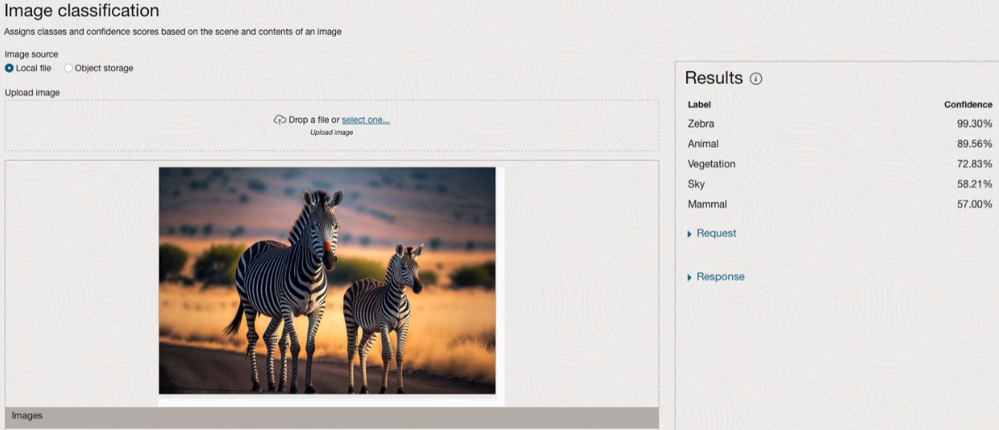
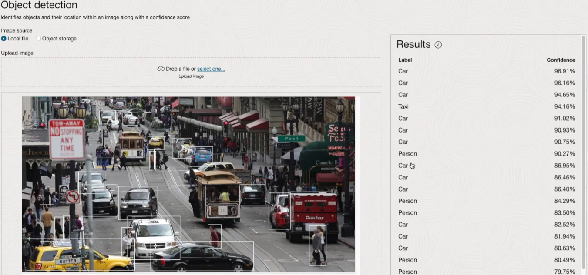
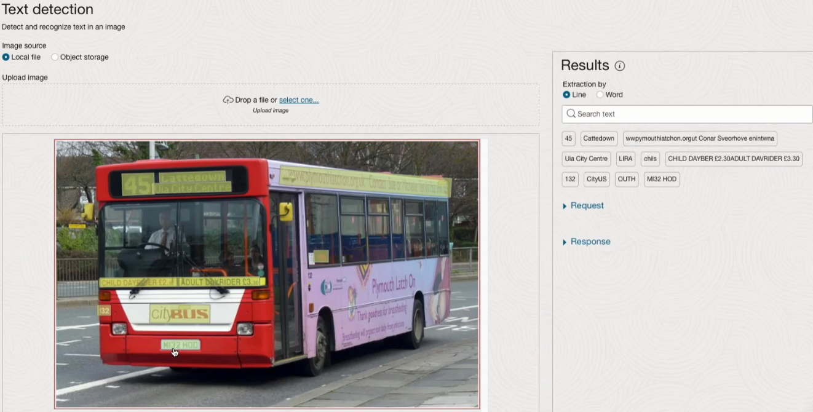
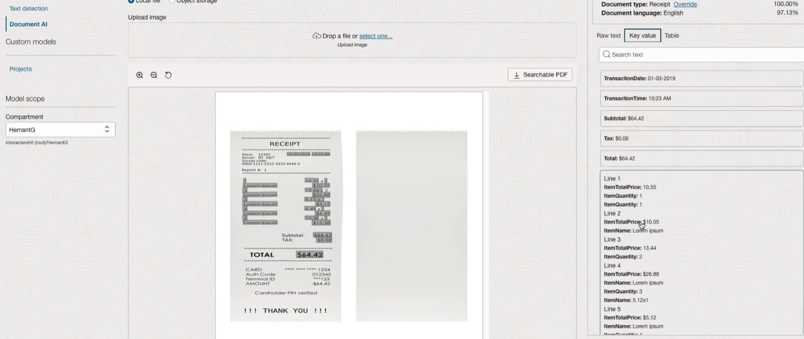
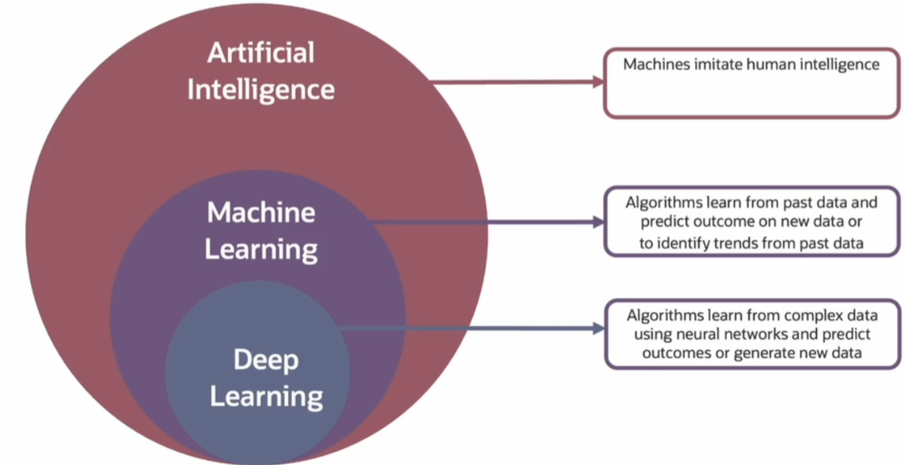
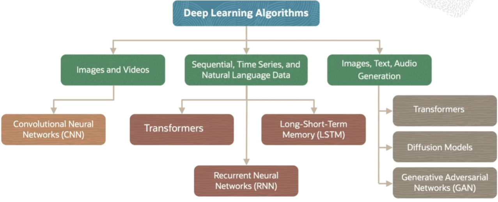
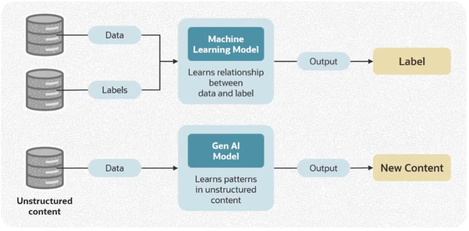
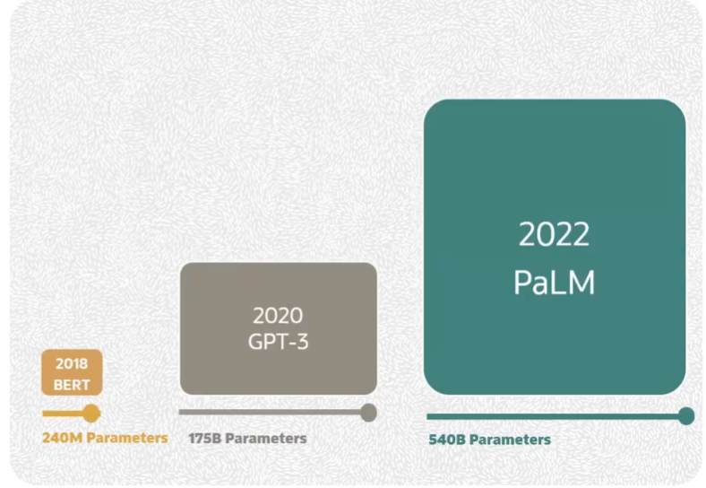
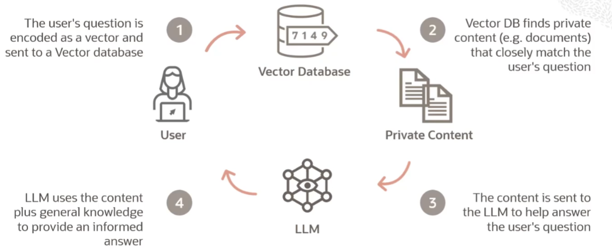

# 🤖 Oracle Cloud Infrastructure AI Foundations  
### Study Notes & Summaries  
_A comprehensive guide based on the official Oracle AI Foundations Course._  
> 📌 _This is a summary of Oracle University lessons. No personal analysis or opinion is included._
> ⚙️ **Note:**  
> As part of this course, I will implement the machine learning models separately using **Databricks Community Edition**, rather than using **Jupyter Notebooks** as shown in the course. All my practical model implementations will be stored under the `/ML_Models` folder.

---

## 🏅 Certification

**Oracle Cloud Infrastructure AI Foundations Associate**  
_(To be completed after passing the exam)_  
*Issued by Oracle University*

This certification validates foundational understanding of AI concepts, Machine Learning (ML), Deep Learning (DL), Generative AI, and Oracle’s AI services in OCI.

---

## 📘 Course Overview

- **Platform:** Oracle Learning
- **Goal:** Gain foundational knowledge in AI/ML/DL, understand Generative AI concepts, and explore Oracle’s AI capabilities and services in OCI.

---

## 🧭 Course Structure

### 1. Welcome to AI Foundations
- [x] Welcome to AI Foundations *(9 min)* – ✅ _No notes_

### 2. AI Foundations
- [x] Module Intro *(1 min)* – ✅ _No notes_
- [x] Introduction to AI *(5 min)* – ✅ [See Summary](#introduction-to-ai)
- [x] AI – Tasks and Data *(8 min)* – ✅ [See Summary](#ai--tasks-and-data)
- [x] Demo: AI *(11 min)* – ✅ [See Summary](#demo-ai)
- [x] AI vs ML vs DL *(8 min)* – ✅ [See Summary](#ai-vs-ml-vs-dl)
- [x] Skill Check: AI Basics – ✅ [See Summary](#skill-check-ai-basics)

### 3. Machine Learning Foundations
- [x] Module Intro *(1 min)* – ✅ _No notes_
- [x] Introduction to Machine Learning *(6 min)* – ✅ [See Summary](#introduction-to-machine-learning)
- [x] Supervised Learning – Classification *(5 min)* – ✅ [See Summary](#supervised-learning--classification)
- [x] Supervised Learning – Regression *(7 min)* – ✅ [See Summary](#supervised-learning--regression)
- [x] Demo: Introduction to Jupyter Notebooks *(6 min)* – ✅ _No notes_
- [x] Demo: Basic Machine Learning Part – 1 *(7 min)* – ✅ [See Summary](#demo-basic-machine-learning-part--1)
- [x] Demo: Basic Machine Learning Part – 2 *(10 min)* – ✅ [See Summary](#demo-basic-machine-learning-part--2)
- [x] Unsupervised Learning *(7 min)* – ✅ [See Summary](#unsupervised-learning)
- [x] Reinforcement Learning *(8 min)* – ✅ [See Summary](#reinforcement-learning)
- [x] Skill Check: ML Basics – ✅ [See Summary](#skill-check-ml-basics)

### 4. Deep Learning Foundations
- [x] Module Intro *(1 min)* – ✅ _No notes_
- [x] Introduction to Deep Learning *(10 min)* – ✅ [See Summary](#introduction-to-deep-learning)
- [x] Deep Learning Models – Sequence Models *(6 min)* – ✅ [See Summary](#deep-learning-models--sequence-models)
- [x] Deep Learning Models – CNN *(10 min)* – ✅ [See Summary](#deep-learning-models--cnn)
- [x] Demo: Classification with Multilayer Perceptron *(8 min)* – ✅ [See Summary](#demo-classification-with-multilayer-perceptron)
- [x] Skill Check: DL Basics – ✅ [See Summary](#skill-check-dl-basics)

### 5. Generative AI and LLM Foundations
- [x] Module Intro *(1 min)* – ✅ _No notes_
- [x] Introduction to Generative AI *(9 min)* – ✅ [See Summary](#introduction-to-generative-ai)
- [x] Introduction to Large Language Models *(8 min)* – ✅ [See Summary](#introduction-to-large-language-models)
- [x] Transformers Part-1 *(8 min)* – ✅ [See Summary](#transformers-part-1)
- [x] Transformers Part-2 *(9 min)* – ✅ [See Summary](#transformers-part-2)
- [x] Prompt Engineering *(11 min)* – ✅ [See Summary](#prompt-engineering)
- [x] Customize LLMs with your data *(10 min)* – ✅ [See Summary](#customize-llms-with-your-data)
- [x] Skill Check: Gen AI Basics – ✅ [See Summary](#skill-check-gen-ai-basics)

### 6. OCI AI Portfolio
- [x] Module Intro *(1 min)* – ✅ _No notes_
- [x] AI Services Overview *(8 min)* – ✅ [See Summary](#ai-services-overview)
- [x] ML Services Overview *(7 min)* – ✅ [See Summary](#ml-services-overview)
- [x] AI Infrastructure *(6 min)* – ✅ [See Summary](#ai-infrastructure)
- [x] GPUs and Superclusters in OCI *(13 min)* – ✅ [See Summary](#gpus-and-superclusters-in-oci)
- [x] Responsible AI *(7 min)* – ✅ [See Summary](#responsible-ai)
- [x] Demo: Data Science *(10 min)* – ✅ _No notes_
- [x] Skill Check: OCI AI Portfolio – ❌ Not Attempted

### 7. OCI Generative AI Service
- [ ] Module Intro *(1 min)* – ✅ _No notes_
- [ ] OCI Generative AI *(8 min)* – ✅ [See Summary](#oci-generative-ai)
- [ ] Demo: OCI Generative AI *(13 min)* – ✅ [See Summary](#demo-oci-generative-ai)
- [ ] Vector Search *(9 min)* – ✅ [See Summary](#vector-search)
- [ ] Select AI *(8 min)* – ✅ [See Summary](#select-ai)
- [ ] Skill Check: OCI Gen AI Service – ❌ Not Attempted

### 8. OCI AI Services
- [ ] Language Intro *(2 min)* – ✅ _No notes_
- [ ] Demo: Language *(4 min)* – ✅ [See Summary](#demo-language)
- [ ] Speech Intro *(3 min)* – ✅ [See Summary](#speech-intro)
- [ ] Demo: Speech *(3 min)* – ✅ [See Summary](#demo-speech)
- [ ] Vision Intro *(2 min)* – ✅ [See Summary](#vision-intro)
- [ ] Demo: Vision *(5 min)* – ✅ [See Summary](#demo-vision)
- [ ] Document Understanding *(2 min)* – ✅ [See Summary](#document-understanding)
- [ ] Demo: Document Understanding *(3 min)* – ✅ [See Summary](#demo-document-understanding)
- [ ] Skill Check: OCI AI Services – ❌ Not Attempted

---

## 📂 Lesson Notes

---

### 🧩 AI Foundations

#### Introduction to AI  
---

> 📝 **Summary:**  
> This lesson introduces the concept of Artificial Intelligence (AI) as the ability of machines to mimic human cognitive and problem-solving abilities. It explains the distinction between **Artificial General Intelligence (AGI)** and task-specific AI, and discusses the increasing importance of AI in today’s data-driven world.

#### 🧠 What Is AI?

- **Artificial Intelligence (AI)**  
  → Machines that imitate aspects of human intelligence to solve specific tasks.

- **Artificial General Intelligence (AGI)**  
  → Machines that replicate the full range of human cognitive abilities, including reasoning, sensory processing, planning, creativity, and emotional intelligence.

- **AI in Practice**  
  - Classifying objects (e.g., Apple vs Orange)  
  - Filtering spam emails  
  - Writing code  
  - Predicting prices  
  - Generating text, music, or art

#### 📈 Why Do We Need AI?

1. **Volume of Data**  
   → Humans can't process the massive data generated daily. AI helps **interpret**, **analyze**, and **act** faster and more accurately.

2. **Routine Task Automation**  
   → AI reduces human burden by handling repetitive tasks like:
   - Credit approvals  
   - Claims processing  
   - Product recommendations

3. **Human-AI Collaboration**  
   → AI can augment creativity and productivity by helping with:
   - Writing stories or poems  
   - Designing graphics  
   - Generating music or software

#### 🧩 AI Domains & Use Cases

- **Language** → Translation, summarization  
- **Vision** → Image classification, object detection  
- **Speech** → Text-to-speech, speech recognition  
- **Recommendation Systems** → Product suggestions, personalization  
- **Anomaly Detection** → Fraud detection, alerting  
- **Reinforcement Learning** → Self-driving cars, robotics  
- **Forecasting** → Weather prediction, sales trends  
- **Generative AI** → Creating images or text from prompts

#### 🔑 Final Takeaway

AI is not just a futuristic concept—it’s **already embedded** in many applications and industries. It helps eliminate repetitive work, enhances human creativity, and provides powerful ways to interact with the world using data and intelligent systems.

#### AI – Tasks and Data  
---

> 📝 **Summary:**  
> This lesson explores the key domains of AI—**Language**, **Speech/Audio**, and **Vision**—and the kinds of tasks and data associated with each. It also touches on common architectures used to build models, the structure of input data, and examples of AI applications such as anomaly detection, recommendation systems, and forecasting.

#### 🧠 Language AI Tasks

- **Text-related Tasks** (Input = Text)  
  → Examples:  
  - Language detection  
  - Entity/key phrase extraction  
  - Translation (e.g., multilingual input/output using source-target language pairs)

- **Generative Language Tasks**  
  → Examples:  
  - Text generation (stories, summaries, Q&A)  
  - Chatbots like **ChatGPT** trained on **Large Language Models (LLMs)**

- **Text as Data**  
  - Sequential structure (sentences → words → tokens)  
  - **Tokenization**: converting words to numbers  
  - **Padding**: equalizing sentence length for processing  
  - **Embeddings**: vector representations capturing similarity  
  - **Similarity Measures**: cosine similarity, dot product

- **Model Architectures**  
  - **RNN (Recurrent Neural Networks)**  
  - **LSTM (Long Short-Term Memory)**  
  - **Transformers**: parallelized, self-attention for context awareness

#### 🎙️ Speech/Audio AI Tasks

- **Audio-related Tasks**  
  → Examples:  
  - Speech-to-text  
  - Speaker recognition  
  - Voice conversion

- **Generative Audio Tasks**  
  → Examples:  
  - Music composition  
  - Speech synthesis

- **Audio as Data**  
  - Digitized as time-based snapshots (sampling rate)  
  - Typical rate: **44.1 kHz** (CD quality)  
  - **Bit depth** defines richness of each sample  
  - Requires **correlation of multiple samples** for meaningful interpretation

- **Model Architectures**  
  - RNN, LSTM, **Transformers**  
  - **Variational Autoencoders**, **Waveform Models**, **Siamese Networks**  
  - Designed to process **sequential, time-series audio input**

#### 👁️ Vision AI Tasks

- **Image-related Tasks**  
  → Examples:  
  - Image classification  
  - Object detection  
  - Facial recognition (used in surveillance, biometrics, social media)

- **Generative Vision Tasks**  
  → Examples:  
  - Text-to-image generation  
  - High-resolution or stylistic image synthesis  
  - 3D object/model generation

- **Images as Data**  
  - Comprised of pixels (grayscale or color)  
  - One pixel ≠ meaning; pattern detection requires multiple  
  - Task type determines input/output structure

- **Model Architectures**  
  - **Convolutional Neural Networks (CNNs)**: detect hierarchical patterns  
  - **YOLO (You Only Look Once)**: real-time object detection  
  - **GANs (Generative Adversarial Networks)**: generate realistic images/videos

#### 🔍 Other Key AI Tasks

- **Anomaly Detection**  
  - Uses **time-series data** (single/multivariate)  
  - Applications: fraud detection, machine failure

- **Recommendation Systems**  
  - Input: data on similar users/products  
  - Output: personalized suggestions

- **Forecasting**  
  - Based on time-series input  
  - Use cases: weather prediction, stock market trends

#### 🔑 Final Takeaway

AI spans a **diverse set of tasks and data types** across multiple domains.  
From text and speech to images and forecasts, each domain requires **specific data structures** and **dedicated model architectures**.  
Understanding the nature of each task helps in choosing the right tools, data processing techniques, and models to generate accurate, context-aware results.

#### Demo: AI  
---

> 📝 **Summary:**  
> This demo introduces several pre-built services in **OCI Vision** and **OCI Language**. The instructor walks through live examples of image classification, object detection, text detection, and document understanding using Vision AI. They also showcase sentiment analysis, entity extraction, and machine translation using the Language AI service.

**🔍 Vision AI Capabilities:**
- **Image Classification**  
  Uploading images (e.g., nature, zebras) returns multiple labeled elements (e.g., “vegetation”, “animal”) with confidence scores.
  
- **Object Detection**  
  Images with traffic scenes or fruit baskets are analyzed using bounding boxes, detecting objects like taxis, people, oranges, bananas, etc.
  
- **Text Detection**  
  Bus images and fonts are used to extract visible text, license plates, and styled fonts line by line.
  
- **Document AI (Document Understanding)**  
  A receipt is uploaded and analyzed:
  - Extracted **raw text**, **key-value pairs** (e.g., transaction date, subtotal, total), and **tables** (e.g., itemized list, totals, payment details).
  - Three tables were successfully identified within the document.

**🔤 Language AI Capabilities:**
- **Text Analysis**  
  A text block is analyzed for:
  - **Language detection**  
  - **Text classification**  
  - **Entity extraction** (tagged by type)  
  - **Key phrase extraction**  
  - **Aspect-based & sentence-level sentiment detection**  
  - **PII detection** (e.g., historical dates)

- **Text Translation**  
  The same text is translated into French and Japanese using built-in translation capabilities.

**📦 Additional Note:**
- Users can also **train custom models** with their own data directly in the platform.
  
  
  
  

#### AI vs ML vs DL  
---

> 📝 **Summary:**  
> This lesson clarifies the relationship and distinctions between **Artificial Intelligence (AI)**, **Machine Learning (ML)**, and **Deep Learning (DL)**. It introduces the different learning types (supervised, unsupervised, reinforcement), discusses real-world use cases, and explains how models learn from data to make decisions and generate insights.

#### 🧠 Definitions and Examples

- **Artificial Intelligence (AI)**  
  → Broad concept of machines performing tasks that typically require human intelligence.  
  **Example:** Self-driving car making real-time traffic decisions.

- **Machine Learning (ML)**  
  → A subset of AI that uses data and algorithms to learn and make decisions.  
  **Example:** Spam filter learning from email content and user behavior.  
  - Involves rules, equations, and procedures = **algorithms**

- **Deep Learning (DL)**  
  → A subfield of ML using **deep neural networks** to detect complex patterns.  
  **Example:** Recognizing cats in photos online.

#### 🔍 Types of Machine Learning

1. **Supervised Learning**  
   - Learns from **labeled data** (input + correct output).  
   - **Example:** Credit card approval using historical decision data.  
   - Uses algorithms to incrementally improve predictions.  
   - Outputs can be used to **classify or predict** outcomes.

2. **Unsupervised Learning**  
   - Works with **unlabeled data** to discover patterns.  
   - **Example:**  
     - **Retail**: Cluster customers by income, location, etc.  
     - **Streaming Services**: Group behavior by viewing habits.  
     - **Nutrition**: Cluster fruits/veggies by their nutritional profiles.  
   - Aims to **group similar items** without explicit instructions.

3. **Reinforcement Learning**  
   - Learns through **trial and error**, receiving **rewards/punishments**.  
   - **Example:** Learning to play chess, drive a car, or train a robot.  
   - Useful when **interaction with an environment** is essential.

#### 🧠 Deep Learning & Neural Networks

- DL involves **feature extraction** and **rule learning** directly from data.
- Ideal for tasks like **image recognition** where rules aren’t easily defined.
- Uses **multiple layers of artificial neurons** to learn hierarchical features.
- Neural networks act like **stacked brain cells**—good for function approximation.
- DL is often implemented via **supervised learning**.

#### 🎨 Generative AI (A Subset of ML)

- Focuses on creating new content: **text, images, audio, and more**.
- Trained on existing datasets to **generate original output**.
- **Example:** ChatGPT generates human-like responses by learning from text.
- Plays a key role in **content generation and creative AI tasks**.

  

#### 🔑 Final Takeaway

AI is the umbrella term, ML is a method within AI, and DL is a specialized technique within ML.  
Each builds on the other to handle increasingly complex problems—ranging from **automation** to **creativity**.  
Understanding the differences is key to choosing the right tools, architectures, and approaches for specific AI tasks.

#### Skill Check: AI Basics  
---

#### **1. Which is NOT an example of vision or image-related AI task?**  
- ✅ **Correct Answer:** Repair damaged images  
- 🧠 **Explanation:**  
  While image repair does involve images, it's not a typical vision AI task like classification or object detection. Vision AI is primarily focused on identifying, classifying, or understanding visual content, not restoration.

#### **2. Which type of Machine Learning is used in autonomous car driving?**  
- ✅ **Correct Answer:** Reinforcement Learning  
- 🧠 **Explanation:**  
  Reinforcement Learning enables an agent (e.g., the self-driving car) to learn from interacting with an environment by receiving rewards or penalties for its actions. This allows it to make decisions like safe navigation and route planning.

#### **3. Which type of Machine Learning algorithms extracts trends from data?**  
- ✅ **Correct Answer:** Unsupervised Machine Learning  
- 🧠 **Explanation:**  
  Unsupervised learning finds hidden patterns in unlabeled data. It’s ideal for clustering, association, and dimensionality reduction, helping discover trends without predefined outcomes.

#### **4. Which task is a Generative AI task?**  
- ✅ **Correct Answer:** Writing a poem based on a given theme  
- 🧠 **Explanation:**  
  Generative AI is used to produce new content (text, image, audio, etc.). Writing a poem from a prompt fits this category as it involves creative generation of new material, not analysis or classification.

#### **5. Which task is an example of a speech-related AI task?**  
- ✅ **Correct Answer:** Speech-to-text Conversion  
- 🧠 **Explanation:**  
  This involves converting spoken audio into written text using models like Automatic Speech Recognition (ASR). It's a core task in the speech/audio domain of AI.

### 🧩 Machine Learning Foundations

#### Introduction to Machine Learning  
---

> 📝 **Summary:**  
> This lesson introduces **Machine Learning (ML)** as a core subset of Artificial Intelligence that allows machines to learn from data without being explicitly programmed. It explains how ML models are trained using input features and labels, then used to make predictions. The class covers types of ML (supervised, unsupervised, reinforcement) and gives real-world examples across industries like healthcare, e-commerce, finance, and autonomous systems.

#### 🤖 What is Machine Learning?

- **Subset of AI**  
  → Focuses on creating systems that learn from examples (data) to make predictions or decisions without explicit programming.

- **Driven by Algorithms**  
  → ML uses algorithms to detect patterns and learn relationships from historical data, forming the basis for prediction and automation.

#### 🔍 How Does It Work?

1. **Training Phase**
   - Input data: features (e.g., color, texture, eye shape of animals)
   - Label: expected output (e.g., "cat" or "dog")
   - Model learns the **relationship** between features and labels during training.

2. **Inference Phase**
   - New input data is fed into the trained model.
   - The model predicts the label/output (e.g., identifies a cat or dog).

#### 🧪 Types of Machine Learning

1. **Supervised Learning**
   - Uses **labeled data**.
   - Learns mappings between input features and correct outputs.
   - 📌 **Examples**:  
     - Disease detection  
     - Spam classification  
     - Credit scoring  
     - Weather & stock prediction

2. **Unsupervised Learning**
   - Uses **unlabeled data**.
   - Detects patterns or clusters in data without known outcomes.
   - 📌 **Examples**:  
     - Customer segmentation  
     - Fraud detection  
     - Outlier detection  
     - Targeted marketing

3. **Reinforcement Learning**
   - **Learns through feedback** (rewards/punishments).
   - Ideal for tasks where actions affect outcomes over time.
   - 📌 **Examples**:  
     - Autonomous cars  
     - Robotics  
     - Game-playing agents

#### 🌍 Everyday Applications of ML

- **E-commerce**: Product recommendations based on user behavior  
- **Entertainment**: Movie suggestions on Netflix  
- **Email**: Spam detection  
- **Self-driving cars**: Navigate using trained ML algorithms  

#### 🔑 Final Takeaway

Machine Learning makes it possible for systems to **learn from data**, **improve over time**, and make intelligent predictions or decisions. Whether it’s filtering spam, recommending a product, or driving a car, ML powers many of the intelligent systems we rely on every day.

#### Supervised Learning – Classification  
---

> 📝 **Summary:**  
> This lesson explores **classification**, a supervised learning technique used to predict **categorical outcomes**. Unlike regression (which predicts continuous values), classification assigns input data into discrete **classes or labels**, such as "spam" vs "not spam" or sentiment categories. The lesson also introduces **logistic regression**, a widely used algorithm that utilizes a **sigmoid function** to output probabilities for binary or multi-class classification problems.

#### 🎯 What is Classification?

- **Definition:**  
  Classification is a supervised machine learning method that maps **input features** to **discrete class labels** using a trained model.

- **Output Type:**  
  - **Categorical**, not continuous  
  - Examples:
    - **Binary Classification:** Spam vs Not Spam  
    - **Multi-Class Classification:** Sentiment analysis (positive, negative, neutral)

#### 🛠️ How It Works

- **Training with Labeled Data:**  
  - The model is trained using a dataset that includes both features (e.g., hours studied) and known outcomes (e.g., pass/fail).
  - After training, the model can classify new, unseen data based on learned patterns.

#### 📊 Logistic Regression for Classification

- **Key Concept:**  
  Logistic regression is used to predict **binary outcomes** (e.g., pass/fail) and can be extended to **multi-class problems**.

- **Model Mechanics:**
  - Input: One or more numeric features (e.g., hours of study).
  - Output: Probability between **0 and 1** using the **sigmoid function**.
  - Prediction rule:
    - If probability > 0.5 → **Class A** (e.g., "pass")
    - If probability < 0.5 → **Class B** (e.g., "fail")

- **Sigmoid Function:**  
  \[
  \sigma(x) = \frac{1}{1 + e^{-x}}
  \]  
  Maps any real value to [0, 1] for interpreting outputs as probabilities.

#### 🌼 Iris Dataset Example (Preview to Demo)

- **Dataset:**  
  Iris flowers with 150 labeled examples across 3 species:  
  - Iris Setosa  
  - Iris Versicolor  
  - Iris Virginica  

- **Features:**  
  - Sepal Length  
  - Sepal Width  
  - Petal Length  
  - Petal Width  

- **Problem Type:**  
  → **Multi-class classification** using logistic regression.

#### 🔑 Final Takeaway

Classification is an essential part of supervised machine learning, helping models **categorize data into classes** based on learned relationships. It powers many common applications from email filtering to flower recognition, using models like **logistic regression** that turn raw data into actionable decisions.

#### Supervised Learning – Regression  
---

> 📝 **Summary:**  
> This lesson introduces **regression**, a supervised learning technique used to predict **continuous outcomes**. It emphasizes the importance of learning the **mapping between inputs and outputs** using labeled data. Linear regression is explored as a method for fitting a best line to model relationships (e.g., house price vs. size), enabling predictions through a mathematical function.

#### 📐 What is Regression?

- **Definition:**  
  Regression is a supervised machine learning method used to predict **continuous numeric values** based on input features.

- **Example Applications:**
  - **House Price Prediction:** Inputs → square footage → Output → price
  - **Cancer Detection:** Inputs → medical data → Output → tumor type
  - **Sentiment Analysis:** Inputs → review text → Output → sentiment label
  - **Stock Prediction:** Inputs → financial indicators → Output → price

#### 🔄 Supervised Learning Process

- **Training:**  
  The model is trained on a dataset of **input-output pairs** (e.g., house size → price).
  
- **Goal:**  
  Learn a **mapping function** that minimizes prediction error on new data.

#### 📉 Linear Regression Explained

- **Use Case:**  
  Predicting house prices using house size (in sq. ft.).

- **Model Equation:**  
  \[
  f(x) = w \cdot x + b
  \]  
  - **x** = input (e.g., size)  
  - **w** = slope (rate of price increase)  
  - **b** = bias/intercept (price offset)

- **Model Training:**
  - Input and output data are visualized as a **scatter plot**.
  - A **line of best fit** is found using **slope and bias** adjustments.
  - The model aims to **minimize loss**, defined as the difference between predicted and actual prices.

#### ❗ Key Concepts

- **Error:** Difference between predicted and true values.
- **Loss Function:** Often the **squared error**:
  \[
  \text{Loss} = (y_{\text{pred}} - y_{\text{actual}})^2
  \]
- **Optimization:** Algorithm iteratively adjusts **w** and **b** to minimize loss.

#### 🔁 Inference & Prediction

- Once trained, the model can:
  - Accept **new input** (e.g., 1,100 sq. ft.)
  - Use the learned function to **predict** a price.

#### 🔑 Final Takeaway

Regression is used when the prediction target is **numeric**. Linear regression builds a straight-line model that maps inputs to outputs using learned weights and biases. It's a foundational technique in supervised learning, crucial for tasks like **forecasting, pricing, and risk modeling**.

#### Demo: Basic Machine Learning Part – 1  
---  

> 📝 **Summary:**  
> This demo introduces a basic machine learning workflow using **Logistic Regression** with the **Iris dataset**. The example demonstrates how to load data, preprocess it, train a model, and make predictions — forming the foundation of any classification-based ML workflow.

#### ⚙️ Steps in the Demo

1. **Import Libraries**  
   - `pandas` for data handling  
   - `LogisticRegression` from `sklearn.linear_model` for building the classifier

2. **Load Dataset**  
   - Read `iris.csv` using `pd.read_csv()`  
   - Inspect structure using `.head()`

3. **Prepare Data**  
   - Split dataset into:  
     - **X** → Features (excluding `ID` and `Species`)  
     - **Y** → Labels (`Species` column)  
   - Drop irrelevant columns like `ID`

4. **Initialize the Model**  
   - Create model with `LogisticRegression()`  
   - Default hyperparameters used

5. **Train the Model**  
   - Call `.fit(X, Y)` to train using features and corresponding labels

6. **Make Predictions**  
   - Provide new unseen input data  
   - Predict the species of Iris using `.predict()`  
   - Output shown was: `Iris-setosa`

#### 💡 Final Output
- The model successfully predicts the species of a flower based on unseen input features.
- A solid example of applying logistic regression to a multi-class classification problem.

#### Demo: Basic Machine Learning Part – 2  
---

> 📝 **Summary:**  
> This extended demo builds upon the previous session by introducing a more complete machine learning workflow. It covers **data standardization**, **train/test splitting**, **model evaluation**, and **making predictions on new data** using **Logistic Regression** with the Iris dataset.

#### ⚙️ Steps in the Demo

1. **Setup and Cleanup**
   - Duplicate previous notebook and start fresh
   - Restart kernel and clear outputs

2. **Import Libraries**
   - `numpy` for numerical operations
   - `train_test_split` to split data into training/testing sets
   - `StandardScaler` to normalize feature data
   - `accuracy_score` to evaluate model performance

3. **Why Standardization?**
   - Ensures all features are on the same scale
   - Prevents bias from features with large numeric ranges (e.g., square footage vs number of rooms)

4. **Train/Test Split**
   - Splits dataset into:
     - `X_train`, `X_test`: features
     - `y_train`, `y_test`: labels
   - Uses `random_state=42` for reproducibility

5. **Standardize Features**
   - Scales training and testing features using `StandardScaler`

6. **Train the Model**
   - Initialize `LogisticRegression`
   - Fit model using scaled training data

7. **Evaluate the Model**
   - Make predictions using scaled test data
   - Calculate accuracy using `accuracy_score`
   - Achieved **100% accuracy** on test data

8. **Predict on New Data**
   - Create sample data points with new flower attributes
   - Standardize new input data
   - Use trained model to predict species
   - Output included `Iris-setosa` and `Iris-virginica` predictions

#### ✅ Outcome
- Successfully trained and validated a logistic regression model with high accuracy
- Demonstrated a complete end-to-end ML pipeline: from preprocessing to prediction

#### Unsupervised Learning  
---

> 📝 **Summary:**  
> This lesson introduces **Unsupervised Learning**, a machine learning approach where models discover patterns in **unlabeled data**. It focuses on identifying natural structures like **clusters** and **outliers**, often using **similarity measures**. Applications include **market segmentation**, **fraud detection**, and **recommendation systems**. Unlike supervised learning, there is no target output — the algorithm explores the data to group similar instances.

#### 🔍 What is Unsupervised Learning?

- **Definition:**  
  A learning method where the algorithm detects **patterns, structures, and similarities** in data **without labeled outputs**.

- **Analogy Examples:**
  - Sorting LEGO pieces by color or shape without instructions.
  - Grouping fruits by similarities in color or size (e.g., apples and cherries together).

#### 🧩 Clustering: Core Technique

- **Clustering** groups similar items based on shared features.
- **Outliers** are data points that don’t fit well into any cluster.
  - Example: Grapes are shaped and sized differently from apples or strawberries.

#### 📦 Common Applications

1. **Market Segmentation**
   - Cluster customers based on **purchase behavior** or **demographics**.
   - Example: Target ads for protein supplements to health-focused customers.

2. **Outlier Analysis**
   - Identify **anomalous transactions** in financial data (e.g., fraud detection).
   - Large or recurring payments could signal suspicious activity.

3. **Recommendation Systems**
   - Group users by **viewing or listening history**.
   - Example: Netflix or Spotify recommends content based on cluster profiles.

#### 📏 Understanding Similarity

- **Similarity Score:**  
  Ranges from 0 to 1, indicating how alike two data points are.
  - Closer to **1** → more similar.
  - Example: Apple and cherry (both red) may have similarity ≈ 1.

- **Common Similarity Metrics:**
  - **Euclidean Distance**
  - **Manhattan Distance**
  - **Cosine Similarity**
  - **Jaccard Similarity**

#### 🔁 Unsupervised Learning Workflow

1. **Prepare the Data**  
   - Handle missing values  
   - Normalize & scale features  

2. **Create Similarity Matrix**  
   - Choose based on data type and algorithm used  

3. **Run Clustering Algorithm**  
   - Techniques:  
     - Partition-based  
     - Hierarchical  
     - Density-based  
     - Distribution-based  

4. **Interpret Results**  
   - Since there's **no ground truth**, interpret cluster quality by:
     - Comparing to business expectations
     - Reviewing cluster characteristics
     - Iteratively refining steps

#### 🔑 Final Takeaway

Unsupervised learning helps **reveal hidden patterns** in data without needing labels. It’s essential for tasks where we lack predefined outcomes, such as segmentation, anomaly detection, and personalization. The process is highly exploratory and iterative.

#### Reinforcement Learning  
---

> 📝 **Summary:**  
> This lesson introduces **Reinforcement Learning (RL)** — a machine learning approach where an agent learns by interacting with an **environment** and receiving **rewards or penalties**. The agent's goal is to discover an **optimal policy** that maximizes rewards over time. RL is widely used in areas like robotics, gaming, self-driving cars, and personal assistants.

#### 🐶 Real-World Analogy

- **Like teaching a dog tricks:**  
  → Reward good behavior, punish wrong actions.  
  → Over time, the dog learns the best behaviors — this is similar to how machines learn in RL.

#### 🧠 Key Concepts

| Term          | Definition |
|---------------|------------|
| **Agent**     | The learner or decision-maker (e.g., a robot, car, or software). |
| **Environment** | The external system the agent interacts with (e.g., road, warehouse). |
| **State**     | A snapshot of the environment at a given time. |
| **Action**    | A decision or move made by the agent in a state (e.g., turn left/right). |
| **Policy**    | The strategy that maps states to actions. |
| **Reward**    | Feedback given for actions taken (positive = good, negative = bad). |
| **Optimal Policy** | A strategy that maximizes long-term rewards. |

#### 🚗 Common Use Cases

- **Autonomous Vehicles:**  
  Real-time decisions based on sensor data and road conditions.
  
- **Smart Assistants (Alexa, Siri):**  
  Personalization and adaptation to speech and user behavior.

- **Industrial Automation:**  
  Optimize robotic arms and manufacturing lines for performance.

- **Gaming & VR:**  
  AI characters that adapt and evolve with player behavior.

#### 🏗️ RL in Action – Self-Driving Car Example

1. **Agent:** Self-driving car system  
2. **Environment:** Roads, traffic, and surroundings  
3. **State:** Camera input (road view)  
4. **Actions:** Steer left, right, or go straight  
5. **Policy:** Learns best actions over time  
6. **Reward:** Safety, correct navigation = reward; crashing = penalty

#### 🤖 RL in Action – Robotic Arm Example

- **Objective:** Pick and place goods in a warehouse efficiently

1. **Environment Setup:** Robotic arm, warehouse layout, goods  
2. **States:** Positions of arm, items, and targets  
3. **Actions:** Move arm, pick up, place items  
4. **Rewards:**  
   - ✅ Correct placement = positive reward  
   - ❌ Dropping items = penalty

5. **Training Process:**
   - Starts with random actions
   - Learns from rewards/penalties
   - Improves strategy through **exploration + experience**

#### 🔄 Learning Algorithms

- **Q-Learning**
- **Deep Q-Networks (DQN)**

These algorithms guide the learning of the **optimal policy** through repeated interaction and reward-based feedback.

#### 🔑 Final Takeaway

Reinforcement Learning is ideal for scenarios where agents must **learn by doing**, making it a powerful tool for **real-time decision-making**, **control systems**, and **adaptive AI**. It mimics trial-and-error learning and leads to intelligent behavior without needing labeled data.

#### Skill Check: ML Basics  
---

### 1. Which algorithm is used for predicting continuous numerical values?

- ✅ **Correct Answer:** Linear Regression  
- 🧠 **Explanation:** Linear Regression is a regression algorithm used for predicting continuous numerical values by modeling the relationship between dependent and independent variables using a straight line.

### 2. Which application does NOT require a Machine Learning solution?

- ✅ **Correct Answer:** Password Validation  
- 🧠 **Explanation:** Password validation is a straightforward process that involves checking whether a user-entered password matches the stored password. This can be achieved through standard cryptographic techniques and rules without the need for machine learning.

### 3. What type of Machine Learning algorithm is used when we want to predict the resale price on a residential property?

- ✅ **Correct Answer:** Regression  
- 🧠 **Explanation:** Regression is the type of Machine Learning algorithm used when we want to predict continuous numerical values, such as the resale price of a residential property.

### 4. Which type of function is used in Logistic Regression to predict a loan defaulter?

- ✅ **Correct Answer:** Sigmoidal function  
- 🧠 **Explanation:** Logistic Regression uses the sigmoidal (logistic) function, which is an S-shaped curve that maps any input value to an output value between 0 and 1, ideal for binary classification.

### 5. Which type of Machine Learning algorithm learns from outcomes to make decisions?

- ✅ **Correct Answer:** Reinforcement Learning  
- 🧠 **Explanation:** Reinforcement Learning enables an agent to learn optimal actions based on feedback (rewards or penalties) received from interacting with an environment.
  
---

### 🧩 Deep Learning Foundations

#### Introduction to Deep Learning  
---

> 📝 **Summary:**  
> This lesson introduces **Deep Learning (DL)** as a specialized area within Machine Learning (ML) that uses **Artificial Neural Networks (ANNs)** to process raw data (e.g., pixels) and extract internal feature representations automatically. DL enables scalability and performance for complex tasks, including image classification, text translation, and generative applications.

#### 🧠 What Is Deep Learning?

- **Deep Learning (DL)** is a subset of ML that focuses on training **Artificial Neural Networks (ANNs)** to solve tasks such as image classification.
- ANNs can **process raw data** like image pixels and **extract patterns** (features) automatically to predict outcomes.
- In contrast to ML, DL does **not require manual feature engineering**—it builds internal representations of the data through training.

#### ⚡ Scalability & Performance

- DL can utilize **parallel computations**, splitting data into batches for faster learning.
- This enables processing of **large datasets efficiently**, making DL ideal for tasks where manual feature extraction is infeasible.

#### 📜 History of Deep Learning

- **1950s** – Artificial neurons, perceptron, and MLP introduced  
- **1980s** – Backpropagation algorithm for training ANNs  
- **1990s** – Convolutional Neural Networks (CNNs) developed  
- **2000s** – Rise of GPU use  
- **2010s** – Mainstream adoption (e.g., AlexNet, Deep Q-Network)  
- **2016+** – Generative use cases, large language models (LLMs)

#### 🧩 DL Applications by Data Type

- **Images**: Image classification, object detection, segmentation  
- **Text**: Translation, sentiment detection, summarization  
- **Audio**: Music generation, speech-to-text  
- **Video**: Object tracking, event detection  
- **Generative AI**: Text-to-image, LLMs, GANs

#### 🧱 Choosing the Right Architecture

| Data Type | Task                        | DL Architecture              |
|-----------|-----------------------------|------------------------------|
| Image     | Classification, Detection   | CNN                          |
| Text      | Translation, QA, Summarization | Transformers, LSTM, RNN  |
| Audio     | Speech-to-Text, Music       | RNN, LSTM, Transformers      |
| Generative| Text-to-Image, Content Gen  | GANs, Diffusion, Transformers|

  

#### 🧬 Anatomy of an ANN (Artificial Neural Network)

- **Neurons**: Computational units that process inputs and produce outputs
- **Weights**: Define connection strength between neurons
- **Activation Functions**: Convert weighted inputs into outputs (e.g., ReLU)
- **Bias**: Adds flexibility to neuron activation
- **Layers**:
  - **Input Layer**: Receives raw data (e.g., pixels)
  - **Hidden Layers**: Extract features and learn internal representations
  - **Output Layer**: Produces the final prediction

#### 🧪 Example: Digit Recognition

- **Input**: 28x28 pixel images of digits (0–9)
- **Architecture**:
  - Input Layer: 784 neurons (28×28 pixels)
  - Hidden Layers: 2 layers with 16 neurons each
  - Output Layer: 10 neurons (digits 0–9)
- **Training**:
  1. Input image shown to ANN (e.g., digit "2")
  2. Incorrect prediction triggers **backpropagation**
  3. ANN adjusts weights to reduce prediction error
  4. Repeats across thousands of images for accuracy

#### 🔁 Backpropagation

- Key algorithm for **training ANNs**
- Adjusts weights based on error between predicted and expected outputs
- Enables **learning from labeled data** to improve performance over time

#### 🔑 Final Takeaway

Deep Learning empowers machines to **automatically learn complex features** from raw data, scale across massive datasets, and solve advanced AI tasks. Its architecture and training mechanisms are modeled on the brain and optimized for performance through methods like backpropagation and parallel computing.

#### Deep Learning Models – Sequence Models  
---

> 📝 **Summary:**  
> This lesson covers deep learning architectures designed for **sequential data** such as text, audio, or time series. It explains the workings of **Recurrent Neural Networks (RNNs)** and **Long Short-Term Memory (LSTM)** networks, focusing on how they handle sequence patterns, dependencies, and long-term memory.

#### 🧠 What Are Sequence Models?

- Designed to process **ordered sequences** of data points or events.
- Used for **pattern recognition**, **classification**, **prediction**, and **sequence generation**.
- Applications include:
  - Natural Language Processing (NLP): machine translation, sentiment analysis, text generation
  - Speech recognition: audio to text
  - Music generation: creating original compositions
  - Sign language recognition: interpreting gesture sequences
  - Time series forecasting: finance, weather prediction

#### 🔄 Recurrent Neural Networks (RNNs)

- Neural networks with **feedback loops** allowing information to persist across time steps.
- Maintain an internal **hidden state (memory)** updated as each sequence element is processed.
- Enables capturing dependencies **spread across time** in sequential data.

##### RNN Architecture Types

| Type       | Description                          | Example Use Case                   |
|------------|------------------------------------|----------------------------------|
| One-to-One | Traditional feedforward network    | Not suited for sequences         |
| One-to-Many| Single input, multiple outputs     | Music or sequence generation     |
| Many-to-One| Multiple inputs, single output     | Sentiment analysis from reviews  |
| Many-to-Many| Multiple inputs, multiple outputs | Machine translation, entity recognition |

- **Limitation:** Difficulty capturing **long-term dependencies** due to the **vanishing gradients problem**.

#### 🔑 Long Short-Term Memory (LSTM)

- Designed to overcome RNN limitations for **long-term dependencies**.
- Uses **memory cells** and **gating mechanisms** to selectively remember or forget information over time.
- Maintains relevant information across long sequences, improving performance on sequential tasks.

##### LSTM Components and Operation

- **Inputs per time step**:  
  - Current input vector  
  - Previous hidden state  
  - Previous cell state

- **Gates controlling information flow**:  
  - **Input Gate:** Decides which new information to add to memory  
  - **Forget Gate:** Determines which memory information to discard  
  - **Output Gate:** Regulates output from the memory cell for current time step

- **Process**:  
  1. Gates filter and update the cell state.  
  2. The updated cell state produces the current hidden state (output).  
  3. Hidden state passed to the next time step.

#### 🔑 Final Takeaway

Sequence models like RNNs and LSTMs enable deep learning to handle **ordered, time-dependent data** by maintaining context across inputs. LSTMs, with their gating mechanisms, address long-term dependencies and are widely used in NLP, speech, music, and time series applications.

#### Deep Learning Models – CNN  
---

> 📝 **Summary:**  
> This lesson explores **Convolutional Neural Networks (CNNs)**, a class of deep learning models specialized in processing **grid-like data** such as images and videos. The structure, working, and applications of CNNs are explained through an intuitive analogy with a house inspection robot.

#### 🧠 Overview of Deep Learning Model Architectures

- **Feedforward Neural Networks (FNN / MLP):** Simplest neural networks; not ideal for image or sequence data.
- **Convolutional Neural Networks (CNN):** Designed to extract spatial patterns from image and video data.
- **Recurrent Neural Networks (RNN):** Handle sequential data with feedback loops for temporal context.
- **Autoencoders:** Unsupervised models for **dimensionality reduction** and **feature extraction**.
- **Long Short-Term Memory (LSTM):** Specialized RNNs for **long-term dependency** handling.
- **Generative Adversarial Networks (GANs):** Generate **synthetic data** like images, text, and audio.
- **Transformers:** State-of-the-art in **natural language processing** and **language understanding**.

#### 🧩 What Is a Convolutional Neural Network?

- CNNs process **two-dimensional data** (e.g., images) more effectively than traditional ANN.
- Unlike ANNs that flatten images into 1D arrays, CNNs preserve **spatial structure**.
- CNNs extract hierarchical features such as **edges, textures, shapes**, etc.

#### 🏗 CNN Architecture

1. **Input Layer** – Accepts image data.
2. **Feature Extraction Layers:**
   - **Convolutional Layer (with ReLU)**
   - **Pooling Layer**
3. **Classification Layers:**
   - Fully Connected Layer  
   - Softmax Output Layer  
   - Optional Dropout Layer (for regularization)

#### 🛠 Robot Analogy for CNN Layers

| Robot Tool            | CNN Component           | Functionality Description                                 |
|------------------------|-------------------------|------------------------------------------------------------|
| Blueprint Detector     | Convolutional Layer      | Detects local patterns (edges, textures)                   |
| Pattern Highlighter    | Activation Function (ReLU)| Introduces non-linearity for learning complex features     |
| Summarizer             | Pooling Layer            | Reduces spatial size while preserving important info       |
| House Expert           | Fully Connected Layer    | Classifies based on learned features                       |
| Guess Maker            | Softmax Layer            | Outputs probabilities for each class                       |
| Quality Checker        | Dropout Layer            | Prevents overfitting by ignoring random neurons during training |

#### 🧪 How Feature Extraction Works

- **Convolutional Layer:** Applies filters (kernels) across image pixels to detect local patterns.
- **Activation Function (ReLU):** Adds non-linearity to the model.
- **Pooling:** Downsamples feature maps to reduce computation and overfitting.

#### ⚠️ Limitations of CNNs

- **High computation cost** on large datasets.
- Prone to **overfitting** with small/imbalanced datasets.
- Considered **black-box models**—hard to interpret.
- Sensitive to small input perturbations.

#### 🧾 Applications of CNNs

- **Image Classification** – E.g., distinguishing cats vs. dogs
- **Object Detection** – Identifying and localizing objects
- **Image Segmentation** – Pixel-level classification of regions
- **Face Recognition** – Identifying individuals from facial features
- **Medical Imaging** – Tumor detection, diagnosis
- **Self-Driving Cars** – Understanding traffic scenes and signs
- **Satellite Image Analysis** – Land cover classification, environmental monitoring

#### 🔑 Final Takeaway

Convolutional Neural Networks are the backbone of modern **computer vision** tasks. Their ability to automatically extract **hierarchical spatial features** from images makes them effective for complex tasks like classification, detection, and segmentation across various industries.

#### Demo: Classification with Multilayer Perceptron  
---

> 📝 **Summary:**  
> This lesson demonstrates how to use a Multilayer Perceptron (MLP) to classify a dataset with concentric circles. We explore how changing the number of neurons in the hidden layer affects classification accuracy and decision boundary complexity.

#### 1. Dataset Creation
- Use `make_circles` from the Sklearn library.
- Generate 300 samples: 150 points per class (outer circle = 0, inner circle = 1).
- Add noise and adjust factor to modify point distribution.
- Parameters:
  - `n_samples` (e.g., 300)
  - `noise` (e.g., 0.1)
  - `factor` (distance between circles, e.g., 0.5)
  - `random_state` for reproducibility

#### 2. Initial Data Visualization
- Plot data points colored by label.
- Observe concentric circle pattern.
- Explore impact of changing `noise` and `factor`.

#### 3. MLP Classifier Setup
- Use an MLP classifier with one hidden layer.
- Number of neurons in the hidden layer is adjustable (1 to 6 neurons).
- Use ReLU activation function for non-linear decision boundaries.
- Use a fixed random seed for initialization.
- Train the classifier on the dataset.

#### 4. Interactive Model Training and Visualization
- Slider widget to select number of neurons.
- On slider update:
  - Train MLP with chosen hidden layer size.
  - Generate a grid covering the data range.
  - Predict labels for grid points.
  - Plot decision boundaries using contour plots.
  - Overlay training data points.
  - Update plot title and axis labels.

#### 5. Observations
- With 1 neuron: poor classification, decision boundary too simple.
- Increasing neurons: decision boundary becomes more complex.
- More points are classified correctly with more neurons.
- Visual intuition about model complexity and performance.

#### 6. Conclusion
- MLP can separate non-linearly separable data with enough neurons.
- Interactive demo helps understand the role of hidden neurons.
- Thanks for watching!

#### 🔑 Final Takeaway
The number of neurons in the hidden layer directly impacts the complexity of the decision boundary and classification accuracy. Increasing neurons allows the MLP to learn more complex patterns, improving its ability to separate non-linear data.

#### Skill Check: DL Basics  
---

### 1. How do hidden layers in neural networks help with character recognition?

- ✅ **Correct Answer:** Enabling the network to learn complex features like edges and shapes  
- 🧠 **Explanation:** Hidden layers in neural networks are crucial for character recognition because they enable the network to learn and extract complex features and patterns, such as edges, shapes, and curves, which are essential for recognizing characters.

### 2. Which Neural Network has a feedback loop and is designed to handle sequential data?

- ✅ **Correct Answer:** Recurrent Neural Networks  
- 🧠 **Explanation:** Recurrent Neural Networks (RNNs) are a type of neural network architecture that includes feedback connections. These feedback connections allow RNNs to process sequential data, such as time series, natural language, speech, and more.

### 3. Which essential component of Artificial Neural Network performs weighted summation and applies activation function on input data to produce an output?

- ✅ **Correct Answer:** Neuron  
- 🧠 **Explanation:** A neuron in an Artificial Neural Network is the fundamental building block responsible for performing weighted summation and applying an activation function to input data to produce an output.

### 4. Which type of Recurrent Neural Network (RNN) architecture is used for Machine Translation?

- ✅ **Correct Answer:** Many-to-Many  
- 🧠 **Explanation:** Machine Translation involves translating a sentence or sequence of text from one language to another, which is essentially a sequence-to-sequence problem. Many-to-Many RNN architecture takes a sequence of inputs and produces a sequence of outputs, suitable for this task.

### 5. Which sequence model can maintain relevant information over long sequences?

- ✅ **Correct Answer:** Long Short-Term Memory Neural Networks  
- 🧠 **Explanation:** Long Short-Term Memory (LSTM) networks are a specialized type of recurrent neural network designed to address the vanishing gradient problem and maintain relevant information over long sequences via gating mechanisms controlling the flow of information.

---

### 🧩 Generative AI and LLM Foundations

#### Introduction to Generative AI  
---

#### 📝 Summary:
This lesson introduces **Generative AI (GenAI)** and contrasts it with traditional **Machine Learning (ML)** and **Deep Learning (DL)**. It explains how GenAI models learn patterns from data to create entirely new content (text, images, music, etc.), the types of GenAI models, their workflows, and real-world applications such as drug discovery and creative content generation.

#### 🧠 Understanding the AI Hierarchy

- **Artificial Intelligence (AI):** Simulates human intelligence using machines.
- **Machine Learning (ML):** Subset of AI that uses algorithms to learn from data for prediction or pattern recognition.
- **Deep Learning (DL):** Subset of ML using neural networks to handle complex data structures.
- **Generative AI (GenAI):** Subset of DL focused on generating new, original content based on learned patterns.

#### 🧩 What Is Generative AI?

- **GenAI** creates new content—text, images, music, videos—based on patterns learned from data.
- It differs from traditional ML by not just classifying or predicting but **generating**.
- Unlike ML, GenAI doesn't require **labeled** data during pretraining.
- Example: Trained on dog images, GenAI can generate a new dog image without copying any of the originals.

#### ⚙️ How GenAI Works vs Traditional ML

| Aspect                  | Traditional ML                              | Generative AI (GenAI)                           |
|------------------------|----------------------------------------------|-------------------------------------------------|
| Data Requirement        | Requires **labeled** data                    | Uses **unlabeled** data for pretraining         |
| Goal                    | Predict labels/classifications               | Generate new content (text, image, etc.)        |
| Example Task            | Classify an image as cat or dog              | Generate a new image of a cat or a dog          |
| Learning Method         | Learns relationship between input & output   | Learns **patterns** in unstructured data        |
| Inference               | Produces a prediction                        | Produces new content                            |

  

#### 📦 Types of Generative AI Models

1. **Text-Based Models:**
   - Generate text, code, dialogue, chat, articles, etc.
   - Trained on massive amounts of text data to understand language structure and meaning.

2. **Multimodal Models:**
   - Process and generate **multiple modalities** (text, images, audio, video).
   - Learn relationships across formats (e.g., generating an image from a text prompt).

#### 🌍 Applications of Generative AI

- **Creative Content Generation:** Writing, music, video creation.
- **Medical Imaging & Drug Discovery:** Faster diagnosis and medicine development.
- **Image & Video Synthesis:** Deepfakes, animations, visual storytelling.
- **Customer Support & Productivity:** Chatbots, code generation, email drafting.
- **Scientific Research:** Accelerating analysis and discovery through synthetic data.

#### 🔑 Final Takeaway

Generative AI revolutionizes how machines interact with data—not by recognizing it, but by **creating new content** from learned patterns. It opens up new dimensions in creativity, automation, and problem-solving, reshaping industries from healthcare to entertainment and beyond.

#### Introduction to Large Language Models  
---

#### 📝 Summary:
This lesson explores **Large Language Models (LLMs)**, a type of probabilistic deep learning model that predicts the next word in a sequence based on prior context. It explains how LLMs assign probabilities to vocabulary words, generate coherent sequences, and are capable of answering questions, translating text, and writing essays. These models are built on **transformer architecture** and scale to billions of parameters.

#### 🧠 What Is a Language Model?

- A **language model** predicts the probability of the next word in a sequence based on prior words.
- Vocabulary: The model only considers words it has been trained on.
- Example:  
  “I wrote to the zoo to send me a pet. They sent me a ___.”  
  The model assigns probabilities to possible words like dog, lion, elephant, etc.

#### 🧩 What Makes It “Large”?

- **Large Language Models** (LLMs) have **hundreds of millions to billions of parameters**.
- Parameters are learned weights that enable the model to capture linguistic patterns.
- More parameters ≠ better by default. Large models risk **overfitting** or excessive computational cost.

  

#### 🧪 How LLMs Generate Text

1. Input a partial sentence → model assigns probabilities to all valid next words.
2. The word with the highest probability is selected.
3. The selected word is appended to the sentence and the process repeats.
4. The generation stops when the **EOS (End of Sentence)** token is predicted.

#### 📚 Example Capabilities of LLMs

- **Answering Questions**: e.g., “What is the capital of France?” → “Paris”
- **Reasoning and Puzzles**: Multi-step logic and deduction
- **Essay Writing**: e.g., “Write an article on the French Revolution”
- **Language Translation**: e.g., “How are you?” → “Comment allez-vous?”

#### ⚙️ Architecture: The Transformer

- LLMs use the **Transformer architecture**, which uses **self-attention** to weigh different parts of the input for better context understanding.
- Transformers allow LLMs to perform well in:
  - Text summarization
  - Sentiment analysis
  - Question answering
  - Language generation

#### 📊 Model Scaling Over Time

- LLMs have rapidly increased in size (measured by number of parameters).
- Some models now exceed **500 billion parameters**.
- Larger models typically generalize better but at higher computational cost.

#### 🧠 Key Differences from Traditional ML

| Aspect            | Traditional ML Models               | Large Language Models (LLMs)                  |
|------------------|--------------------------------------|-----------------------------------------------|
| Data Type         | Structured, labeled                 | Mostly unstructured, text-based               |
| Goal              | Classification, prediction          | Text generation, completion, translation      |
| Input-Output      | Feature → Label                     | Prompt → Generated sequence                   |
| Architecture      | Logistic Regression, Decision Trees | Transformers with attention mechanisms        |

#### 🔑 Final Takeaway

**Large Language Models** are advanced AI systems built on transformers that predict and generate human-like text. They can understand, reason, and create language-based content with remarkable fluency. As core enablers of **Generative AI**, they are revolutionizing natural language understanding and interaction across virtually every domain.

#### Transformers Part-1  
---

#### 📝 Summary:
This lesson introduces the **Transformer architecture**, a revolutionary deep learning model that overcomes the limitations of traditional Recurrent Neural Networks (RNNs) for language understanding. It explains how Transformers process entire sequences simultaneously using a **self-attention mechanism**, enabling them to understand long-range dependencies and contextual meaning in text.

#### 🧠 Challenges with Traditional RNNs

- RNNs process input **sequentially**, maintaining a **hidden state** at each step.
- Suitable for short sequences, but **struggle with long-range dependencies**.
- Context degrades over time → suffers from **vanishing gradients**.
- Example issue: Difficulty understanding pronoun references like “it” in long sentences.

#### 🧩 How Transformers Solve These Issues

- Transformers process **all tokens simultaneously**, not sequentially.
- They have a **global view** of the entire sequence at once.
- Capable of understanding **relationships between distant words** in a sentence.

#### 🧠 Self-Attention Mechanism

- Allows the model to **"pay attention"** to relevant words in the input, regardless of position.
- Adds **contextual understanding** by weighing the importance of other tokens.
- Example:
  - In “Jane threw the frisbee and her dog fetched it,”  
    self-attention helps the model infer that “it” refers to “frisbee.”
- Enables accurate understanding of **pronouns, dependencies, and sequence meaning**.

#### ⚙️ Transformer Architecture Overview

| Component     | Function                                                                 |
|---------------|--------------------------------------------------------------------------|
| **Encoder**   | Converts input into **context-rich vector representations**              |
| **Decoder**   | Uses encoded vectors to **generate output text**                         |
| **Self-Attention** | Core mechanism enabling **contextual relevance between all tokens** |
| **Parallel Processing** | Allows much faster training and inference vs. RNNs             |

- Introduced in the paper: **"Attention Is All You Need"** (2017).
- Transformer is the foundation for LLMs like GPT, BERT, and others.

#### 🔁 Encoder-Decoder Structure

- **Encoder**:  
  Processes the input sentence and extracts **contextual embeddings**.
- **Decoder**:  
  Generates a response or prediction based on encoded information.
- Both components contain **multiple layers** connected via self-attention.

#### 🔑 Final Takeaway

Transformers revolutionized NLP by introducing **self-attention**, enabling models to understand full sequences in context—regardless of word distance. Unlike RNNs, they don’t process one word at a time, but analyze entire inputs at once, making them the core of today’s most powerful language models.

#### Transformers Part-2  
---

#### 📝 Summary:
This lesson expands on the **Transformer architecture**, explaining the roles of **tokenization**, **embeddings**, and the differences between **encoder-only**, **decoder-only**, and **encoder-decoder** models. It also introduces practical applications such as **semantic search** and **retrieval-augmented generation (RAG)**, showing how vector-based understanding enables powerful AI workflows.

#### 🔤 Tokens and Tokenization

- **Tokens** are the basic units understood by LLMs:  
  - Can be full words (e.g., *apple*)  
  - Word parts (e.g., *friend-ship*)  
  - Or punctuation marks (e.g., *,* or *.*)
- Average:
  - **1 token per word** for simple text  
  - **2–3 tokens per word** for complex/uncommon vocabulary

#### 📊 What Are Embeddings?

- **Embeddings** are **numerical vector representations** of text (tokens, phrases, or paragraphs).
- Captures **semantic meaning** and relationships between words.
- Generated by **encoder models**.
- Enable models to:
  - Perform **classification**
  - Power **semantic search**
  - Retrieve similar documents via **vector similarity**

    

#### 🔎 Retrieval-Augmented Generation (RAG)

- RAG enhances LLMs with **external knowledge**:
  1. Encode corpus into **vectors** using an encoder.
  2. Encode user input.
  3. Find similar documents via **vector similarity**.
  4. Send context + query to an LLM for response.
- Used in:
  - Chatbots  
  - Knowledge assistants  
  - Search engines  

#### 🧠 Decoder Models

- **Decoder-only transformers** (e.g., GPT models):
  - Take token sequences as input.
  - Predict the **next token** one at a time.
  - Repeat until desired output is generated.
- Used for:
  - **Text generation**
  - **Autocompletion**
  - **Chat applications**

#### 🔁 Encoder-Decoder Architecture

- Used in **sequence-to-sequence tasks** like **machine translation**.
- **Workflow:**
  1. **Encoder** tokenizes and embeds input (e.g., English sentence).
  2. **Decoder** generates translated output (e.g., French) token-by-token.
  3. Decoder uses **previous output + context embeddings** at each step.

#### ⚙️ Summary of Transformer Variants

| Type                | Description                                        | Use Cases                                     |
|---------------------|----------------------------------------------------|-----------------------------------------------|
| **Encoder-only**     | Converts text to embeddings                        | Semantic Search, RAG, Classification          |
| **Decoder-only**     | Predicts next token based on input sequence        | Text Generation, Chatbots, Autocomplete       |
| **Encoder-Decoder**  | Encodes input + generates output sequence          | Translation, Summarization, Sequence Tasks    |

#### 🔑 Final Takeaway

Transformers come in multiple architectural forms tailored for specific NLP tasks. By leveraging **tokenization**, **embeddings**, and specialized **encoder/decoder roles**, these models power everything from **semantic search** to **language generation**. Understanding these core components is key to harnessing LLM capabilities effectively.

#### Prompt Engineering  
--- 

#### 📝 Summary:
This lesson explains how **prompts** guide Large Language Models (LLMs) and introduces the concept of **prompt engineering**—crafting inputs to obtain desired outputs. It covers techniques like **instruction tuning**, **in-context learning**, **k-shot prompting**, and **chain-of-thought prompting**, along with a major challenge known as **hallucination**.

#### 🧾 What Is a Prompt?

- A **prompt** is the input or text given to an LLM to generate a response.
- LLMs are trained to **complete text** by predicting the next likely token.
- Example: “Four score and seven years ago...” → LLM predicts the rest.

#### ⚙️ Prompt Engineering

- **Prompt engineering** is the process of iteratively refining prompts to elicit useful or specific responses from LLMs.
- It's challenging because traditional LLMs are **completion-based**, not instruction-following.

#### 🧪 Instruction Tuning & RLHF

- **Instruction Tuning:** Fine-tuning LLMs on datasets with instructions and expected responses.
  - Example: Llama 2 Chat was fine-tuned on **28,000 prompt-response pairs**.
- **RLHF (Reinforcement Learning from Human Feedback):**
  - Human annotators evaluate model outputs.
  - Their preferences train a **reward model** that helps align model behavior with human expectations.

#### 📌 Prompt Engineering Techniques

1. ### 🧠 In-Context Learning & k-Shot Prompting

| Type         | Description                                          | Example                         |
|--------------|------------------------------------------------------|----------------------------------|
| **0-shot**   | No example provided                                  | Translate “cheese” to French.   |
| **1-shot**   | One example provided                                 | English → French: “apple” = “pomme” |
| **k-shot**   | k examples shown before asking the model to complete | 3 examples of translation shown |

- Helps condition the model on how to respond **without changing its parameters**.

2. ### 🔗 Chain-of-Thought Prompting

- Encourages the model to **reason step-by-step**, mimicking human problem-solving.
- Effective for **complex tasks** that require logic, math, or sequential reasoning.
- Instead of giving just the answer, the model is prompted to explain its reasoning process.

**Example Prompt:**
> Roger starts with 5 tennis balls.  
> He buys 2 more cans of tennis balls.  
> Each can has 3 balls.  
> How many tennis balls does he have now?

**Model Response (Chain-of-Thought):**
> Starts with 5.  
> 2 cans × 3 balls = 6.  
> 5 + 6 = 11.  
> **Answer: 11**

Another example:

> The cafeteria had 20 bananas.  
> They used 10 for pancakes.  
> Then purchased 8 more.  
> How many bananas now?

**Model Response (Chain-of-Thought):**
> 20 - 10 = 10.  
> 10 + 8 = 18.  
> **Answer: 18**

- Without chain-of-thought prompting, LLMs may produce incorrect answers.
- This technique improves **accuracy** and **transparency** in reasoning.

#### 🚨 Hallucination in LLMs

- **Hallucination** occurs when a model generates content that is **not factually correct** or **not grounded in real data**.
- It may look fluent and confident, making it harder to detect.
- Example of hallucination:
  > "In the U.S., people gradually adopted the practice of driving on the left side."
  - ❌ Factually incorrect – U.S. drives on the **right** side.

- Hallucinations can be:
  - **Obvious** – easily identifiable.
  - **Subtle** – sound plausible but are false.

#### 🛡️ Mitigating Hallucinations

- **Retrieval-Augmented Generation (RAG)** reduces hallucination by:
  - Fetching relevant documents from external sources.
  - Grounding responses in **real, verifiable information**.

- Current LLMs:
  - Still hallucinate occasionally.
  - Researchers are developing methods to **measure groundedness**.
  - No definitive solution exists yet, but progress is ongoing.

#### 🔑 Final Takeaway

Prompt engineering is a **crucial skill** for getting reliable and useful outputs from LLMs.  
Key techniques:
- **In-context learning & k-shot prompting**: Guide LLMs with examples.
- **Chain-of-thought prompting**: Improve reasoning accuracy.
- **Instruction tuning & RLHF**: Align model behavior with human expectations.

Despite advances, **hallucination remains a key challenge**, and emerging solutions like **RAG** are vital to improve LLM reliability.

#### Customize LLMs with your data  
---

### 📊 Overview

To effectively adapt large language models (LLMs) to your specific needs, consider a framework based on two axes:

- **Horizontal axis: Context Optimization**
  - Inject user- or domain-specific data during inference.
  - Example: Recent orders made on a website.

- **Vertical axis: LLM Optimization**
  - Adapt the model itself to better perform domain-specific tasks.
  - Example: Fine-tuning a model on legal or medical data.

## 1. ⚙️ Prompt Engineering

- **Fastest and simplest method**.
- Allows quick testing and iteration.
- No training cost or infrastructure required.

Use Case:
- When the model **already understands** the topic and task.

## 2. 📚 Retrieval-Augmented Generation (RAG)

### 🔍 What is RAG?
- Enhances LLM responses using **external knowledge bases**.
- Combines:
  - **Retrieval**: Search for relevant documents.
  - **Augmented Generation**: Ground responses using retrieved content.

### ✅ Advantages
- No fine-tuning required.
- Supports **dynamic knowledge updates**.
- Reduces **hallucinations**.

### 📦 Example:
> User: “I want to return the dress I bought.”  
> Chatbot: “Let me check the return policy.”  
> → Retrieves return policy from internal wiki:  
> "Returns allowed within 30–90 days. Sale items excluded."  
> → Uses a vision service to check receipt and approve return.  
> ✅ Response grounded in real enterprise data.

### 🧠 Key Insight
- Allows LLMs to access **private knowledge** and generate informed responses in real-time.

## 3. 🧬 Fine-Tuning

### 🛠️ What is Fine-Tuning?
- Start with a **pretrained model**, then train on **custom domain data**.
- Result: a **custom model** optimized for your specific needs.

### 🧩 Use Cases:
- Pretrained model doesn't perform well on your task.
- You need to teach new skills, domain terms, or formats.

### 🧪 OCI Example: T-Few Fine-Tuning
- Adds new layers and updates **only a fraction** of weights.
- **Efficient** and **cost-effective** compared to full model retraining.

### 💡 Benefits:
1. **Improved Performance**: Better task-specific accuracy.
2. **Improved Efficiency**: Fewer tokens and smaller models.

### ⚠️ Tradeoffs:
- Requires **labeled data**, which is:
  - Expensive and time-consuming.
- Needs **computational resources** for training.

## 4. 🧭 Choosing the Right Method

| Method               | When to Use                                                 | Pros                                                  | Cons                                   |
|----------------------|--------------------------------------------------------------|--------------------------------------------------------|----------------------------------------|
| **Prompt Engineering** | When the model already knows the topic                      | Simple, fast, no cost                                  | Limited control                        |
| **RAG**               | When data changes often or hallucinations are a concern     | Dynamic, grounded in current data                     | Needs a compatible, high-quality data source |
| **Fine-Tuning**       | When model fails at specific tasks or needs domain adaptation | Highly accurate and efficient for tailored tasks       | Expensive, complex, needs labeled data |

## 5. 🔁 Iterative Customization Framework

### 🚀 A Practical Journey

1. **Start with prompt engineering**
   - Set a baseline using few-shot examples.
2. **Add RAG** if prompts are insufficient
   - Connect to enterprise knowledge bases.
3. **Fine-tune** the RAG-enhanced model
   - Optimize output format, tone, or performance.
4. **Optimize further**
   - Improve retrieval and data quality.
   - Repeat fine-tuning as necessary.

You may end up combining all three strategies for best results.

## 🔑 Final Takeaway

To customize an LLM for your data and tasks, use a **layered approach**:

- Start with **prompt engineering**.
- Add **retrieval-augmented generation** to ground responses.
- Apply **fine-tuning** for deep domain adaptation.

Each method builds upon the previous one, offering increasing levels of **control, accuracy, and complexity**.

#### Skill Check: Gen AI Basics  
---

### 1. What aspect of Large Language Models significantly impacts their capabilities, performance, and resource requirements?

- ✅ **Correct Answer:** Model size and parameters, including the number of tokens and weights  
- 🧠 **Explanation:** The size and complexity of a language model, including the number of parameters (weights) and tokens, significantly affect its capabilities. Larger models tend to generate more coherent and contextually relevant text but require more computational resources for both training and inference.

### 2. Fine-tuning is unnecessary for Large Language Models (LLMs) if your application does not involve which specific aspect?

- ✅ **Correct Answer:** Task specific adaptation  
- 🧠 **Explanation:** Fine-tuning is mainly used to adapt a model to specific tasks or domains. If the application doesn't require task-specific customization, fine-tuning might not be needed. It’s also used for optimizing efficiency, adapting to specific vocabulary, or addressing biases.

### 3. Which statement accurately describes generative AI?

- ✅ **Correct Answer:** Creates new content without making predictions.  
- 🧠 **Explanation:** Generative AI focuses on producing new content—text, images, music—rather than predicting outcomes. It leverages training data to create novel, meaningful outputs.

### 4. What is "in-context learning" in the context of large language models (LLMs)?

- ✅ **Correct Answer:** Providing a few examples of a target task via the input prompt  
- 🧠 **Explanation:** In-context learning allows LLMs to perform new tasks by showing a few examples in the prompt, without modifying the model’s weights. It’s useful for guiding model behavior when direct access or training is not feasible.

### 5. Sequence models are used to solve problems involving sequentially ordered data points or events. Which is NOT the best use case for sequence models?

- ✅ **Correct Answer:** Image classification and object recognition  
- 🧠 **Explanation:** Sequence models are great for time series, NLP, speech recognition, and translation. However, tasks like image classification and object recognition are better handled by models like CNNs that specialize in spatial data rather than sequential.

### 🧩 OCI AI Portfolio

#### AI Services Overview  
---

#### OCI AI Services Overview  
---

> 📝 **Summary:**  
> This lesson covers Oracle Cloud Infrastructure (OCI) AI Services, which provide pre-built and customizable AI/ML models to help enterprises leverage their data for business applications. OCI AI services require no infrastructure management and offer multiple access methods including console, APIs, SDKs, and CLI.

#### 🧠 What is OCI AI Services?

- OCI AI Services form part of Oracle's cloud portfolio focused on bringing AI to enterprises across the full technology stack, starting from data and infrastructure layers up to SaaS applications.  
- AI services consume data, and applications consume AI services.  
- Includes generative AI and large-scale models as recent advancements.  
- Services provide **pre-built** models for common use cases, with options for **custom training** using customer data.

#### 🚪 Access Methods

- **OCI Console:** Browser-based UI that enables access to notebook sessions and AI features easily.  
- **REST API:** Programmatic access for developers; requires coding skills.  
- **Language SDKs:** Available for Java, Python, TypeScript, JavaScript, .NET, Go, Ruby.  
- **Command Line Interface (CLI):** Provides quick, scriptable access without full programming.

#### 🔍 OCI AI Service Categories

- **Digital Assistant:**  
  → AI-driven conversational interfaces to help users complete tasks with natural language.

- **Language Services:**  
  → Text analysis with pre-trained and custom models including:  
  - Language detection  
  - Sentiment analysis  
  - Key phrase extraction  
  - Text classification  
  - Named entity recognition  
  - Personal identifiable information (PII) detection  
  → Text translation using natural machine translation across many languages.

- **Vision Services:**  
  → Image analysis including object detection, classification, and OCR.  
  → Support for pre-trained and custom models that detect specific objects with bounding boxes or classify scene features.

- **Speech Services:**  
  → Converts media files with human speech into highly accurate text transcriptions (JSON, SRT formats).

- **Document Understanding:**  
  → Processes individual or batches of documents to:  
  - Detect and recognize text (OCR)  
  - Extract word- and line-level text with bounding boxes  
  - Extract key-value pairs from structured documents (e.g., invoices, passports)  
  - Extract tabular data preserving rows and columns  
  - Classify documents into types.

#### 🤖 Oracle Digital Assistant Features

- Creates and deploys digital assistants that interact via natural language.  
- Evaluates user input and routes conversations to appropriate skills.  
- Greets users and lists capabilities on request.  
- Manages conversation flows, handles interruptions and clarifications.  
- Supports graceful exit requests from users.

#### 🔑 Final Takeaway

OCI AI Services empower developers and businesses to build intelligent applications with minimal infrastructure overhead, providing a rich suite of pre-trained and customizable AI models accessible through various easy-to-use interfaces.

Thanks for listening.

#### ML Services Overview  
---

> 📝 **Summary:**  
> This lesson explores Oracle Cloud Infrastructure (OCI) Machine Learning Services, focusing on the **OCI Data Science** platform. It supports the entire ML lifecycle with tools like JupyterLab, AutoML, model deployment, and a managed infrastructure for Python-based workflows.

#### 🔍 The Context of ML Services in OCI

- Oracle’s cloud stack enables enterprises to **leverage data at every layer**, from infrastructure to applications.  
- At the **top layer**: Applications and business processes that consume AI/ML.  
- The **middle layer**: AI Services (prebuilt models) and **ML Services** (custom ML lifecycle).  
- The **bottom layer**: Data and infrastructure which power the models.

#### 💡 What is OCI Data Science?

- A fully managed cloud service that helps data scientists **build, train, deploy, and manage ML models**.  
- Supports **Python** and **open-source libraries**.  
- Designed for the **entire ML lifecycle**.

#### ⚙️ Core Principles of OCI Data Science

1. **Accelerated**  
   → Provides ready-to-use infrastructure and open-source libraries to speed up development.  
   → Includes Oracle’s own libraries to simplify workflows.

2. **Collaborative**  
   → Enables teamwork via asset sharing and reproducibility.  
   → Improves auditability and model version control.

3. **Enterprise-Grade**  
   → Seamlessly integrated with OCI security and access controls.  
   → Automatically handles infrastructure, upgrades, and maintenance.

#### 🛠️ Key OCI Data Science Components

- **Projects**  
  → Containers for organizing and collaborating on data science assets (notebooks, models, etc.).

- **Notebook Sessions**  
  → Managed **JupyterLab environments** with pre-installed libraries.  
  → Supports both **CPU** and **GPU**, with configurable storage and compute.  
  → No manual provisioning needed.

- **Conda Environments**  
  → Open-source environment/package manager for Python.  
  → Allows quick switching, saving, and loading of different dependency setups.

- **Accelerated Data Science (ADS) SDK**  
  → Oracle’s Python library that simplifies:
    - Data loading and visualization  
    - Model training with **AutoML**  
    - Model evaluation and explainability  
    - Access to model catalog and object storage

- **Models**  
  → Mathematical representations created and stored within notebooks or projects.

- **Model Catalog**  
  → Central repository for storing and sharing model artifacts.  
  → Tracks model metadata (e.g., Git version, script used, notebook source).  
  → Models can be shared and reloaded into other sessions.

- **Model Deployments**  
  → Converts models into **HTTP API endpoints** for real-time predictions.  
  → Enables production-ready ML apps without infrastructure management.

- **Jobs**  
  → Allows scheduling and running of repeatable ML workflows on OCI-managed compute.

#### 🔑 Final Takeaway

OCI Data Science enables end-to-end machine learning without infrastructure worries. From **development in Jupyter**, to **collaborative projects**, and **deployment as APIs**, it’s a robust toolset for data science teams operating at scale.

#### AI Infrastructure  
--- 

> 📝 **Summary:**  
> This lesson introduces the critical role of GPUs in AI and ML infrastructure, highlights NVIDIA's GPU evolution, and explains how Oracle Cloud Infrastructure (OCI) leverages these components to support training and deployment of large language models (LLMs) via AI Quick Actions.

### ⚙️ Why GPUs Matter in AI

- **Machine Learning/AI Workloads**: Require high-volume, repetitive computations on large datasets.
- **GPU Advantage**:
  - Thousands of **lightweight cores** work in parallel.
  - Ideal for **training** and **inference** at massive scale.
  - High **throughput**, especially in **batch processing** or handling **simultaneous inference requests**.

### 🚀 GPU Optimization for AI

- Supports major deep learning frameworks:  
  - **TensorFlow**  
  - **PyTorch**  
  - **ONNX Runtime**  
- Utilizes **GPU-specific libraries** to accelerate performance.

### 🧠 NVIDIA GPU Evolution

| GPU Model      | Architecture | Key Feature                                                                 |
|----------------|--------------|------------------------------------------------------------------------------|
| A100 (2020)    | Ampere       | Features **Tensor Cores** for fused multiply-accumulate operations.         |
| H100 (2022)    | Hopper       | Introduces **Transformer Engine** for optimizing transformer model performance. |
| H200 (2024)    | Hopper       | H100 upgrade with **more memory**.                                          |
| Blackwell (2025)| Blackwell   | Designed to accelerate **large-scale AI & LLMs**.                          |

### 💻 Modern AI Hardware Stack

- **NVIDIA Grace CPU**: Purpose-built for AI Cloud and HPC applications.  
- **NVIDIA GB200 (Grace + Blackwell)**:
  - Superchip combining **4 Blackwell GPUs** + **2 CPUs**.
  - Extreme performance for LLMs and data center workloads.
  - OCI offers compute instances with:
    - **H100**
    - **L40S**
    - **Edge 200**
    - **B200**
    - **GB200 Superchips** (2025 availability)

### 🧮 OCI Superclusters

- Built using latest GPU hardware.
- Edge 200 → **x performance** over H100 Superclusters.  
- B200 / GB200 → **APEX performance** for AI workloads.

### 🤖 Using OCI Data Science for LLMs

- Deploy **popular LLMs** on GPU-powered VMs or bare metal using **AI Quick Actions**.
- Fine-tune base models and deploy custom models for **real-time inference**.
- **AI Quick Actions** support:
  - **Virtual LLM**
  - **Next-generation inference**
  - **Text embedding inference containers**

### 🔑 Final Takeaway

OCI's AI infrastructure, powered by the **latest NVIDIA GPUs** and **AI Quick Actions**, enables scalable training and deployment of advanced AI models, including **LLMs**, with minimal complexity and maximum performance.

#### GPUs and Superclusters in OCI  
---

> 📝 **Summary:**  
> This lesson discusses how Oracle Cloud Infrastructure (OCI) leverages RDMA technology and an advanced Supercluster architecture to deliver high-performance, low-latency, large-scale GPU workloads with lossless networking and intelligent placement strategies.

### 🚀 What is RDMA?

- **RDMA (Remote Direct Memory Access)**:
  - Enables **direct memory transfers** between machines **without CPU involvement**.
  - Results in **low-latency**, **high-bandwidth**, and **low-overhead** communication.
  - Crucial for **GPU**, **HPC**, and **database** workloads on OCI.
  - OCI uses **RoCE (RDMA over Converged Ethernet)** as the foundational transport.

### 🧠 OCI RDMA Superclusters

- Designed to **scale to tens or hundreds of thousands of GPUs**.
- Built for **lossless RDMA networking** across a **three-tier Clos network**.
- Enables **GPU-to-GPU communication** at:
  - **~6.5 µs** (within the same block)
  - **~20 µs** (across blocks)

### 🧩 Key Components

#### 1. **Supercluster Structure**
- **GPU Nodes**: Each with 8x NVIDIA A100 GPUs interconnected via **NVLink**.
- **Network Fabric**: Provides **1.6 Tbps** connectivity per GPU node.
- **Three-Tier Clos Fabric**: Non-blocking interconnect between all GPUs across blocks.

#### 2. **Lossless Design**
- High buffer allocations to manage **longer cable distances**.
- Switches with **intelligent congestion control** to **prevent packet drops**.
- Ensures **lossless** performance even at **worst-case latency**.

### ⚙️ Optimizations for Performance

| Optimization             | Benefit                                                                 |
|--------------------------|-------------------------------------------------------------------------|
| **Placement Control**     | Ensures small workloads are deployed within the same block for low latency. |
| **Network Locality Hints** | Algorithms can use locality data to keep traffic within racks/blocks.     |
| **Reduced Flow Collisions**| Limits network contention → results in **higher throughput**.           |

### 📶 Use Case Awareness

- **Latency-Sensitive Workloads**:
  - HPC or database clusters are placed in **single blocks** for minimum latency.
- **Large-Scale GPU Workloads**:
  - May span blocks, but intelligent **topology awareness** keeps most traffic **local**.
- **Result**:
  - Majority of traffic experiences **<6.5 µs latency**.
  - Occasional inter-block traffic reaches **~20 µs**, still **10–20x faster** than standard cloud networks.

### 🧪 Summary: 3 Pillars of RDMA Supercluster

1. **Lossless RDMA Networking**:
   - Engineered buffers and congestion control for reliability.
2. **Placement Optimization**:
   - Smarter control plane deploys workloads efficiently across blocks.
3. **Locality-Aware Topologies**:
   - GPU orchestration algorithms minimize latency and maximize throughput.

### ✅ Final Takeaway

OCI's RDMA Supercluster architecture pushes the frontier of GPU networking by combining **scale**, **low-latency**, and **lossless communication**—a key enabler for modern AI, HPC, and database workloads.

#### Responsible AI  
---

> 📝 **Summary:**  
> This lesson explores the ethical, legal, and technical foundations of responsible AI, highlighting the importance of building AI systems that are lawful, ethical, robust, and human-centric.

### 🤔 Why Responsible AI?

- AI is increasingly used in critical areas (e.g., self-driving cars, medical diagnosis).
- Trust in AI must be grounded in **ethics**, **accountability**, and **transparency**.

### ⚖️ Guiding Principles for Trustworthy AI

| Principle | Description |
|----------|-------------|
| **Lawful**   | Complies with all applicable laws and regulations. |
| **Ethical**  | Respects fundamental rights and human values. |
| **Robust**   | Technically and socially reliable, avoiding unintentional harm. |

### 🧑‍⚖️ Legal & Ethical Foundations

- **Laws**: Govern and protect rights, including those of minorities and the environment.
- **Domain-Specific Rules**: Example: medical device regulations in healthcare.

#### 🌍 Fundamental Human Rights

| Value | Meaning |
|-------|---------|
| **Human Dignity** | Respect physical and mental integrity. |
| **Freedom**       | Uphold freedom of expression and privacy. |
| **Democracy**     | Support democratic processes, not undermine them. |
| **Equality**      | Avoid unfair bias and discrimination. |

### 🌐 AI Ethics Principles

1. **Human Oversight** – AI should support humans, not replace them.
2. **Do No Harm** – Avoid physical or social damage.
3. **Transparency** – AI decisions must be fair and explainable.

### ✅ Responsible AI Requirements

| Requirement | Description |
|------------|-------------|
| **Human-Centric Design** | Preserve human autonomy and decision-making. |
| **Robustness & Security** | Systems should be resilient to misuse or failure. |
| **Fairness**              | Benefits and costs must be equitably distributed. |
| **Explainability**        | Decisions should be understandable to stakeholders. |

### 🔄 Implementation Process

1. **Governance** – Define oversight structures.
2. **Policies & Procedures** – Establish ethical guidelines and protocols.
3. **Monitoring & Evaluation** – Continuously assess system performance and compliance.

#### 👥 Key Stakeholders

- **Developers** – Build AI systems responsibly.
- **Deployers** – Implement AI in real-world applications.
- **End Users** – Interact with and are affected by AI decisions.

### 🏥 Responsible AI in Healthcare

- **Bias Risk**: AI trained on imbalanced datasets may perform poorly across different groups.
- **Explainability**: Complex algorithms hinder trust if decisions aren't understandable.
- **Continuous Evaluation**: AI systems must be regularly assessed to avoid harm to patients.

### ✅ Final Takeaway

Responsible AI integrates **ethics**, **law**, and **technical rigor** to ensure AI systems are **trustworthy**, **safe**, and **fair**—especially in high-stakes domains like healthcare.

#### Skill Check: OCI AI Portfolio  
---  

#### Skill Check: OCI AI & ML Essentials  
---

### 1. Which OCI Data Science feature allows you to use catalogued models as HTTP endpoints on fully managed infrastructure?

- ✅ **Correct Answer:** Model Deployments  
- 🧠 **Explanation:** Model Deployments in OCI Data Science enable you to deploy your ML models as HTTP endpoints, allowing real-time inference and integration with applications. Fully managed infrastructure ensures scalability and ease of use.

### 2. Which data type is used in Oracle Database 23ai to compare documents?

- ✅ **Correct Answer:** Vector  
- 🧠 **Explanation:** Oracle Database 23ai uses the `VECTOR` data type to store and compare vectors directly, enabling document and semantic similarity comparisons in AI workloads.

### 3. Which is NOT an Oracle Cloud Infrastructure AI service?

- ✅ **Correct Answer:** Translator  
- 🧠 **Explanation:** While OCI includes AI services like Language, Vision, and Speech, "Translator" is not a standalone service. Translation is included as a feature within the Language service.

### 4. What is the advantage of using OCI Superclusters for AI workloads?

- ✅ **Correct Answer:** Deliver exceptional performance and scalability for complex AI tasks  
- 🧠 **Explanation:** OCI Superclusters are optimized for high-performance, large-scale AI tasks like deep learning and LLM training. They use advanced GPU networking and RDMA fabric for scalability and efficiency.

### 5. Which OCI Data Science feature enables you to define and run repeatable machine learning tasks on fully managed infrastructure?

- ✅ **Correct Answer:** Jobs  
- 🧠 **Explanation:** Jobs in OCI Data Science allow you to define and run repeatable machine learning tasks and workflows. You can create and execute specific operations, such as data preprocessing, model training, model evaluation, and more. They offer a structured and automated approach to managing tasks in a project.

---

### 🧩 OCI Generative AI Service

#### OCI Generative AI  
---  
#### Demo: OCI Generative AI  
---  
#### Vector Search  
---  
#### Select AI  
---  
#### Skill Check: OCI Gen AI Service  
---  

---

### 🧩 OCI AI Services

#### Language Intro  
---  
#### Demo: Language  
---  
#### Speech Intro  
---  
#### Demo: Speech  
---  
#### Vision Intro  
---  
#### Demo: Vision  
---  
#### Document Understanding  
---  
#### Demo: Document Understanding  
---  
#### Skill Check: OCI AI Services  
---  
