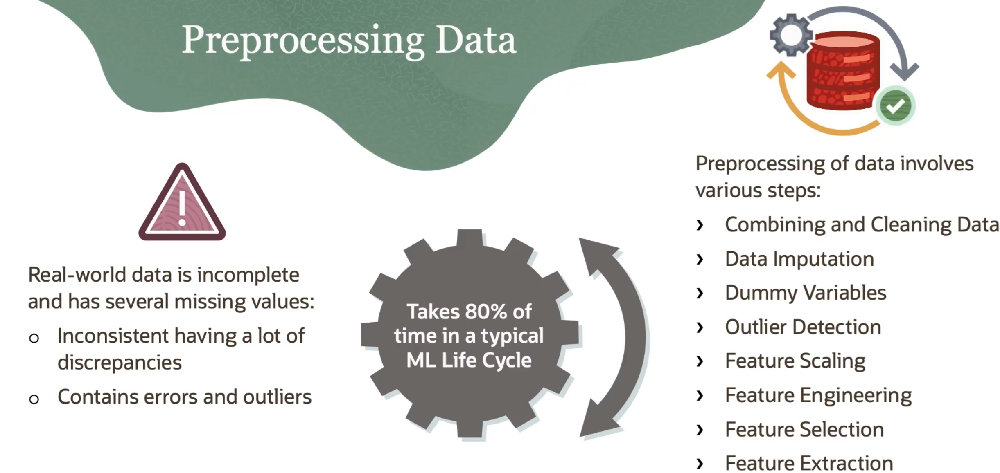
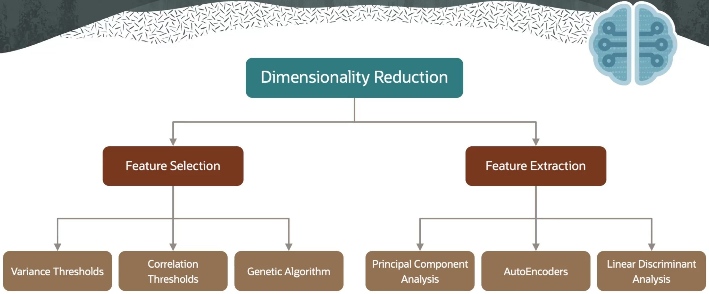
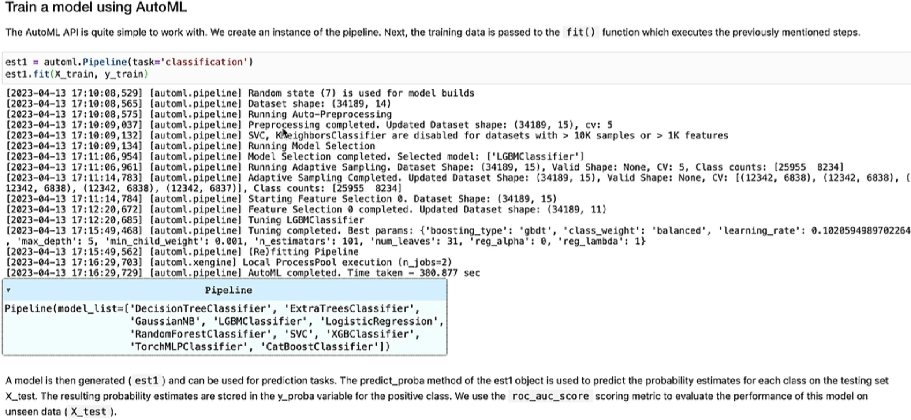

# 🤖 Oracle Cloud Infrastructure Data Science Professional  

## Study Notes & Summaries  

_A comprehensive guide based on the official Oracle Data Science Professional Course._  

> 📌 _This is a summary of Oracle University lessons. No personal analysis or opinion is included._  

> ⚙️ **Note:**  
> As part of this course, I will implement the Data Science applications separately using **Databricks Community Edition**, rather than using **Jupyter Notebooks** as shown in the course. All my practical implementations will be stored under the `/DataScience_Projects` folder.  

---  

## 🏅 Certification  

  

**Oracle Cloud Infrastructure 2025 Data Science Certified Professional**  
Certified on **[Insert Date After Passing]**  
*Issued by Oracle University*  

---  

## 📘 Course Overview  

- **Platform:** Oracle Learning  
- **Goal:** Learn how to design, implement, and manage the complete Machine Learning lifecycle on OCI, including workspace setup, data preparation, training, deployment, and MLOps practices.  

---  

## 🧭 Course Structure  

### 1. Welcome to Data Science  

- [x] Course Overview *(7 min)* – ✅ _No notes_  
- [x] Expert Tips: Intro *(1 min)* – ✅ _No notes_  

### 2. Introduction and Configuration  

- [x] Data Science: Introduction *(16 min)* – ✅ [See Summary](#data-science-introduction)  
- [x] ADS SDK Overview *(14 min)* – ✅ [See Summary](#ads-sdk-overview)  
- [x] Tenancy Configuration Basics *(13 min)* – ✅ [See Summary](#tenancy-configuration-basics)  
- [x] Configure a Tenancy with OCI Resource Manager *(4 min)* – ✅ [See Summary](#configure-a-tenancy-with-oci-resource-manager)  
- [x] Networking for Data Science *(8 min)* – ✅ [See Summary](#networking-for-data-science)  
- [x] Authenticate to OCI APIs *(5 min)* – ✅ [See Summary](#authenticate-to-oci-apis)  
- [x] Skill Check: Introduction and Configuration – ✅ [See Summary](#skill-check-introduction-and-configuration)  

### 3. Workspace Design and Setup  

- [x] Projects *(6 min)* – ✅ [See Summary](#projects)  
- [x] Notebook Sessions *(10 min)* – ✅ [See Summary](#notebook-sessions)  
- [x] How to Work with JupyterLab *(14 min)* – ✅ [See Summary](#how-to-work-with-jupyterlab)  
- [x] Conda Environments: Overview *(8 min)* – ✅ [See Summary](#conda-environments-overview)  
- [x] Data Science Conda Environments *(15 min)* – ✅ [See Summary](#data-science-conda-environments)  
- [x] Manage Conda Environments *(11 min)* – ✅ [See Summary](#manage-conda-environments)  
- [x] Demo: Manage Conda Environments *(16 min)* – ✅ [See Summary](#demo-manage-conda-environments)  
- [x] OCI Vault: Introduction *(12 min)* – ✅ [See Summary](#oci-vault-introduction)  
- [x] Using OCI Vault in OCI Data Science *(15 min)* – ✅ [See Summary](#using-oci-vault-in-oci-data-science)  
- [x] Code Repositories (Git) *(21 min)* – ✅ [See Summary](#code-repositories-git)  
- [x] Demo: Code Repositories (Git) *(10 min)* – ✅ [See Summary](#demo-code-repositories-git)  
- [x] Skill Check: Workspace Design and Setup – ✅ [See Summary](#skill-check-workspace-design-and-setup)  

### 4. Machine Learning Lifecycle  

- [x] ML Lifecycle: Overview *(15 min)* – ✅ [See Summary](#ml-lifecycle-overview)  
- [x] Access Data *(10 min)* – ✅ [See Summary](#access-data)  
- [x] Data Preprocessing *(13 min)* – ✅ [See Summary](#data-preprocessing)  
- [x] Demo: Data Preprocessing *(4 min)* – ✅ [See Summary](#demo-data-preprocessing)  
- [x] Data Visualization *(10 min)* – ✅ [See Summary](#data-visualization)  
- [x] Model Training *(4 min)* – ✅ [See Summary](#model-training)  
- [x] Expert Tips: Training a ML Model on OCI *(3 min)* – ✅ [See Summary](#expert-tips-training-a-ml-model-on-oci)  
- [x] Oracle AutoML: Introduction *(11 min)* – ✅ [See Summary](#oracle-automl-introduction)  
- [x] Demo: Oracle AutoML *(29 min)* – ✅ [See Summary](#demo-oracle-automl)  
- [x] Hyperparameter Tuning: ADSTuner *(4 min)* – ✅ [See Summary](#hyperparameter-tuning-adstuner)  
- [x] Model Evaluation *(9 min)* – ✅ [See Summary](#model-evaluation)  
- [x] Expert Tips: ADS Evaluators *(3 min)* – ✅ [See Summary](#expert-tips-ads-evaluators)  
- [ ] Model Explanations: Global Explainer *(14 min)* – ✅ [See Summary](#model-explanations-global-explainer)  
- [ ] Model Explanations: Local Explainer *(8 min)* – ✅ [See Summary](#model-explanations-local-explainer)  
- [ ] Expert Tips: Explainers *(2 min)* – ✅ [See Summary](#expert-tips-explainers)  
- [ ] Model Catalog: Overview *(9 min)* – ✅ [See Summary](#model-catalog-overview)  
- [ ] Model Serialization *(7 min)* – ✅ [See Summary](#model-serialization)  
- [ ] Model Deployment *(11 min)* – ✅ [See Summary](#model-deployment)  
- [ ] Demo: Model Deployment *(6 min)* – ✅ [See Summary](#demo-model-deployment)  
- [ ] Expert Tips: Hugging Face *(2 min)* – ✅ [See Summary](#expert-tips-hugging-face)  
- [ ] Demo: Model Deployment using TensorFlow *(21 min)* – ✅ [See Summary](#demo-model-deployment-using-tensorflow)  
- [ ] LLM Training & LangChain Integration *(3 min)* – ✅ [See Summary](#llm-training--langchain-integration)  
- [ ] Demo: Deploy LangChain based RAG to OCI Data Science *(4 min)* – ✅ [See Summary](#demo-deploy-langchain-based-rag-to-oci-data-science)  
- [ ] Demo: OCI Data Science Operators *(10 min)* – ✅ [See Summary](#demo-oci-data-science-operators)  
- [ ] Demo: OCI AI Quick Actions *(4 min)* – ✅ [See Summary](#demo-oci-ai-quick-actions)  
- [ ] Skill Check: Machine Learning Lifecycle – ✅ [See Summary](#skill-check-machine-learning-lifecycle)  

### 5. MLOps Practices  

- [ ] MLOps Architecture *(6 min)* – ✅ [See Summary](#mlops-architecture)  
- [ ] Data Science Jobs *(11 min)* – ✅ [See Summary](#data-science-jobs)  
- [ ] Demo: Create Artifacts *(4 min)* – ✅ [See Summary](#demo-create-artifacts)  
- [ ] Demo: Create and Manage Jobs *(5 min)* – ✅ [See Summary](#demo-create-and-manage-jobs)  
- [ ] Demo: Start and Manage a Job Run *(7 min)* – ✅ [See Summary](#demo-start-and-manage-a-job-run)  
- [ ] Demo: Scaling *(4 min)* – ✅ [See Summary](#demo-scaling)  
- [ ] Jobs Monitoring and Logging *(6 min)* – ✅ [See Summary](#jobs-monitoring-and-logging)  
- [ ] Data Science Pipeline *(7 min)* – ✅ [See Summary](#data-science-pipeline)  
- [ ] Demo: Data Science Pipeline *(16 min)* – ✅ [See Summary](#demo-data-science-pipeline)  
- [ ] Model Deployment: Autoscaling *(8 min)* – ✅ [See Summary](#model-deployment-autoscaling)  
- [ ] Expert Tips: Pipelines *(2 min)* – ✅ [See Summary](#expert-tips-pipelines)  
- [ ] Skill Check: MLOps Practices – ✅ [See Summary](#skill-check-mlops-practices)  

### 6. Related OCI Services  

- [ ] Spark Applications, Data Flow, and Data Science *(11 min)* – ✅ [See Summary](#spark-applications-data-flow-and-data-science)  
- [ ] Oracle Open Data *(3 min)* – ✅ [See Summary](#oracle-open-data)  
- [ ] OCI Data Labeling *(6 min)* – ✅ [See Summary](#oci-data-labeling)  
- [ ] Skill Check: Related OCI Services – ✅ [See Summary](#skill-check-related-oci-services)  

---  

# 📂 Lesson Notes  

---  

# 2. Introduction and Configuration  

# Data Science: Introduction

---  

## Key Concepts
- **Oracle Cloud Infrastructure (OCI) Data Science** – Cloud service for full ML lifecycle support.  
- **Data Science Lifecycle** – Build, train, deploy, and manage machine learning models.  
- **Historical Context of Data Science** – Key figures: William Ockham, Tobias Mayer, Arthur Samuel, John W Tukey, Deep Blue, DJ Patil, Jeff Hammerbacher.  
- **Machine Learning & AI Services** – OCI ML services (for data scientists) vs AI services (pre-built models via API).  
- **Employee Attrition Use Case** – Example to connect ML concepts to real business problems.  
- **Core Principles of OCI Data Science** – Accelerate individual productivity, enable collaboration, enterprise-grade reliability.  
- **Key Terminology** – Projects, Notebook Sessions, Conda, ADS SDK, Model Catalog, Model Deployment, Data Science Jobs.  
- **Access Methods** – OCI Console, REST API, SDKs, CLI.  
- **Global Availability** – OCI regions providing secure, high-performance cloud environments.  

#### Historical Foundations of Data Science
- **Ockham’s Razor (1300s)** – Favor simple solutions; applied to machine learning.  
- **Tobias Mayer (1700s)** – Importance of collecting large datasets; early data science.  
- **Arthur Samuel (1952)** – Coined “machine learning”; checkers game AI.  
- **John W. Tukey (1962)** – Predicted computing’s impact on empirical data analysis.  
- **Deep Blue (1997)** – IBM supercomputer defeated Garry Kasparov in chess.  
- **Data Science Emergence (2008)** – DJ Patil and Jeff Hammerbacher formalized the field.  
- **Great Resignation (2021)** – Modern application of data science to employee attrition.  

#### Oracle AI & Data Science Ecosystem
- **Data as Foundation** – Structured and unstructured data from multiple sources (sensors, apps, social media, text, images, video).  
- **ML vs AI Services**:  
  - **ML Services** – For data scientists to build, train, deploy models using open-source frameworks.  
  - **AI Services** – Pre-built or customer-trained models accessed via API; no infrastructure management.  
- **Supporting Services** – Data labeling, business analytics, graph analytics, data integration, and management.  
- **Enterprise Integration** – Security, access control, managed infrastructure, patching, and upgrades handled by OCI.  

#### OCI Data Science Core Principles
- **Accelerate Individual Productivity** – Pre-installed open-source libraries, scalable compute, Oracle libraries.  
- **Collaboration** – Share assets, ensure reproducibility and auditability across teams.  
- **Enterprise-Grade** – Fully managed cloud infrastructure with integrated security and compliance.  

#### OCI Data Science Features & Terminology
- **Projects** – Collaborative containers for organizing notebooks, models, and assets.  
- **Notebook Sessions** – JupyterLab interactive coding environment for model development.  
- **Conda** – Python environment and package management for reproducible work.  
- **Accelerated Data Science (ADS) SDK** – Automates ML workflow tasks: data access, visualization, AutoML, evaluation, model explanation, and OCI service integration.  
- **Model Catalog** – Central repository for storing, sharing, and managing models with provenance metadata.  
- **Model Deployment** – Deploy models as HTTP endpoints for real-time predictions.  
- **Data Science Jobs** – Define and execute repeatable ML tasks on managed infrastructure.  
- **Access Methods** – OCI Console (browser-based), REST API, SDKs (Python, Java, TypeScript, .NET, Go, Ruby), CLI.  
- **Global Availability** – OCI regions offer secure, high-performance environments worldwide.  

## ✅ Summary
This module introduced **OCI Data Science** and its role in enabling end-to-end machine learning in the cloud. Historical context highlighted the evolution of data science and machine learning. Key OCI principles—productivity, collaboration, and enterprise-grade reliability—were emphasized alongside core features such as projects, notebook sessions, ADS SDK, model catalog, and model deployments. Students are prepared to leverage cloud infrastructure for real-world scenarios, with employee attrition as a primary use case, and to access OCI Data Science via multiple interfaces globally. The next module will cover **provisioning and configuring the cloud environment** to begin hands-on machine learning work.

# ADS SDK Overview  

---  

## Key Concepts
- **Accelerated Data Science (ADS) SDK** – Python library designed by data scientists for data scientists to support the full ML lifecycle.  
- **End-to-End ML Workflow** – Connect to data, perform exploratory analysis, feature engineering, model training, evaluation, interpretability, and deployment.  
- **ADS Versions** – Public version (PyPi/GitHub) vs Oracle Cloud integrated version with AutoML and explainability.  
- **Data Access & Integration** – Connectors for relational and non-relational databases, object storage, cloud providers, web files, and big data services.  
- **Model Management** – Training, hyperparameter tuning, artifact creation, evaluation, interpretability, and deployment.  
- **Feature Engineering & Visualization** – Smart plotting, feature type recommendations, correlation plots, and transformation suggestions.  
- **Model Explainability** – Local and global interpretability, what-if scenario testing, and accumulated local effects (ALE) plots.  
- **Deployment & Logging** – Model deployment for various ML frameworks with logging of predictions and access.  

#### Overview of ADS SDK
- Designed for data scientists to streamline the machine learning lifecycle in OCI.  
- Integrates OCI services such as Autonomous Database, Big Data Service, and OCI Vault for secure credential management.  
- Improves common tasks such as exploratory data analysis, feature engineering, hyperparameter tuning, AutoML, and model explainability.  
- Accessible via Conda in OCI Data Science Service, or installable from PyPi or GitHub.  

#### Connecting to Data Sources
- **Local & Object Storage** – ADS provides access to block storage and object storage using OCI protocols, allowing Pandas integration as if local.  
- **Databases** – Easy connections to Oracle DB, Autonomous Database, and other cloud providers (S3, GCS, Azure, Dropbox).  
- **Non-Relational & Big Data** – Connect to NoSQL databases and Hadoop-based Big Data Service (BDS) without local copying.  
- **Web Access** – Read files directly from HTTP/HTTPS sources into dataframes.  

#### Data Visualization & Feature Engineering
- **Exploratory Data Analysis (EDA)** – Smart plotting with reusable feature type classes and default visualizations.  
- **Feature Engineering** – ADS dataset class provides transformations, categorical encoding, null value handling, and recommendations for improved model features.  
- **Correlation & Summary Tools** – Summary statistics, visualizations, and correlation heat maps for deeper data understanding.  

#### Model Training & Optimization
- **AutoML** – Automatically trains multiple models, tunes hyperparameters, and provides performance metrics.  
- **ADSTuner** – Supports manual hyperparameter optimization for fine-tuned model performance.  
- **Model Artifacts** – Packages trained models for storage in the model catalog and deployment.  

#### Model Evaluation & Interpretability
- **Model Evaluation** – ADS evaluator provides metrics and charts appropriate for classification and regression problems.  
- **Interpretability & Explainability** – Model-agnostic explanations including local (single prediction) and global (overall behavior) insights.  
- **Visualization Tools** – Partial dependence plots and accumulated local effects (ALE) plots to understand relationships and model learning.  

#### Model Deployment & Logging
- **ADS Model Framework** – Deploy models of various types (AutoML, PyTorch, scikit-learn, TensorFlow, generic models) with minimal commands.  
- **Production Monitoring** – Integration with OCI logging for tracking predictions and access, ensuring secure and observable model operations.  

## ✅ Summary
This module provided a comprehensive overview of the **ADS SDK**, covering its goals, installation methods, and integration with OCI services. Key functionalities include connecting to diverse data sources, exploratory analysis, feature engineering, AutoML, hyperparameter tuning, evaluation, and model interpretability. The SDK simplifies model deployment and monitoring in production while supporting a variety of ML frameworks. By using ADS, data scientists can accelerate workflows, ensure model reliability, and integrate seamlessly with OCI for enterprise-grade ML operations.

# Tenancy Configuration Basics  

--- 

## Key Concepts
- **Tenancy Configuration** – Organizing and managing access to OCI Data Science resources.  
- **Compartments** – Logical containers to organize resources and control access.  
- **User Groups & Dynamic Groups** – Groups of users or resources that define access permissions.  
- **Policies** – Rules that define what actions groups can perform on resources within compartments.  
- **Matching Rules** – Criteria to dynamically assign resources to dynamic groups.  
- **Policy Syntax & Verbs** – Defines access level: `inspect`, `read`, `use`, `manage`.  
- **Required & Optional Policies** – Policies necessary for data science operations and additional useful policies.  

#### Compartments
- Logical grouping of cloud resources to manage access.  
- Can be created via the Identity Console by specifying a name, description, and optional tags.  
- Planning compartment structure is recommended before creation.  
- Access to compartments is granted through policies to user and dynamic groups.  

#### User Groups
- Collections of users with defined access to resources.  
- Steps to create:  
  1. Create individual users.  
  2. Create user groups.  
  3. Add users to groups.  
- Determines how users interact with resources in compartments.  

#### Dynamic Groups
- Special groups containing resources that match defined rules.  
- Resources include notebook sessions, model deployments, and job runs.  
- Membership changes dynamically as resources are created or deleted.  
- Enables resource principals to make API calls according to policies.  
- Created via Identity Console with name, description, and matching rules (e.g., compartment OCID).  

#### Policies
- Define access for users and resources at the group and compartment level.  
- **Basic Syntax:**  Allow group <group-name> to <verb> <resource-type> in compartment <compartment-name>
- **Verbs:**  
- `inspect`: list resources without accessing user metadata.  
- `read`: access resources and user-specified metadata.  
- `use`: read plus ability to work with resources (update but not create/delete).  
- `manage`: full permissions, including create and delete.  
- **Resource Types:**  
- Specific (e.g., `data science model`) or aggregate (e.g., `data science family`).  

#### Required Data Science Policies
- Allow user groups to manage all data science resources in a compartment.  
- Allow dynamic groups to manage all data science resources.  
- Enable access to metrics and logging:  
- User group: read metrics and manage log groups.  
- Dynamic group: use log content.  
- Optional policies for custom networking and accessing related OCI services (e.g., object storage, virtual networks).  

#### Creating and Managing Resources
- **Compartment Creation:** Identity Console → Compartments → Create Compartment → Name & Description → Create.  
- **User Creation:** Identity Console → Users → Create User → Name, Description, Email → Create.  
- **Group Creation:** Identity Console → Groups → Create Group → Name & Description → Add Users.  
- **Dynamic Group Creation:** Identity Console → Dynamic Groups → Create Dynamic Group → Name & Description → Add Matching Rules.  
- **Policy Management:** Use Policy Builder (manual editor) to create, edit, and save required and optional policies.  

## ✅ Summary
This module covered **OCI tenancy configuration basics** for Data Science. Key components include **compartments** for organizing resources, **user groups** and **dynamic groups** for access management, and **policies** for defining permissions. The lesson explained **matching rules** for dynamic groups, **policy syntax and verbs**, and both **required and optional policies** for data science operations. Practical demonstrations included creating compartments, users, groups, dynamic groups, and applying policies to manage access effectively. The knowledge from this module ensures secure, structured, and efficient management of OCI Data Science resources.

# Configure a Tenancy with OCI Resource Manager  

---  

## Key Concepts
- **OCI Resource Manager (ORM)** – Service to automate tenancy configuration for OCI Data Science.  
- **Data Science Service Template** – Preconfigured template that creates essential resources automatically.  
- **Stacks** – ORM constructs used to deploy templates and manage infrastructure as code.  
- **User Groups & Dynamic Groups** – Groups automatically created by the template for access management.  
- **Policies** – Predefined statements controlling user and resource permissions within compartments.  
- **Terraform Scripts** – Alternative method for automating tenancy configuration.  

#### Data Science Service Template
- Automatically creates the following resources for a basic data science use case:  
  - **User Group** – Name defined by the user.  
  - **Dynamic Group** – Name defined by the user with matching rules for:  
    - `datasciencenotebooksession`  
    - `datasciencemodeldeployment`  
    - `datasciencejobrun`  
  - **Policies** – Example statements created:  
    - Allow user group to manage `data-science-family` in the compartment.  
    - Allow dynamic group to manage `data-science-family`.  
    - Allow user group to read metrics.  
    - Allow dynamic group to use log content.  

#### Running the ORM Stack
- **Process Overview:**  
  1. Create the stack.  
  2. Select a template (e.g., Data Science Service).  
  3. Choose the compartment for your resources.  
  4. Configure optional variables.  
  5. Apply the stack to create resources automatically.  
  6. Add users to the created user group.  
- Templates are only accessible via the OCI Console.  
- Stacks can be edited after creation to adjust configurations.  

#### Alternative: Terraform Script
- Tenancy configuration can also be automated using a **Terraform script** available on a public GitHub repository.  
- Offers flexibility for users who prefer infrastructure as code rather than using prebuilt templates.  
- Terraform script replicates the setup of user groups, dynamic groups, and policies similar to the Data Science Service template.  

## ✅ Summary
This module focused on automating OCI Data Science tenancy configuration using **OCI Resource Manager**. The **Data Science Service template** simplifies setup by creating user groups, dynamic groups, and essential policies automatically. Users can deploy these resources by running an ORM stack and then adding users to the created groups. For users preferring code-based configuration, a **Terraform script** is available on GitHub. This approach ensures consistent, repeatable, and efficient setup of OCI Data Science resources.

# Networking for Data Science  

---

## Key Concepts
- **Virtual Cloud Network (VCN)** – A virtual private network in Oracle Cloud used to organize and isolate resources.  
- **Subnet** – A subdivision of a VCN; contains VNICs and defines routing, security, and DHCP options.  
- **Virtual Network Interface Card (VNIC)** – Connects instances to subnets, enabling communication inside and outside the VCN.  
- **Dynamic Routing Gateway (DRG)** – Provides private network traffic paths between VCNs or to on-premises networks.  
- **NAT Gateway** – Enables outbound internet access for private resources without exposing them to incoming traffic.  
- **Service Gateway** – Allows private network traffic between VCN resources and supported Oracle Cloud services.  
- **Data Science Workloads** – Resources like notebook sessions, jobs, job runs, and model deployments.  
- **Networking Patterns** – Default (service-managed) or custom (bring-your-own VCN) networking for workloads.  

#### Cloud Networking Components
- **VCN & Subnets**  
  - VCN is a virtual private network; subnets act as configuration units within it.  
  - Subnets ensure consistent routing, security, and DHCP options for all VNICs.  
- **VNICs**  
  - Attach to workloads and determine network connectivity.  
- **Optional Virtual Routers**  
  - **DRG** – Connects VCN to other VCNs or on-premises networks.  
  - **NAT Gateway** – Enables outbound internet access for private resources.  
  - **Service Gateway** – Connects VCN to supported OCI services without public IPs.  

#### Networking for Data Science Workloads
- **Default Networking**  
  - Workload attaches via secondary VNIC to a pre-configured service-managed subnet.  
  - Provides egress to the public internet through NAT and access to OCI services via service gateway.  
  - Quick and simple setup without needing custom network resources or policies.  
- **Custom Networking**  
  - Workload attaches to a pre-existing subnet owned by the tenancy.  
  - Enables access to private network resources, e.g., enterprise Git servers or on-prem databases.  
  - Requires coordination with tenancy networking administrator and additional policies.  

#### VCN Wizard Setup
- Steps to create a VCN with internet connectivity:  
  1. Navigate to Networking → Virtual Cloud Networks.  
  2. Start the VCN Wizard and choose "Create VCN with Internet Connectivity."  
  3. Provide a name and optionally configure advanced settings.  
  4. Click Create and wait for resources to be provisioned.  
  5. View the newly created VCN in the console.  
- Note: If tenancy was configured via OCI Resource Manager, this step may already be completed.  

## ✅ Summary
This lesson introduced the key **cloud networking components** required for OCI Data Science, including VCNs, subnets, VNICs, DRGs, NAT, and service gateways. It explained how these components fit together to enable **connectivity for data science workloads** and outlined the two network configuration patterns: **default networking** for quick access to the internet and OCI services, and **custom networking** for private network access. Finally, the VCN Wizard provides a streamlined way to set up networking if not already configured via OCI Resource Manager.

# Authenticate to OCI APIs  

---  

## Key Concepts
- **Authentication vs. Authorization** – Authentication verifies identity; authorization determines access level.  
- **OCI APIs** – Interfaces allowing data science resources (notebook sessions, jobs, model deployments) to interact with other OCI services.  
- **Resource Principals** – Identity and Access Management (IAM) feature allowing OCI resources to authenticate securely without storing credentials.  
- **OCI SDKs and CLI** – Interfaces including ADS SDK, OCI Python SDK, and OCI Command Line Interface for interacting with OCI services.  
- **OCI Configuration and API Key** – Alternative authentication method using configuration files and API keys for personal IAM users.  

#### Resource Principals
- Each resource (notebook session or job run) has its own identity.  
- Certificates are automatically created, assigned, and rotated for security.  
- Provides a more practical authentication method for non-interactive environments like job runs.  
- Resource principal tokens are cached for 15 minutes; policy or dynamic group changes take effect after cache expiration.  
- Slight interface-specific variations exist for setting resource principals in SDKs or CLI.  

#### Personal IAM User Authentication
- Uses OCI configuration files and API keys.  
- Requires uploading the OCI configuration file and associated `.pem` key files into the notebook session.  
- The `api_key` notebook can be used to generate required configuration and key files.  
- Default method when resource principals are not explicitly used.  

#### Authentication Interfaces
- **ADS SDK** – Supports both resource principal and API key authentication.  
- **OCI Python SDK** – Supports resource principals and configuration file-based authentication.  
- **OCI CLI** – Can authenticate via resource principals or personal IAM credentials.  
- Resource principal authentication is preferred for automated workloads; API key method suits personal IAM access and interactive sessions.  

## ✅ Summary
This lesson covers authenticating OCI APIs for data science workloads. It introduces **resource principals** as a secure and practical method for authenticating notebook sessions and job runs without storing credentials. Alternative authentication via **OCI configuration files and API keys** is explained for personal IAM users. Guidance is provided on using these authentication methods across ADS SDK, OCI Python SDK, and OCI CLI, emphasizing the differences and cache behavior of resource principal tokens. This ensures secure, flexible access to OCI resources for both interactive and automated workloads.

# Skill Check: Introduction and Configuration  

---

#### 1. What does the Data Science Service template in Oracle Resource Manager (ORM) NOT automatically create?  
✅ Correct Answer: Individual Data Science users  

🧠 Explanation: Oracle Resource Manager automatically creates the policies for a basic use case, required user groups, and dynamic groups. However, it does **not** create individual Data Science users—these must be created separately by an administrator.  

#### 2. Which statement about resource principals is true?  
✅ Correct Answer: A resource principal is a feature of IAM that enables resources to be authorized principal actors.  

🧠 Explanation: Resource principals provide a secure method for resources (like a notebook session or job) to authenticate to other OCI services without manually managing credentials. Other options are incorrect because resource principals **do** provide secure authentication and do not require separate credential management.  

#### 3. Which feature of Oracle Cloud Infrastructure Data Science provides an interactive coding environment for building and training machine learning models?  
✅ Correct Answer: Notebook session  

🧠 Explanation: OCI Notebook sessions are interactive environments specifically designed for building, exploring, and training ML models. Projects, jobs, and model catalogs serve other purposes but are not interactive coding environments.  

#### 4. What is feature engineering in machine learning used for?  
✅ Correct Answer: To transform existing features into new ones  

🧠 Explanation: Feature engineering improves model quality by creating new features from existing ones. It is **not** primarily about understanding data, tuning parameters, or interpreting models, although it supports those goals indirectly.  

#### 5. Which allows the sharing and loading back of ML models into a Notebook session?  
✅ Correct Answer: Model catalog  

🧠 Explanation: The model catalog is a centralized repository that stores model artifacts along with metadata, allowing models to be shared across team members and reloaded into Notebook sessions. Options like model provenance or deployment are related concepts but do not directly handle sharing/loading.  

#### 6. Which statement about dynamic groups is true?  
✅ Correct Answer: They have matching rules, where is replaced by the identifier of the compartment created for Data Science.  

🧠 Explanation: Dynamic groups are logical collections of OCI resources (like notebooks or jobs) defined by matching rules. They are **not** individual users or access-granted groups; they focus on resources, not people.  

#### 7. Which OCI Data Science interaction method can function in both ways — with or without the need of scripting?  
✅ Correct Answer: OCI Console  

🧠 Explanation: The OCI Console provides a graphical interface that allows interaction with Data Science services without scripting, but it can also support scripted operations in some cases. REST API, SDKs, and CLI require scripting or programming to interact with services.

# 3. Workspace Design and Setup  

# Projects  

---

## Key Concepts
- **Data Science Project** – A collaborative workspace for teams to organize resources and work around a specific use case or business question.  
- **Resources within Projects** – Includes notebook sessions, models, and other data science artifacts associated with a project.  
- **Creation Methods** – Projects can be created via the OCI Console UI or programmatically using the ADS SDK.  
- **Project Metadata** – Includes display name, description, OCID, creation date/time, creator, and tags.  
- **Project Management** – Viewing, editing, and deleting projects, with specific constraints for deletion.  

#### Creating Projects
- **From the Console UI:**  
  - Navigate to Analytics and AI → Data Science → Create Project.  
  - Select the target compartment, optionally provide a name, description, and tags.  
  - View the project details immediately after creation.  

- **From the ADS SDK:**  
  - Use the `ProjectCatalog` object.  
  - Call the `create_project` method, specifying the compartment ID.  
  - Environment variables can be used to align with the notebook session’s compartment.  

#### Project Metadata and Organization
- Projects maintain **metadata**: display name, description, OCID, creation info, and tags.  
- Editable fields include **display name, description, and tags**.  
- Tags help in organizing, filtering, and tracking projects effectively.  

#### Managing Projects
- **Viewing Projects:**  
  - Access all projects via the Project List page.  
  - Click a project to view detailed metadata and associated resources.  

- **Editing Projects:**  
  - Update display name, description, and tags through the Console or SDK.  

- **Deleting Projects:**  
  - Projects must be empty (no associated notebook sessions or models).  
  - Delete from List View or Project View, confirming deletion by entering the project name.  
  - Deleted projects can be filtered out from the active project list.  

## ✅ Summary
This lesson covers the design and management of **data science workspaces** via projects in OCI. Projects provide a structured environment to organize notebooks, models, and other resources around a specific business use case. Learners are introduced to **creating projects** through the Console UI and ADS SDK, **managing metadata** like names, descriptions, and tags, and **project lifecycle operations** including viewing, editing, and deletion. Proper use of projects ensures organized, collaborative, and maintainable data science workflows.

# Notebook Sessions  

--- 

## Key Concepts
- **Notebook Sessions** – Managed JupyterLab environments for building, training, and running models in OCI Data Science.  
- **Managed Infrastructure** – OCI handles compute, storage, software updates, and patching for notebook sessions.  
- **Compute Shapes** – Support for CPU and GPU shapes to match computational needs.  
- **Persistent Storage** – Block storage retains notebooks, data, and environments.  
- **Networking Options** – Default or custom networking for connecting workloads to resources or the internet.  
- **Lifecycle Management** – Activation, deactivation, scaling, and deletion of notebook sessions.  
- **Metrics** – CPU, memory, and network usage for monitoring session performance.  

#### Creating Notebook Sessions
- **From the Console:**  
  - Navigate to a project → Create Notebook Session.  
  - Select compartment, optionally provide a name, compute shape, storage size (50–10,240 GB), and networking type.  
  - Default networking allows quick access to OCI services and internet; custom networking allows connection to pre-existing VCN/subnets.  
  - Creation takes a few minutes; “Open” button is enabled when active.  

#### Managing Notebook Sessions
- **Viewing Sessions:**  
  - All notebook sessions listed on the project’s Notebook Sessions page.  
  - Metadata includes display name, OCID, creation info, compute shape, storage, VCN/subnet, and tags.  

- **Editing Sessions:**  
  - Only the display name is editable once the session is active.  
  - Tags and other settings are viewable across OCI interfaces.  

- **Activating/Deactivating Sessions:**  
  - Activation provisions compute resources; deactivation shuts down compute but retains block storage.  
  - Deactivation reduces costs while preserving notebooks and data.  
  - Reactivation attaches the existing block volume to a new compute instance.  
  - Compute shape, storage, and network configuration can be adjusted during activation.  

- **Deleting Sessions:**  
  - Must confirm by entering the display name.  
  - All files and changes not backed up or committed are lost upon deletion.  
  - Deletion destroys the compute instance and attached block volume.  

#### Monitoring Metrics
- Notebook session Details page provides:  
  - CPU utilization  
  - Memory usage  
  - Network traffic (in and out)  

## ✅ Summary
This lesson introduces **OCI Data Science notebook sessions**, covering their creation, management, and lifecycle. Notebook sessions are fully managed JupyterLab environments supporting both CPU and GPU shapes, with persistent block storage for data and code. Key operations include **activating, deactivating, editing, deleting**, and **monitoring metrics**. Networking options and compute scaling allow flexibility for different workloads. Proper management ensures efficient use of resources, cost control, and preservation of critical project data.

# How to Work with JupyterLab  

---  

## Key Concepts
- **JupyterLab** – Web-based user interface for interactive computing, serving as the interface for OCI notebook sessions.  
- **Integration** – Supports documents, text editors, terminals, notebooks, and custom components.  
- **File Compatibility** – Handles multiple file types including images, CSV, JSON, Markdown, PDF, Vega, and Vega-Lite.  
- **Extensions** – Environment Explorer and GitHub integration for managing conda environments and version control.  
- **Interactive Features** – Code consoles, kernel-backed documents, and live editing across multiple views.  
- **User Interface Elements** – Menu bar, launcher, left/right sidebars, main work area, and command palette.  

#### JupyterLab Interface Overview
- **Top Chrome Bar:** Oracle logo, notebook session name, session timeout, Help icon, sign out.  
- **Left Sidebar:**  
  - File browser for navigating directories and managing files.  
  - Terminal and kernel sessions management.  
  - Git extension for version control.  
  - Command palette to search and run JupyterLab commands.  
  - Property Inspector for notebook-specific actions.  
  - Table of contents for Markdown-based navigation.  
  - Extensions management.  
- **Launcher:**  
  - Quick access to notebooks, consoles, text editors, terminals, Environment Explorer, and notebook examples.  
  - Right side for creating new files and sessions, selecting kernels, and accessing tutorials.  

#### Notebook Operations
- **Creating Notebooks:**  
  - Use the launcher to select a kernel (e.g., Python3) and create a new notebook.  
  - Tips and environment variables are pre-populated for convenience.  
  - Renaming notebooks via right-click.  
- **Running Code:**  
  - Run cells using the triangle icon, Run menu, or Shift+Enter.  
  - Cell execution order displayed with numbered output.  
  - Cell types: Code or Markdown for documentation.  
  - Merge, split, and reorder cells using Edit menu.  
- **Kernel Management:**  
  - Change kernel from the top-right menu.  
  - Interrupt or shut down kernels when necessary.  

#### Advanced Features
- **Variable Inspector:** View variables side-by-side with notebook content.  
- **View Options:**  
  - Show line numbers, collapse/expand cells and outputs.  
- **Themes and Settings:** Customize appearance and behavior of JupyterLab.  
- **File Management:** Create, upload, and interact with various file types; CSV files render with columns and rows.  
- **Terminal Usage:** Standard Linux commands and pre-installed tools like conda CLI, GIT CLI, and OCI CLI.  
- **Help Menu:** Access reference material, FAQs, and documentation.  

## ✅ Summary
This lesson provides a comprehensive overview of **JupyterLab in OCI Data Science**, highlighting its interface, features, and functionality. Users can efficiently create, run, and manage notebooks while leveraging integrated tools such as terminals, variable inspector, Environment Explorer, and GitHub extensions. Navigation, customization, and kernel management enable interactive and productive data science workflows. The lesson emphasizes usability, interactive computing, and multi-format support to streamline development and collaboration within notebook sessions.

# Conda Environments: Overview  

---  

## Key Concepts
- **Conda Environment** – Open-source package management system that bundles Python interpreters, libraries, and software into isolated environments.  
- **Isolation** – Allows separate configurations for different projects, avoiding software conflicts.  
- **Reproducibility** – Ensures that models and computations can be reproduced over time with consistent software versions.  
- **Environment Explorer** – GUI tool in OCI Data Science for managing, exploring, and filtering conda environments.  
- **Types of Conda Environments** – Includes data science managed environments, published (user-managed) environments, and installed environments within notebook sessions.  

#### Benefits of Using Conda
- Install only required packages or update selectively.  
- Switch between multiple isolated environments tailored for specific tasks (e.g., computer vision vs. linear regression).  
- Share environments with team members for consistent collaboration.  
- Deploy models or run jobs in the same environment used during training, ensuring reproducibility.  

#### Conda Environment Management in OCI
- **Environment Explorer:**  
  - Provides card view and list view for managing environments.  
  - Search and filter by keywords, GPU support, or deprecated status.  
- **Data Science Conda Environments:**  
  - Curated and managed by OCI Data Science Service.  
  - Tailored for specific software frameworks (e.g., PyTorch, TensorFlow), industry verticals (e.g., healthcare), or general-purpose tasks (e.g., exploratory data analysis).  
- **Published Conda Environments:**  
  - Created and managed by the user.  
  - Stored in Object Storage for sharing across notebook sessions, teams, and deployments.  
- **Installed Conda Environments:**  
  - Environments installed in individual notebook sessions.  
  - Required for running notebooks; persist across session deactivation/reactivation as stored on block volume.  

#### Workflow with Conda Environments
- Select or create a conda environment suitable for your notebook or project.  
- Use Environment Explorer to manage or filter environments.  
- Switch between environments for different modeling tasks without conflicts.  
- Share published environments with teammates for collaboration and consistent reproducibility.  
- Deploy models or run jobs using the same environment to ensure consistent execution.  

## ✅ Summary
This lesson provides a detailed overview of **conda environments in OCI Data Science**, highlighting their role in isolating software dependencies, enabling reproducible research, and supporting collaboration. Users can leverage managed data science conda environments or create and share their own published environments. Installed environments in notebook sessions ensure that code runs consistently, and the **Environment Explorer** facilitates efficient management, discovery, and filtering of available environments. Conda environments streamline both model development and deployment while maintaining reproducibility and consistency across projects.

# Data Science Conda Environments  

--- 

## Key Concepts
- **Data Science Conda Pack** – Pre-made, curated conda environments provided by Oracle for data science projects, including necessary software and libraries.  
- **Environment Explorer** – GUI tool in JupyterLab to browse, manage, and access conda environments.  
- **Conda Environment Types** – Includes application-based, use case-based, and family/grouping by Python version and architecture.  
- **Naming Conventions** – Environments are named based on application or use case, architecture, Python version, and sometimes version of included software.  
- **Popular Use Cases** – Includes computer vision, data exploration, machine learning, natural language processing, ONNX models, Oracle databases, and frameworks like PyTorch, PySpark, and TensorFlow.  

#### Benefits of Oracle Data Science Conda Environments
- Pre-built for specific tasks or software applications.  
- Includes OCI Python SDK and ADS SDK.  
- Provides access to advanced features such as AutoML and model explainability in select environments.  
- Ensures consistency across notebook sessions, model training, and deployment.  

#### Types and Families of Conda Environments
- **Application-Based Conda Environments** – Focused on software frameworks (e.g., PyTorch, TensorFlow, ONNX, PySpark).  
- **Use Case-Based Conda Environments** – Tailored for tasks such as computer vision, data exploration, natural language processing, and financial analytics.  
- **Conda Environment Families** – Grouped by Python version and architecture (CPU/GPU). Multiple versions may exist for the same environment with software updates.  

#### Popular Conda Environments and Their Features
- **Computer Vision** – Supports image/video processing, object detection, facial recognition, and image stitching. Includes libraries such as scikit-image, Pillow, OpenCV, and PyTorch.  
- **Data Exploration and Manipulation** – For data ingestion, visualization, and streaming. Includes pandas, Matplotlib, Seaborn, Plotly, Bokeh, and Kafka Python library.  
- **General Machine Learning** – Covers data manipulation, supervised learning, AutoML, and model explainability. Includes xgboost, lightgbm, Keras, TensorFlow, Oracle AutoML, and MLX.  
- **Natural Language Processing (NLP)** – For text extraction, key phrase extraction, POS tagging, and deep learning tasks. Includes nltk, KeyBERT, transformers, PyTorch Lightning, and SimpleTransformers.  
- **ONNX Environment** – For portable model formats, conversion between frameworks, and inferencing with ONNX Runtime.  
- **Oracle Database** – Supports Autonomous and on-premise databases (ATP, ADW). Includes ipython-sql, SQL Alchemy, and ADS Connector for ETL, batch processing, and queries.  
- **PyTorch** – Deep learning framework with GPU and CPU acceleration, used for computer vision, NLP, and general ML.  
- **PySpark** – Python API for Apache Spark, supports distributed computing and MLlib for machine learning.  
- **TensorFlow** – Ecosystem for training and deploying deep neural networks. Includes TensorBoard for visualization and ADS for workflow acceleration.  

#### Naming Conventions
- **Application-Based** – `[Software] [Version] for [Architecture] on Python [Version]`. Example: `PyTorch 1.10 for GPU on Python 3.7`.  
- **Use Case-Based** – `[Task] for [Architecture] on Python [Version]`. Example: `Data Exploration and Manipulation for CPU on Python 3.7`.  

## ✅ Summary
Oracle Data Science provides curated **conda packs** to simplify the setup and management of software environments for data science projects. These environments are pre-configured for specific applications or use cases, include key libraries and frameworks, and are organized by Python version and architecture. Users can select the most appropriate environment for tasks such as computer vision, NLP, machine learning, ONNX model execution, database interaction, or distributed computing with PySpark. The **Environment Explorer** in JupyterLab facilitates discovery, management, and customization of these environments, ensuring reproducibility, consistency, and efficiency across notebook sessions, model training, and deployment.

# Manage Conda Environments  

---

## Key Concepts
- **Conda Environment** – A collection of software and libraries bundled together to provide isolated and reproducible setups for data science projects.  
- **odsc CLI** – Oracle Data Science command line tool to manage conda environments with more control than the GUI Environment Explorer.  
- **Environment Explorer** – GUI interface for browsing, managing, and accessing conda environments.  
- **Conda Functionalities via odsc** – Includes browsing, searching, installing, cloning, modifying, publishing, deleting, and creating environments from YAML files.  
- **Slug** – Unique identifier for a conda environment used in commands.  
- **Published Conda** – Custom conda environments shared via Oracle Object Storage for model deployment and team collaboration.  

#### Browsing and Searching Conda Environments
- **Browsing** – Use `odsc conda list` to see details such as name, slug, description, and key libraries.  
  - `odsc conda list --local` lists installed environments in the notebook session.  
  - `odsc conda list --override` lists published environments in object storage.  
- **Searching** – Combine `odsc conda list` with Unix tools like `grep`, `awk`, or `perl` to filter YAML details.  
  - Example: `odsc conda list | grep <pattern>` to extract specific names or slugs.  

#### Installing Conda Environments
- Install managed or published conda environments:  
  - `odsc conda install --slug <slug>` for data science conda environments.  
  - `odsc conda install --slug <slug> --override` for published environments in object storage.  

#### Cloning Conda Environments
- Clone existing environments to create a new custom environment:  
  - `odsc conda clone --from-env <source_slug> --env <new_name>`  
  - Generates a new slug automatically for identification.  

#### Modifying Conda Environments
- Use standard conda commands to modify environments:  
  - Activate environment: `conda activate /home/datascience/conda/<slug>`  
  - Install or upgrade packages: `python3 -m pip install <package> --upgrade`  
- Ensures changes only affect the specific environment without altering others.  

#### Publishing Conda Environments
- Share environments via Object Storage for team use, jobs, and model deployment:  
  1. Initialize bucket once per notebook session:  
     - `odsc conda init --bucket_namespace <namespace> --bucket_name <bucket>`  
  2. Publish environment: `odsc conda publish --slug <slug>`  

#### Deleting Conda Environments
- Remove unneeded environments to free up space:  
  - `odsc conda delete --slug <slug>`  

#### Creating Conda Environments from YAML
- Create environments from scratch using a manifest YAML file:  
  - `odsc conda create --file <yaml_file>`  
  - Optional `--empty` flag prevents base packages from being installed.  
- Base packages include essential tools for notebook sessions.  

## ✅ Summary
Managing conda environments in Oracle Cloud Data Science Service can be done through both the **Environment Explorer GUI** and the **odsc CLI**. The odsc command provides full control over environments, enabling users to browse, search, install, clone, modify, publish, delete, and create conda environments. Custom and published environments can be shared across teams and used in model deployment and jobs, ensuring reproducibility and flexibility. By combining odsc commands with Unix tools, users can efficiently navigate and manipulate their conda setups, supporting consistent and streamlined data science workflows.

# Demo: Manage Conda Environments  

---

## Key Concepts
- **ODSC CLI** – Oracle Data Science command-line tool for managing conda environments with full control over browsing, installing, cloning, modifying, publishing, deleting, and creating environments.  
- **Data Science Service Conda Packs** – Pre-built or custom conda environments used within Oracle Cloud Data Science notebooks for reproducible and isolated workflows.  
- **Slug** – Unique identifier for each conda environment, required for most ODSC operations.  
- **Published Conda Environments** – Custom conda environments uploaded to Oracle Object Storage for sharing and deployment.  
- **Conda YAML File** – Manifest file defining channels, dependencies, and configurations for creating custom conda environments.

#### Browsing and Searching Conda Environments
- **Browsing Environments** – `odsc conda list` returns a YAML file with metadata for all Data Science Service-managed conda packs.  
  - `--local` lists environments installed in the current notebook session.  
  - `--override` lists published conda environments in Object Storage.  
- **Searching** – Combine `odsc conda list` with Unix commands like `grep` to extract names, slugs, or other YAML fields.  
  - Example: `odsc conda list | grep -E 'name|slug'` filters for relevant identifiers.  

#### Installing Conda Environments
- Install managed or published environments:  
  - Managed: `odsc conda install --slug <slug>`  
  - Published: `odsc conda install --slug <slug> --override`  
- Version selection is available during installation to choose a specific release of the environment.  

#### Cloning Conda Environments
- Clone an existing environment to create a separate, modifiable copy:  
  - `odsc conda clone --from-env <source_slug> --env <new_name>`  
  - New slug is automatically generated based on the new name.  

#### Modifying Conda Environments
- Activate environment for modification using the standard conda tool:  
  - `conda activate /home/datascience/conda/<slug>`  
- Install or upgrade packages (e.g., `pip install pendulum`) within the activated environment.  
- Deactivate the environment once modifications are complete.  

#### Publishing Conda Environments
- Steps to share environments via Object Storage:  
  1. Create an Object Storage bucket and note the namespace.  
  2. Initialize ODSC for publishing:  
     - `odsc conda init --bucket_namespace <namespace> --bucket_name <bucket>`  
  3. Publish environment: `odsc conda publish --slug <slug>`  
- Published environments appear under the override view and are stored in bucket folders organized by architecture and version.  

#### Deleting Conda Environments
- Remove unneeded environments from the notebook session:  
  - `odsc conda delete --slug <slug>`  
- Prompts for confirmation before deletion to prevent accidental removal.  

#### Creating Conda Environments from YAML
- Build a new environment from a manifest YAML file:  
  - `odsc conda create --file <yaml_file>`  
  - Optional `--empty` flag prevents installing default base packages.  
- Allows advanced users to define channels, dependencies, and environment specifics programmatically.  

## ✅ Summary
This demo showcased how Oracle Cloud Infrastructure’s **ODSC CLI** provides comprehensive management of conda environments for Data Science Service notebooks. Users learned to **browse, search, install, clone, modify, publish, delete, and create environments from YAML files**. By leveraging ODSC with standard Unix tools, data scientists can efficiently control environment lifecycles, ensure reproducibility, and share custom conda environments for model deployment and collaborative workflows within Oracle Cloud.

# OCI Vault: Introduction  

--- 

## Key Concepts
- **OCI Vault** – A managed Oracle service for securely storing encryption keys and secrets, preventing sensitive credentials from being stored in code or configuration files.  
- **Secrets** – Credentials such as passwords, tokens, or other confidential data used to access OCI services or external systems.  
- **Keys** – Cryptographic entities used for encrypting or signing data; include master encryption keys, data encryption keys, and wrapping keys.  
- **Key Rotation** – The process of generating new key versions to reduce risk if a key is compromised.  
- **OCID** – Oracle Cloud Identifier, a unique identifier for vault components such as keys or secrets, which remains consistent across rotations.  

#### Understanding OCI Vault
- **Purpose** – Centralizes and secures credentials needed for data science workflows, including database access, artifact storage, and OCI service interaction.  
- **Integration** – Works with ADS SDK, OCI CLI, REST API, and other Oracle services for seamless credential management.  
- **Components** –  
  - **Vaults** – Logical containers for keys and secrets. Can be provisioned as virtual private (dedicated HSM) or shared partition.  
  - **Keys** – Cryptographic keys used for encryption, decryption, and digital signatures.  
  - **Secrets** – Encrypted credentials stored securely, accessible when needed by applications or code.  

#### Types of Vaults
- **Virtual Private Vault**  
  - Dedicated hardware security module (HSM) partition.  
  - Supports up to 1,000 key versions.  
  - Allows backups to Object Storage for disaster recovery and cross-region replication.  
- **Shared Vault**  
  - HSM partition shared with other Oracle customers.  
  - Lower cost; pay only for stored keys, key versions, and secrets.  
  - Does not support Object Storage backups.  

#### Keys and Encryption
- **Encryption Algorithms Supported** – AES (symmetric), RSA (asymmetric), ECDSA (asymmetric elliptic curve).  
- **Master Encryption Keys** – Created or imported by users, define encryption algorithm and key shape.  
- **Data Encryption Keys** – Generated using a master key (envelope encryption); encrypt data while minimizing risk if a key is compromised.  
- **Key Rotation** – Creates new key versions while maintaining the ability to decrypt previously encrypted data using older versions.  

#### Managing Secrets
- **Storage** – Store credentials in the Vault rather than code for better security and maintainability.  
- **Access** – Code retrieves secrets using the secret's OCID, without exposing actual credentials.  
- **Versioning and Rotation** – Secrets are versioned; rotating secrets updates their content while keeping the OCID consistent.  
- **Integration** – Secrets can be created via OCI Console UI, SDK, CLI, or REST API.  

## ✅ Summary
This module demonstrated the importance of **OCI Vault** for secure management of secrets and encryption keys in Oracle Cloud Infrastructure. Key takeaways include using vaults to centralize credentials, understanding vault types (virtual private vs shared), leveraging keys and key versions for encryption, and implementing key and secret rotation to reduce security risk. By storing secrets in OCI Vault instead of code, data scientists ensure secure, maintainable, and auditable access to sensitive resources across workflows.

# Using OCI Vault in OCI Data Science  

---

## Key Concepts
- **OCI Vault** – Securely stores encryption keys and secrets, enabling data scientists to protect credentials and sensitive information.  
- **Oracle Managed Keys vs Customer Managed Keys** – Oracle can manage master encryption keys automatically, or customers can manage their own keys in their Vault.  
- **Secrets** – Credentials or sensitive data such as database passwords, authentication tokens, or wallet files.  
- **OCI SDK vs ADS SDK** – OCI SDK provides general-purpose Vault operations; ADS SDK offers data-science-specific classes for simpler integration.  
- **Base64 Encoding** – Used to store Python dictionaries or structured data as secrets in the Vault.  
- **Secret Lifecycle** – Includes creation, storage, retrieval, and rotation of secrets using Vault.

#### Encryption Management in OCI
- **Oracle Managed Keys** – OCI services automatically use Oracle master keys to generate data encryption keys for resources like block volumes, object storage, OKE clusters, etc.  
- **Customer Managed Keys** – Keys are created or imported into a customer Vault, and the customer is responsible for key lifecycle and rotation.  
- **Key Usage** – Master keys generate data encryption keys that encrypt the actual data. Choice of key management is critical for security zones or compliance requirements.  

#### Storing and Retrieving Secrets Using Python
##### Using OCI SDK
- **Secret Preparation** – Credentials are converted from Python dictionary → JSON → Base64 encoded object.  
- **Creating Secret** – Use `Base64SecretContentDetails` to store encoded content, then create `SecretDetails` including metadata (Vault ID, key ID, compartment, description, name).  
- **Vault Client** – `VaultsClient` and `VaultsClientCompositeOperations` are used to create the secret and wait for it to become active.  
- **Retrieving Secret** – Use `SecretsClient` with the OCID of the secret, access `secret_bundle_content.content` to obtain Base64 content, then decode back to JSON and Python dictionary.  

##### Using ADS SDK
- **Simplified Workflow** – ADS SDK provides classes tailored for common data science use cases:  
  - **MySQLDBSecretKeeper** – Stores and retrieves MySQL database credentials.  
  - **ADBSecretKeeper** – Stores Autonomous Database credentials and optional wallet files.  
  - **BDSSecretKeeper** – Stores credentials for OCI Big Data Service and HDFS access.  
  - **AuthTokenSecretKeeper** – Stores authentication tokens for services like streaming or GitHub.  
- **Saving Secrets** – Pass Vault ID, key ID, and credentials dictionary to the `save` method along with optional metadata.  
- **Retrieving Secrets** – Call `load_secret` with the secret OCID to receive a dictionary of credentials in one line of code.  

#### Best Practices
- Avoid storing credentials in code or configuration files.  
- Use Vault to centrally manage and rotate secrets.  
- Choose Oracle or customer managed keys depending on security requirements and compliance.  
- Use ADS SDK classes to simplify secret handling in data science workflows.  

## ✅ Summary
This module demonstrated managing encryption keys and secrets in OCI for data science workflows. Key points include the distinction between Oracle managed and customer managed keys, converting credentials into Base64 secrets, storing and retrieving them with the OCI SDK, and leveraging ADS SDK secret keepers for simplified, workflow-oriented access. By following these practices, data scientists can securely manage credentials, integrate with various OCI services, and minimize the risk of exposing sensitive information.

# Code Repositories (Git)  

---

## Key Concepts
- **Version Control Systems (VCS)** – Tools to track changes in code, notebooks, documents, and analyses over time.  
- **Repositories (Repos)** – Directories that store all versions of a project, allowing collaboration and version history.  
- **Centralized vs Distributed VCS** – Centralized systems rely on a central server; distributed systems (like Git) allow local copies and offline work.  
- **Git** – A distributed version control system widely used for managing code and data science projects.  
- **Git Workflow** – Staging, committing, pushing, pulling, branching, and merging changes.  
- **OCI Code Repository & GitHub Integration** – Cloud-hosted repositories with secure access and external connections for collaboration.

#### Understanding Version Control
- **Purpose** – Tracks changes in software, data analysis, and documents, allowing multiple versions and collaboration.  
- **Resources Managed** – Includes JupyterLab notebooks, datasets, ML models, reports, and code.  
- **Repository Analogy** – A repository is like a filing cabinet storing a project; each commit represents a snapshot in time.  
- **Branching and Merging** – Enables parallel development and testing of new ideas without affecting the main code base.

#### Types of Version Control Systems
- **Centralized VCS** – Simple setup, controlled workflow, examples: Subversion, CVS, Perforce.  
- **Distributed VCS** – Multiple local copies, offline commits, fast branching, examples: Git, Bazaar, Mercurial.  
- **Hybrid Approach** – Distributed system with a central server to simplify collaboration in larger teams.

#### Using Git in Data Science
##### Local Git Workflow
- **Working Area** – Files being actively modified and tracked.  
- **Staging** – Selecting which changes to include in the next commit.  
- **Committing** – Saving a snapshot of staged changes with a message and SHA identifier.  
- **Branching** – Creating isolated copies to experiment or collaborate without affecting the main branch.  
- **Merging** – Combining changes from different branches into a single version.

##### Git in OCI JupyterLab
- **Git Extension** – Graphical interface for creating, cloning, committing, pushing, pulling, and staging changes.  
- **Supported Services** – OCI Code Repository, GitHub, GitLab, Bitbucket, or self-hosted Git servers.  
- **Integration Benefits** – Simplifies version control for notebooks and data science projects.

#### Working with Remote Repositories
- **OCI Code Repository** – Centralized, secure repository integrated with OCI IAM.  
- **External Repos** – GitHub, Bitbucket, GitLab can be linked via secret tokens in OCI Vault.  
- **SSH Authentication** – Use key pairs to connect and authenticate without entering credentials each time.  
- **Common Commands**:
  - `git init` – Initialize a repository.  
  - `git clone` – Copy a remote repository locally.  
  - `git add` – Stage files for commit.  
  - `git commit` – Create a snapshot of changes.  
  - `git push` – Upload local commits to a remote repo.  
  - `git pull` – Fetch and merge changes from a remote repo.  
  - `git fetch` – Retrieve updates without merging.  
  - `git remote` – Manage connections to remote repositories.

## ✅ Summary
This module introduced version control systems and their importance for data science workflows. Key points include centralized versus distributed systems, the role of repositories, and Git’s features for managing code and collaborative work. You learned how to use Git locally, with OCI JupyterLab’s Git extension, and how to connect to remote repositories like OCI Code Repository and GitHub. Essential Git commands and workflows for staging, committing, branching, merging, pushing, and pulling were covered to enable efficient and organized project development.

# Demo: Code Repositories (Git)  

---

## Key Concepts
- **OCI Data Science Notebooks** – The working environment where Git is configured and used.  
- **Git Configuration** – Setting `user.name` and `user.email` to track authorship of commits.  
- **SSH Keys for Authentication** – Secure method for authenticating with GitHub, managed through private/public key pairs.  
- **Remote Repository Linking** – Connecting a local repository in an OCI Notebook to a GitHub repository via SSH.  
- **Git Workflow in OCI** – Creating, staging, committing, and pushing files between local and GitHub repositories.  

#### Configuring Git in an OCI Notebook
- Used `git config user.name` and `git config user.email` to record commit authorship.  
- Verified setup with `git config --list`.  
- Initialized a local repository in a new folder within the notebook environment.  

#### Generating and Using SSH Keys
- Generated keys using `ssh-keygen`, creating both private and public keys.  
- Added the private key to the SSH agent with `ssh-add`.  
- Copied the public key to GitHub under **SSH and GPG Keys** for authentication.  
- Verified setup by linking the local repo to GitHub via the SSH connection string.  

#### Creating and Linking Repositories
- Created a local Git repository in the notebook session.  
- Created a new GitHub repository through the GitHub interface.  
- Connected the local repo to GitHub using `git remote add` (via the Git tab).  
- Confirmed the remote connection with `git remote -v`.  

#### Working with Notebooks and GitHub
##### Staging and Committing
- Created a new Jupyter Notebook file in the session.  
- Tracked the notebook in Git, staged it, and committed with an "Initial Commit" message.  

##### Pushing to GitHub
- Configured upstream tracking with `git push --set-upstream origin master`.  
- Pushed commits from the notebook environment to GitHub.  
- Verified changes in the GitHub repository.  

##### Making and Syncing Changes
- Edited the notebook (e.g., added math code).  
- Saved changes, staged updates, and committed with a descriptive message.  
- Pushed changes again and confirmed updates in GitHub.  

## ✅ Summary
This demo showed how to integrate GitHub with OCI Data Science Notebooks using SSH authentication. Key steps included configuring Git, generating SSH keys, creating and linking local and remote repositories, and demonstrating the Git workflow of staging, committing, and pushing changes. The process ensures seamless synchronization between local notebook sessions and GitHub repositories, supporting version control and collaborative workflows.

# Skill Check: Workspace Design and Setup  

---

#### 1. What is a conda environment?  
✅ Correct Answer: An open source package and environment management system  

🧠 Explanation: Conda is both a package manager and an environment management system. It helps find and install packages and also manage environments. The other options (system for dependencies, kernel collection, Oracle AI deployment system) do not accurately describe Conda.  

#### 2. Which model has an open source, open model format that allows you to run machine learning models on different platforms?  
✅ Correct Answer: ONNX  

🧠 Explanation: ONNX is an open source format that makes ML models portable across platforms and frameworks. TensorFlow and PyTorch are frameworks for training models, and PySpark is used for data processing, not model portability.  

#### 3. What happens when a notebook session is deactivated?  
✅ Correct Answer: The underlying compute instance stops.  

🧠 Explanation: Deactivating a notebook session halts the compute instance and detaches the block volume, preserving data. It reduces costs instead of increasing them, and it does not delete the block volume or discard the boot volume’s data.  

#### 4. What is an accurate description of Git?  
✅ Correct Answer: Git is a distributed version control system that allows you to track changes made to a set of files.  

🧠 Explanation: Git works by cloning the entire repository, including its history, allowing you to track, commit, and push changes. It is distributed, not centralized, and while it supports collaboration, its main function is version control, not preventing merges.  

#### 5. Which is a unique feature of the published Conda environment?  
✅ Correct Answer: It allows you to save the Conda environment to an Object Storage bucket.  

🧠 Explanation: Published Conda environments are saved to Object Storage, making them persistent and shareable across Notebook sessions. Other options mention features (availability, solving business cases, block volume storage) that are not the unique publishing characteristic.  

#### 6. Which CLI command allows a customized Conda environment to be shared with co-workers?  
✅ Correct Answer: odsc conda publish  

🧠 Explanation: The `odsc conda publish` command packages a Conda environment and uploads it to Object Storage, enabling sharing. The other commands (clone, modify, install) serve different purposes and do not publish or share environments.  

#### 7. Which activity of managing a conda environment requires the conda environment to be activated in your terminal?  
✅ Correct Answer: Modifying a Conda environment  

🧠 Explanation: To add, remove, or change libraries, the Conda environment must be active. Publishing, installing, or cloning can be done without activation.  

#### 8. Where are OCI secrets stored?  
✅ Correct Answer: OCI Vault  

🧠 Explanation: Secrets such as passwords, tokens, and credentials are securely stored in OCI Vault. Object Storage, databases, and Autonomous Data Warehouse are not designed for secret storage.  

# 4. Machine Learning Lifecycle  

# ML Lifecycle: Overview  

---

## Key Concepts
- **Machine Learning Lifecycle** – A structured process to build, deploy, and maintain ML models, consisting of six steps: data access, data exploration and preparation, modeling, validation, deployment, and monitoring.  
- **Iterative Nature** – The lifecycle is not linear; steps are repeated and refined until satisfactory performance is achieved.  
- **OCI Data Science Integration** – Provides tools to support each stage of the lifecycle, from data handling to deployment and monitoring.  
- **Business Problem Orientation** – The lifecycle begins with a business objective that guides every technical decision.  

#### Data Access and Preparation
- Data is collected into the notebook session in OCI Data Science for quick access.  
- Sources include enterprise data sets (data lakes, relational and non-relational databases), unstructured data (logs, images, video), public datasets, and data purchased or collected from surveys and sensors.  
- Preparation involves cleansing, handling missing or corrupt data, and labeling data when necessary (with OCI Data Labeling Cloud Service).  
- Exploratory Data Analysis (EDA) includes examining feature distributions, identifying outliers, correlations, skew, bias, and missing values.  
- Feature engineering transforms raw data into meaningful features, such as categorizing time-of-day in traffic datasets or encoding categorical features.  

#### Modeling and Validation
- **Model Building** – Choosing appropriate algorithms (supervised vs. unsupervised), experimenting with features, and training models.  
- **Supervised Learning** – Includes classification and regression tasks requiring labeled data.  
- **Unsupervised Learning** – Focuses on clustering or pattern discovery without labeled outputs.  
- **Validation** – Splitting datasets into training and testing sets to evaluate model performance.  
- **Metrics** – Selection depends on the business case:  
  - Classification: accuracy, precision, recall, confusion matrix.  
  - Regression: RMSE, MAE, R².  
  - Clustering: cohesion of clusters.  
- Multiple models are compared, and the best candidates are preserved using OCI’s model catalog.  

#### Model Deployment
- Models are deployed for either **batch consumption** (scheduled inferencing) or **real-time inferencing** (on-demand predictions such as fraud detection).  
- Deployment often requires collaboration with ML ops engineers to manage pipelines and system integration.  
- Considerations include latency requirements, throughput, and system resource management.  

#### Model Monitoring
- **Statistical Monitoring** – Detects model drift, data distribution changes, or prediction inconsistencies.  
- **Ops Monitoring** – Tracks latency, CPU/memory usage, throughput, reliability, and system logs.  
- Monitoring ensures long-term effectiveness and indicates when retraining or redeployment is needed.  
- Collaboration between data scientists and engineers is essential for both performance and infrastructure monitoring.  

## ✅ Summary
This lesson introduced the machine learning lifecycle as a six-step, iterative process supported by OCI Data Science. Starting with data access and preparation, progressing through modeling and validation, and concluding with deployment and monitoring, each phase ensures models are built to address business objectives effectively. Continuous monitoring and iteration are essential for sustaining model accuracy and performance over time, making the lifecycle a dynamic and ongoing process.

# Access Data  

---

## Key Concepts
- **Importance of data** in the machine learning lifecycle.  
- **Data categories**: batch data, streaming data, and application data.  
- **Why data is needed**: for hypothesis-driven or data-driven insights and problem-solving.  
- **Data access in OCI Data Science**: through user interface, command line, and Accelerated Data Science (ADS) libraries.  
- **Common data sources**: OCI Object Storage, local storage, Autonomous Databases, MySQL, Amazon S3, HTTP/HTTPS endpoints, DatasetBrowser, and PyArrow.  
- **Semantic data types**: categorical, ordinal, continuous, and datetime.  
- **Supported and unsupported formats** in ADS.  

#### Data Categories and Collection
- **Batch data**: generated over time (e.g., backups, migrations).  
- **Stream data**: logs, IoT device outputs, user events.  
- **Application data**: created via API calls, logs, or application events.  
- Data must be **collected into OCI** for preprocessing and training.  

#### Accessing Data Sources
##### OCI Object Storage
- Data accessed via **API keys** or **resource principals**.  
- `set_auth` module manages identity settings.  

##### Local Storage
- Use pandas functions like `read_csv()` with file paths.  

##### Oracle Autonomous Databases
- Supports both services with `ads.read_sql` (15x faster than pandas `read_sql`).  
- Connection with or without **wallet files**.  
- Best practices: use **bind variables** to avoid SQL injection; optimize queries with indexes.  

##### MySQL
- Access with ADS, defining engine as `MySQL`.  
- `ads.to_sql` saves DataFrames back into MySQL.  

##### Amazon S3
- Public and private files accessible via pandas.  
- Private access requires credentials in `storage_options`.  

##### HTTP/HTTPS Endpoints
- Load data directly from URLs with pandas.  

##### DatasetBrowser
- Easy access to well-known datasets from libraries like Seaborn, Sklearn, GitHub.  
- Functions: `list()` to see available datasets, `open()` to load them.  

##### PyArrow and OCI File Systems
- Enables large-scale data processing.  
- Provides file system–style operations with connection info.  

#### Semantic Data Types in ADS
- **Categorical**: labeled groups without order (e.g., eye color).  
- **Ordinal**: ordered categories (e.g., education levels).  
- **Continuous**: measurable quantitative data (e.g., height).  
- **Datetime**: temporal data in date/time formats.  
- Inspectable using `feature_types` and `show_in_notebook`.  

#### Supported Sources and Formats
- **Supported**: multiple structured and semi-structured formats from supported data sources.  
- **Unsupported**: DOC, PDF, raw images, sequences (lists, tuples).  
- **Text extraction module** converts PDF or DOC into plain text.  

## ✅ Summary
This lesson introduced the first step in the machine learning lifecycle: **data access**. Data can be collected from diverse sources—batch processes, streams, and applications—and must be brought into OCI for use in data science. Oracle’s Accelerated Data Science (ADS) library provides efficient methods to access and process data from Object Storage, Autonomous Databases, MySQL, Amazon S3, HTTP endpoints, DatasetBrowser, and PyArrow. Alongside data access, the lesson covered recognition of **semantic data types** and clarified **supported vs. unsupported formats**. Together, these tools and practices ensure data scientists can efficiently prepare and use data for model development in OCI Data Science.

# Data Preprocessing  

---

## Key Concepts
- **Second step of the ML lifecycle**: data exploration and preparation.  
- **Need for preprocessing**: real-world data is often incomplete, inconsistent, or contains outliers.  
- **Core preprocessing tasks**: combining sources, handling missing data, encoding categorical features, detecting outliers, feature scaling, dimensionality reduction, and text preprocessing.  
- **ADS tools**: `suggest_recommendations`, `auto_transform`, and `visualize_transforms`.  
- **Splitting data**: dividing into train, test, and validation sets for model generalization.  

#### Data Cleaning and Preparation
- **Combining sources**: join, append, delete, or filter rows/columns; ensure consistent formats and remove duplicates.  
- **Data imputation**: replace missing values with mean, median, or mode; avoid deleting rows unless necessary.  
- **Categorical encoding**:  
  - `label_encoder` for nominal features.  
  - One-hot encoding for ordinal or hierarchical categories.  

#### Outlier Detection
- Outliers may be errors or valid unusual points.  
- Detection methods: scatterplots, boxplots, or statistical measures.  
- **Supervised learning**: needs labeled data but requires manual effort.  
- **Unsupervised learning**: assumes outliers are rare and do not follow the main data trend.  

#### Feature Scaling and Dimensionality
- **Feature scaling**:  
  - **Normalization** (min–max scaling to [0,1]).  
  - **Standardization** (mean = 0, variance = 1, Gaussian distribution).  
- **Dimensionality reduction**:  
  - **Feature selection**: subset of original variables.  
  - **Feature extraction**: create new features from existing ones.

#### Text Data Preprocessing
- Steps include: vectorization, stop-word removal, POS tagging, tokenization, stemming, and lemmatization.  

#### ADS Transformation Tools
- **`suggest_recommendations`**: detects issues and recommends fixes interactively.  
- **`auto_transform`**: applies multiple optimizations automatically (imputation, dropping correlated columns, handling class imbalance).  
- **`visualize_transforms`**: produces diagrams of applied transformations.  

#### Splitting Data Sets
- Essential for evaluating generalization.  
- Default ADS split: **80% training, 10% testing, 10% validation**.  
- Ratios can be adjusted: larger training sets (80–90%) for big data, smaller (60–70%) when data is limited.  

## ✅ Summary
This lesson covered **data exploration and preparation**, the second step of the ML lifecycle. Real-world data often requires cleaning, imputation, encoding, and scaling before it can be used effectively. Oracle’s ADS library provides tools for automated transformations, issue detection, and visualization, helping streamline preprocessing. Finally, splitting datasets into train, test, and validation sets ensures robust model evaluation and generalization. These steps form the foundation for building reliable machine learning models in OCI Data Science.

# Demo: Data Preprocessing  

---

## Key Concepts
- **Accelerated Data Science (ADS)**: Oracle’s Python library for simplifying ML workflows.  
- **Resource Principal Method**: Used to securely load data from object storage into a DataFrame within an OCI Data Science notebook session.  
- **ADS Transformation Tools**: `suggest_recommendations`, `auto_transform`, and `visualize_transforms` to detect, apply, and review preprocessing steps.  
- **ADS Categorical Encoder**: `ads.dataset.labelencoder` to transform categorical values into numerical representations.  
- **ADS Sampling Utilities**: `upsample` and `downsample` methods from `ads.dataset.helper` for handling imbalanced datasets.  
- **Data Splitting in ADS**: Built-in functions to divide data into training, testing, and validation sets (default split: 80/10/10).  

#### Loading and Exploring the Dataset
- Dataset used: Employee dataset with **1,470 rows** and **36 features** (22 ordinal, 11 categorical, 3 constant).  
- Target feature defined: **Attrition** (whether employees stay or leave).  
- Data accessed through **object storage** using namespace, bucket, and dataset factory methods in the OCI Data Science notebook.  

#### Automated Data Transformations
- **`suggest_recommendations`**: Scans the dataset and provides messages with issues and recommended actions.  
- **`auto_transform`**: Automatically applies optimizations and produces a transformed dataset.  
- **`visualize_transforms`**: Allows comparison between original and transformed datasets.  

#### Encoding and Balancing Data
- **Categorical Encoding**: Example shown on the *job function* feature, converting categories into numeric values.  
- **Upsampling**: Used to balance the dataset by replicating underrepresented records.  
- **Validation**: Checked by comparing attrition value counts before and after upsampling.  

#### Splitting the Dataset
- After transformations, the dataset can be split into:  
  - Training set (default 80%)  
  - Testing set (default 10%)  
  - Validation set (default 10%)  

## ✅ Summary
This demo demonstrated how to use **Oracle’s ADS library** within an OCI Data Science notebook to preprocess a dataset. Key steps included loading data securely from object storage, applying automated transformations, encoding categorical variables, balancing the dataset through upsampling, and splitting data into training, testing, and validation sets. The session highlighted how ADS simplifies and accelerates essential preprocessing tasks for machine learning workflows in Oracle Cloud.

# Data Visualization  

---

## Key Concepts
- **Data Visualization (DV)**: The process of presenting data to reveal insights, patterns, and relationships for analysis and decision-making.  
- **Exploratory Data Analysis (EDA)**: An initial step in data science where visualization guides understanding of data distributions, anomalies, and trends.  
- **Accelerated Data Science (ADS) Visualization Tools**: Provides automatic and customizable plotting, correlation analysis, and feature profiling.  
- **Feature Type System**: Extends Pandas DataFrames to store feature properties and methods, supporting type detection, warnings, and validation for high-quality data.  
- **Automatic Plot Selection**: ADS detects column data types and generates appropriate visualizations (categorical, continuous, or mixed types).  
- **Correlation Measures**: Includes Pearson (continuous-continuous), correlation ratio (continuous-categorical), and Cramer’s V (categorical-categorical).  

#### ADS Automatic Visualizations
- **`show_in_notebook`**: Creates a comprehensive preview of a dataset including feature types, row/column counts, correlations, and basic plots. Uses a statistically significant sample for performance.  
- **`corr`**: Calculates correlation matrices for different feature types. Separate matrices prevent confusion due to differing ranges and methods.  
- **`plot`**: Automatically generates plots based on feature types:
  - Categorical → Bar chart
  - Continuous → Histogram
  - Mixed → Violin plot or scatterplot
  - Continuous-Continuous → Gaussian heatmap  

#### Custom and Advanced Visualizations
- **`feature_plot`**: Generates univariate plots for individual features or summary plots for entire datasets. Supports ADS and custom feature types.  
- **Integration with Libraries**: Users can apply external libraries like Seaborn or Matplotlib for advanced customization:
  - **Seaborn pair plot**: Displays pairwise relationships across multiple features in a grid layout.  
  - **Matplotlib example**: Visualizes real-world events, e.g., California earthquake locations.  
- **Automatic Detection and Flexibility**: ADS automatically detects feature types but allows custom plots with preferred libraries using the `call` method.  

#### Correlation and Feature Profiling
- **Continuous-Continuous**: Pearson correlation coefficient (-1 to 1) for linear relationships.  
- **Continuous-Categorical**: Correlation ratio (0 to 1) for curvilinear dispersion across categories.  
- **Categorical-Categorical**: Cramer’s V (0 to 1) measures association between nominal variables.  
- **Smart Sampling**: `show_in_notebook` uses 95% confidence level and 1% confidence interval to sample data efficiently for visualization without sacrificing accuracy.  

## ✅ Summary
This lesson covered the use of **ADS for data visualization and profiling**. Students learned to generate **automatic visualizations**, compute **feature correlations**, and create **custom plots** using Python libraries like Seaborn and Matplotlib. ADS simplifies EDA by detecting feature types, selecting optimal plot types, and providing comprehensive dataset previews, enabling efficient insight generation and supporting informed data-driven decisions.

# Model Training  

---

## Key Concepts
- **Model Training**: The process of building a mathematical representation of relationships in data, either between features and a target label (supervised learning) or among features (unsupervised learning).  
- **Training Artifact**: The output of model training that captures patterns and relationships in the data.  
- **Score Function**: Evaluates how well the model fits the data, often using error or likelihood measures.  
- **Loss Function (Cost Function)**: Quantifies the difference between predicted values and true target values as a single number.  
- **Update Function**: Iteratively adjusts model parameters to reduce loss and improve performance.  
- **Oracle + Open Source Frameworks**: Oracle data science environments integrate proprietary and open-source tools for flexibility and innovation.  
- **Training Methods**: Models can be trained via notebooks, conda environments (ADS, MLX, AutoML), or jobs.  

#### The Model Training Process
- **Supervised vs. Unsupervised**:  
  - Supervised training learns relationships between features and a target label.  
  - Unsupervised training focuses on identifying patterns among features without labels.  
- **Flow of Training**:  
  - Predictions are generated.  
  - The loss function measures error between predictions and actual values.  
  - Parameters are updated iteratively using the update function to reduce loss.  
- **Visualization Example**:  
  - True data points (green dots).  
  - Model predictions (black line).  
  - Loss represented as red arrows between predictions and true values.  

#### Oracle and Open Source Integration
- **Open Source Benefits**: Freely available, modifiable, and widely supported with active communities.  
- **Oracle Environments**: Provide a mix of Oracle proprietary and open-source frameworks to meet business and research needs.  
- **Custom Libraries**: Users can install external libraries through the terminal or start with their preferred set of frameworks.  

#### Methods of Model Training
- **Notebooks**: Train models by writing and running Python code in JupyterLab.  
- **Conda Environments**: Use pre-configured tools such as ADS, MLX, or AutoML for streamlined training.  
- **Jobs**: Another method for model training, covered later in the course (module 4).  

## ✅ Summary
This lesson introduced **model training** as the foundation of machine learning. The process builds a representation of data relationships, guided by score, loss, and update functions. Oracle’s data science environments combine **proprietary and open-source frameworks**, enabling flexible training setups. Models can be trained via notebooks, conda environments, or jobs, giving data scientists multiple paths to meet their project needs.

# Expert Tips: Training a ML model on OCI  

---

## Key Concepts
- **AML Model on OCI**: Training and deploying Automated Machine Learning (AML) models using Oracle Cloud Infrastructure.  
- **Jobs in Data Science Service**: Define resources, source code, and save outputs for model training.  
- **OCI Object Storage**: Storage service for saving training results and datasets.  
- **Distributed Training**: Horizontal scaling to parallelize training for large datasets or compute-intensive workloads.  
- **Supported Frameworks**: Dask, PyTorch Distributed (Horovod), TensorFlow Distributed.  
- **AutoML / AutoMLx**: Oracle’s automated machine learning pipeline for tuning models and selecting optimal algorithms.  
- **ADS Documentation**: Reference guide for implementing training, distributed workloads, and AutoML pipelines.  

#### Training AML Models Using Jobs
- **Job Setup**: Create a job in ADS specifying:
  - Training code source (Python scripts, GitHub repository)  
  - Resource allocation (compute, memory)  
  - Output storage (OCI Object Storage)  
- **Execution**: Jobs run the training code and save the resulting model or artifacts.  
- **Flexibility**: Jobs can be configured using Python code or YAML definitions.  

#### Distributed Training on OCI
- **Purpose**: Enables parallel processing to reduce training time without affecting model accuracy.  
- **Frameworks Supported**:  
  - **Dask** for parallelized data processing  
  - **PyTorch Distributed (Horovod)** for deep learning workloads  
  - **TensorFlow Distributed** for large-scale training tasks  
- **Implementation**: Users can choose Docker or GitHub-based workflows. Documentation provides detailed guides for each framework.  
- **Community Sharing**: Users are encouraged to share implementations on GitHub and discuss in the Oracle User (OU) community.  

#### Automated Machine Learning (AutoML / AutoMLx)
- **Purpose**: Automatically identifies, tunes, and selects the best model for a given prediction task.  
- **Workflow**:
  - Select a prediction task and training dataset  
  - Use local or parallel engine initialization (`INIT` function)  
  - AutoMLx pipeline automatically finds and tunes the model  
- **Resources**: AutoMLx is available as a conda package in OCI Data Science.  

## ✅ Summary
This session demonstrated advanced capabilities for model deployment and training on Oracle Cloud Infrastructure. Key highlights include creating AML training jobs, leveraging distributed frameworks like Dask, PyTorch, and TensorFlow, and using AutoMLx to automate model selection and tuning. Users are encouraged to explore the ADS and AutoML documentation, implement distributed training workflows, and share their results within the Oracle community for collaborative learning.

# Oracle AutoML: Introduction  

---

# Building and Training with AutoML in ADS

## Key Concepts
- **AutoML (Automated Machine Learning)**: Automates model selection, hyperparameter tuning, feature selection, and adaptive sampling to optimize machine learning workflows.  
- **ADS (Accelerated Data Science)**: Oracle’s framework that provides AutoML capabilities, meta-learning, and pipeline automation.  
- **Meta-Learning**: Learning from previous datasets to predict the performance of algorithms, features, and hyperparameter configurations on new data.  
- **Pipeline Stages**: Algorithm selection, adaptive sampling, feature selection, and model tuning.  
- **Non-Iterative Feed-Forward Approach**: Oracle AutoML predicts candidate pipeline performance before building models, improving efficiency and reducing runtime.  

#### AutoML Approaches and Oracle Enhancements
- **Traditional Approaches**:
  - Bayesian Optimization: Probabilistic model for hyperparameter tuning.
  - Recommender Systems: Suggests configurations based on similarity to known datasets.
  - Genetic Algorithms: Tools like TPOT optimize ML pipelines iteratively.  
- **Oracle AutoML Enhancements**:
  - Feed-forward, non-iterative approach for efficient pipeline selection.
  - Uses meta-learning to avoid cold start issues on new datasets.
  - Automates full ML cycle without requiring user code.  

#### AutoML Workflow in ADS

##### Algorithm Selection
- Identifies the most suitable algorithm based on the dataset.
- Uses meta-learned models to predict algorithm performance.
- Ranks candidate algorithms to focus on the most promising ones.  

##### Adaptive Sampling
- Iteratively selects dataset samples to reduce computation without losing quality.
- Detects unbalanced datasets and ensures sufficient representation.
- Uses meta-learning to predict algorithm performance on sample subsets.  

##### Feature Selection
- Identifies highly predictive features and removes noisy or redundant features.
- Ranks features using multiple algorithms and selects optimal subsets.
- Reduces model building time and improves performance.  

##### Model Tuning
- Automatically optimizes hyperparameters for selected algorithms.
- Uses efficient, scalable methods instead of exhaustive search.
- Supports parallelism via `n_jobs` and output control via `log_level`.
- Visualizes results at each pipeline stage.  

#### AutoML Customization and Control
- Allows specifying algorithm subsets (`model_list`) and custom scoring metrics.
- Supports user-defined time budgets for model optimization.
- Maintains a minimum feature list to prevent dropping critical features.
- Provides comprehensive summaries of training data, pipeline, and model trials.  

## ✅ Summary
This session introduced Oracle ADS AutoML, highlighting its ability to automate model building, hyperparameter tuning, adaptive sampling, and feature selection. The AutoML pipeline leverages meta-learning to predict algorithm and feature performance efficiently, avoiding cold start issues and reducing compute time. Key workflow stages include algorithm selection, adaptive sampling, feature selection, and model tuning. ADS AutoML allows customization of models, metrics, and runtime, enabling data scientists to efficiently produce high-quality predictive models with minimal manual intervention.

# Demo: Oracle AutoML  

---

## Key Concepts
- **AutoMLx**: Oracle’s automated machine learning tool that simplifies the machine learning lifecycle for classification and regression tasks.  
- **Census Income Dataset**: Binary classification dataset from UCI Machine Learning Repository used in this demo.  
- **Pipeline Automation**: AutoMLx automates pre-processing, algorithm selection, adaptive sampling, feature selection, and hyperparameter tuning.  
- **Model Evaluation**: Uses metrics like ROC AUC, confusion matrix, and custom scoring functions to assess model performance.  
- **Customization Options**: Users can specify models, scoring metrics, time budgets, and minimum features to influence AutoML behavior.  

#### Data Preparation and Preprocessing
- **Data Loading**: Dataset fetched using `fetch_openml` and loaded as a pandas dataframe.  
- **Handling Mislabeled Columns**: Numerical columns incorrectly labeled as categorical are converted to appropriate types.  
- **Missing Values**: AutoMLx automatically handles missing values by dropping or imputing based on feature type.  
- **Target Variable Transformation**: Converts income labels into binary format (1 for >50K, 0 for ≤50K).  
- **Train-Test Split**: 70% training, 30% testing split to evaluate model performance on unseen data.  

#### AutoMLx Pipeline
##### Preprocessing
- Cleans, imputes, engineers, and normalizes features automatically.  

##### Algorithm Selection
- Automatically selects the most suitable classification algorithm based on the dataset.  
- Examples include LGBM, AdaBoost, DecisionTree, TorchMLP, LinearSVC, LogisticRegression, XGBoost, Gaussian Naive Bayes.  

##### Adaptive Sampling
- Selects a subset of training data to optimize model evaluation efficiency.  
- Updates sampling strategy based on performance of candidate models to focus on promising feature regions.  

##### Feature Selection
- Identifies the most predictive features while removing irrelevant or noisy ones.  
- Supports multiple feature ranking and selection techniques (e.g., RFE, SFS, correlation analysis).  
- Option to enforce minimum features to ensure critical attributes are retained.  

##### Hyperparameter Tuning
- Optimizes model parameters to maximize predictive performance.  
- Uses parallel processing (`n_jobs`) and configurable verbosity (`log_level`).  
- Supports tuning of top-N models rather than only the best model.  

#### Model Evaluation
- **ROC AUC Score**: Evaluates classifier performance on test data.  
- **Confusion Matrix**: Visualizes true positives, false positives, true negatives, and false negatives.  
- **Custom Scoring**: Allows user-defined scoring functions using scikit-learn’s `make_scorer`.  
- **Time Budget**: Limits AutoMLx optimization process to a user-specified runtime.  

#### Customization and Control
- **Model List**: Restrict optimization to specific algorithms.  
- **Minimum Feature List**: Preserve essential features in the final model.  
- **Alternative Scoring Metrics**: Supports metrics like negative log loss, accuracy, F1 score, and others for classification or regression tasks.  

## ✅ Summary
This demo demonstrated the process of building a binary classifier using Oracle AutoMLx. The tool automates the full machine learning workflow, including preprocessing, algorithm selection, adaptive sampling, feature selection, and hyperparameter tuning. Users can customize the pipeline by selecting specific models, scoring metrics, time budgets, and essential features. AutoMLx efficiently trains models, evaluates them with metrics such as ROC AUC and confusion matrices, and produces a high-performing classifier with minimal manual intervention.

# Hyperparameter Tuning: ADSTuner  

---

## Key Concepts
- **Hyperparameters**: Model parameters that control the learning process and are not directly learned from data.  
- **Hyperparameter Tuning**: The process of systematically searching for the best hyperparameter values to optimize model performance.  
- **ADSTuner**: Oracle’s tool for hyperparameter tuning, compatible with any ML library, providing search strategies, cross-validation, and detailed reports.  
- **Search Spaces**: Defined ranges of hyperparameters that ADSTuner explores. Options include Perfunctory, Detailed, or custom-defined.  
- **Cross-Validation**: A method for evaluating model performance across different folds of the data during tuning.  
- **Stopping Criteria**: Conditions that terminate the hyperparameter search when met.  

#### ADSTuner Overview
- ADSTuner allows hyperparameter tuning for any model, including those without built-in tuning capabilities.  
- Generates a **tuning report** listing trial results, best-performing hyperparameters, and statistics.  
- Requires a reference to the model being tuned and optionally allows setting cross-validation folds and search strategies.  

#### Search Strategies
- **Perfunctory Search**: Optimizes a small subset of important hyperparameters; used early in model exploration to reduce computational cost.  
- **Detailed Search**: Covers a broader range of hyperparameters; used after identifying the most suitable model class.  
- **Custom Search**: Users can define a dictionary specifying hyperparameters and ranges based on prior knowledge of the dataset.  
- Hyperparameters can be adjusted by adding, removing, or modifying ranges for non-categorical parameters.  

#### Tuning Process
- Call the `tune` method, providing observations (features) and outcome values (target).  
- ADSTuner iteratively evaluates different hyperparameter combinations and selects the best-performing set.  
- Cross-validation folds can be specified to assess model performance across different splits.  
- The `exit_criterion` parameter sets stopping conditions to end the tuning process when met.  

## ✅ Summary
ADSTuner simplifies hyperparameter tuning by providing structured search strategies, cross-validation support, and detailed reports. Users can start with a small search (Perfunctory), expand to a Detailed search, or define custom search spaces. The tool evaluates multiple hyperparameter combinations, identifies the best performers, and allows stopping based on criteria, improving model performance efficiently while managing computational cost.

# Model Evaluation  

---

## Key Concepts
- **Model Evaluation**: The process of assessing the quality of a trained ML model’s predictions using metrics and benchmarks.  
- **Evaluation Metrics**: Functions that convert model predictions into interpretable scores or charts to compare against ground truth values.  
- **ADS Evaluator**: Oracle’s tool for model evaluation, supporting binary classification, multiclass classification, and regression tasks.  
- **Benchmarks and Charts**: Confusion matrices, lift/gain charts, precision-recall curves, ROC/AUC curves, residual plots, and QQ plots used to visualize performance.  
- **Custom Metrics**: User-defined evaluation metrics that can be added to ADS evaluators for tailored analysis.  

#### Model Evaluation Process
- Evaluation occurs after model training and involves comparing predicted values to a labeled validation set.  
- Key purposes of model evaluation:
  - **Benchmarking**: Track and compare model performance across multiple metrics.  
  - **Discovering Pitfalls**: Identify cases where accuracy may be misleading, e.g., high accuracy but low precision.  
  - **Understanding Trade-offs**: Assess model performance under different conditions or datasets.  

#### ADS Evaluators
- **Binary Classification**: Evaluates models with two possible outcomes (e.g., 0 or 1). Metrics include precision, recall, F1-score, ROC/AUC, confusion matrix, lift and gain charts.  
- **Multiclass Classification**: Evaluates models with more than two discrete classes. Metrics include hamming loss, weighted/macro/micro F1-score, precision, recall, ROC/AUC. Charts include multiclass ROC curves, precision by level, and PR curves.  
- **Regression**: Evaluates models with continuous outputs. Metrics include R², explained variance, mean squared error (MSE), root mean squared error (RMSE), absolute error, and mean residuals. Charts include observed vs predicted, residuals vs predicted, residuals vs observed, and residual QQ plots.  

#### Using ADS for Evaluation
- Convert fitted estimators into **ADSModel** objects using `from_estimator`.  
- Generate metrics with `evaluator.metrics` and display charts with `evaluator.show_in_notebook`.  
- Add custom metrics using `evaluator.add_metrics`.  
- For multiclass evaluation, specify class levels in the evaluator.  
- Visualizations help compare multiple models, e.g., Logistic Regression vs Random Forest.  

## ✅ Summary
ADS evaluators streamline ML model evaluation by providing standardized metrics, visualizations, and custom metric capabilities. They support binary, multiclass, and regression tasks, enabling comprehensive benchmarking, identifying model weaknesses, and understanding trade-offs. Using ADS ensures consistent, interpretable, and actionable insights into model performance, helping data scientists make informed decisions about model selection and improvements.

# Expert Tips: ADS Evaluators  

---

## Key Concepts
- **ADSEvaluator**: A tool provided by Oracle for evaluating machine learning models efficiently.  
- **Types of Evaluators**: Supports **binary classification**, **multinomial (multiclass) classification**, and **regression** tasks.  
- **ADSModel**: A wrapper for ML estimators that allows integration with ADSEvaluator.  
- **Metrics and Visualization**: Automatically computes evaluation metrics and generates plots for model performance.  

#### Evaluating Binary Classification Models
- Create a binary classification dataset and split it into training and testing sets.  
- Fit multiple estimators (e.g., Logistic Regression, Random Forest) on the training data.  
- Wrap the trained estimators using **ADSModel**.  
- Instantiate **ADSEvaluator** with the ADSModel objects.  
- Retrieve evaluation metrics using `evaluator.metrics` for both training and testing sets.  
- Visualize performance with `evaluator.show_in_notebook`, including confusion matrices and other relevant charts.  

#### Benefits of Using ADSEvaluators
- Simplifies the process of calculating and comparing metrics across multiple models.  
- Automatically generates visualizations for easier interpretation of model performance.  
- Works seamlessly with different types of tasks: binary, multiclass, and regression.  
- Encourages exploration of different datasets and models to understand performance patterns.  

## ✅ Summary
ADSEvaluators streamline model evaluation by automating metric calculation and visualization for binary, multiclass, and regression models. By wrapping estimators in ADSModel and using ADSEvaluator, users can quickly benchmark models, interpret results, and explore performance across datasets, making evaluation both efficient and intuitive.

# Model Explanations: Global Explainer  

---'

## Key Concepts
- **Model Explainability**: The ability to explain the reasons behind a machine learning model’s predictions.  
- **Interpretability**: The extent to which humans can understand the explanations provided by a model.  
- **Model-Agnostic Explanations**: Treat the model as a black box and do not rely on internal model properties.  
- **Global vs Local vs What-If Explanations**:  
  - **Global**: Explains general behavior of the model.  
  - **Local**: Explains individual predictions.  
  - **What-If**: Explores the effect of changes in feature values on predictions.  

#### Global Explanation Techniques
- **Feature Permutation Importance**: Measures a feature’s importance by evaluating how prediction error changes when the feature is shuffled or removed.  
  - Visualizations: Box plots, bar charts, scatter plots.  
  - Features with higher ranks have greater impact on predictions.  
  - Applicable metrics: F1 score for classification, R-squared for regression.  
- **Feature Dependence Explanations**: Evaluates the relationship between feature values and model predictions.  
  - **Partial Dependence Plots (PDP)**: Average model prediction over augmented datasets.  
  - **Individual Conditional Expectation (ICE) Plots**: Model predictions for each sample separately when a feature is varied.  
  - PDP can handle one or two features (continuous or categorical).  
  - ICE plots allow visualization of trends for individual samples, highlighting variability in predictions.  
- **Accumulated Local Effects (ALE)**: Measures the effect of features on predictions while partially isolating other features’ effects.  
  - More robust than PDP against correlated features.  
  - Uses conditional distributions to generate augmented data.  
  - Interprets feature effects for numerical, discrete, and categorical features.  
  - For categorical features, MLX estimates order using encoding techniques and similarity measures.  

#### Visualization and Interpretation
- Feature importance and dependence can be visualized using bar charts, box plots, scatter plots, PDP heatmaps, and ICE plots.  
- ALE plots visualize changes in model predictions relative to average predictions across feature intervals.  
- The x-axis typically represents feature values; the y-axis represents predicted or change in predicted values.  
- Visualizations help identify which features most influence model predictions and understand the model’s behavior globally.  

## ✅ Summary
This lesson introduced model explainability in OCI Data Science, focusing on global explanation techniques. Feature permutation importance, feature dependence (PDP and ICE), and accumulated local effects (ALE) provide model-agnostic methods to interpret and visualize how features influence predictions. These techniques enable practitioners to understand model behavior, identify key features, and communicate results effectively.

# Model Explanations: Local Explainer  

---  

## Key Concepts
- **Local Explanation**: Explains why a model made a specific prediction for an individual sample.  
- **What-If Explanation**: Evaluates how changes in feature values affect model predictions.  
- **LIME (Local Interpretable Model-Agnostic Explanations)**: Approximates a complex model’s local behavior using a simpler surrogate model, such as a linear model.  
- **Surrogate Model**: A simpler, interpretable model used to approximate the predictions of a complex model locally.  
- **Feature Importance in Local Context**: Measures each feature's contribution to the prediction for a specific observation.  

#### Local Explainers
- **Key Idea**: While global model behavior may be complex, local behavior around specific samples can be approximated using simpler models.  
- **Workflow**:  
  1. Start with a trained model and select a sample to explain.  
  2. Generate a large neighborhood of perturbed samples around the selected sample.  
  3. Compute predictions for these local samples.  
  4. Train a surrogate linear model on these predictions to approximate local behavior.  

- **LIME Structure in ADS**:  
  - **Model Section**: Shows the original model predictions and the feature values of the sample.  
  - **Explainer Section**: Configurations of LIME, surrogate model type, number of local samples, and feature discretization.  
  - **Explanations Section**:  
    - **Feature Importance**: Horizontal bar charts showing relative feature contributions (positive increases prediction, negative decreases prediction).  
    - **Explanation Quality**: Evaluates how accurately the surrogate model approximates local behavior using sample distance distributions and evaluation metrics.  

#### What-If Explainers
- **Purpose**: Understand the effect of modifying feature values on model predictions.  
- **Techniques**:  
  - **Explore Sample**: GUI interface allowing interactive modification of a single observation’s feature values. Predictions update dynamically based on changes.  
  - **Explore Predictions**: Visualizes predictions across marginal (one feature) or joint (two features) distributions.  
    - Single-feature plots show how one feature affects the target.  
    - Two-feature plots use color to indicate target values across feature combinations.  

## ✅ Summary
This lesson covered local and What-If model explainability in OCI Data Science. Local explainers, like ADS LIME, provide insight into why a model made a specific prediction by approximating local behavior with a surrogate model. What-If explainers allow users to explore how changes in feature values impact predictions, either for a single sample or across feature distributions. These techniques enhance interpretability and help data scientists understand and trust model outputs on an individual level.

# Expert Tips: Explainers  

---  

# Model Catalog: Overview  

---  

# Model Serialization  

---  

# Model Deployment  

---  

# Demo: Model Deployment  

---  

# Expert Tips: Hugging Face  

---  

# Demo: Model Deployment using TensorFlow  

---  

# LLM Training & LangChain Integration  

---  

# Demo: Deploy LangChain based RAG to OCI Data Science  

---  

# Demo: OCI Data Science Operators  

---  

# Demo: OCI AI Quick Actions  

---  

# Skill Check: Machine Learning Lifecycle  

---  

# 5. MLOps Practices  

# MLOps Architecture  

---  

# Data Science Jobs  

---  

# Demo: Create Artifacts  

---  

# Demo: Create and Manage Jobs  

---  

# Demo: Start and Manage a Job Run  

---  

# Demo: Scaling  

---  

# Jobs Monitoring and Logging  

---  

# Data Science Pipeline  

---  

# Demo: Data Science Pipeline  

---  

# Model Deployment: Autoscaling  

---  

# Expert Tips: Pipelines  

---  

# Skill Check: MLOps Practices  

---  

# 6. Related OCI Services  

# Spark Applications, Data Flow, and Data Science  

---  

# Oracle Open Data  

---  

# OCI Data Labeling  

---  

# Skill Check: Related OCI Services  

---
