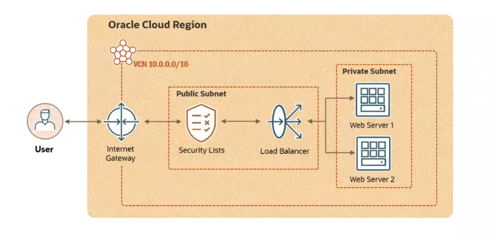
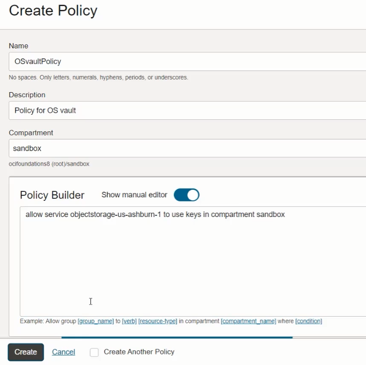

# ☁️ Oracle Cloud Infrastructure (OCI) Foundations  
### Study Notes & Summaries  
_A comprehensive guide based on the official Oracle OCI Foundations Course._

---

## 📘 Course Overview _(To complete after course completion)_

- **Platform:** Oracle Learning
- **Goal:** Understand the core services and architecture of Oracle Cloud Infrastructure
- **Final Test:** Skill Checks after each module (score 80% or higher to pass)

---

## 🧭 Course Structure

### 1. Course Introduction
- [x] OCI Overview *(6 min)* – _No notes_
- [x] Introduction *(2 min)* – _No notes_

### 2. OCI Introduction
- [x] OCI Architecture *(7 min)* – ✅ [See Summary](#oci-introduction--class-oci-architecture)
- [x] Demo: OCI Console Walkthrough *(8 min)* – _No notes_
- [x] Skill Check: OCI Introduction – ✅ [See Answers](#-skill-check-oci-introduction)

### 3. Identity and Access Management (IAM)
- [x] IAM Introduction *(6 min)* – ✅ [See Summary](#identity-and-access-management--class-iam-introduction)
- [x] Compartments *(5 min)* – ✅ [See Summary](#identity-and-access-management--class-compartments)
- [x] Demo: Compartments and Identity Domains *(7 min)* – ✅ [See Summary](#identity-and-access-management--class-demo-compartments-and-identity)
- [x] AuthN and AuthZ *(7 min)* – ✅ [See Summary](#identity-and-access-management--class-authn-and-authz)
- [x] Demo: AuthN and AuthZ *(9 min)* – ✅ [See Summary](#identity-and-access-management--class-demo-authn-and-authz)
- [x] Tenancy Setup *(5 min)* – ✅ [See Summary](#identity-and-access-management--class-tenancy-setup)
- [x] Skill Check: Identity and Access Management (IAM) – ✅ [See Answers](#-skill-check-identity-and-access-management)

### 4. Networking
- [x] VCN Introduction *(5 min)* – ✅ [See Summary](#networking--class-vcn-introduction)
- [x] Demo: VCN Creation Using Wizard *(6 min)* – ✅ [See Summary](#networking--class-demo-vcn-creation-using-wizard)
- [x] VCN Routing *(6 min)* – ✅ [See Summary](#networking--class-vcn-routing)
- [x] VCN Security *(4 min)* – ✅ [See Summary](#networking--class-vcn-security)
- [x] Load Balancer *(5 min)* – ✅ [See Summary](#networking--class-load-balancer)
- [x] Demo: Load Balancer *(10 min)* – ✅ [See Summary](#networking--class-demo-load-balancing)
- [x] Skill Check: Networking – ✅ [See Summary](#-skill-check-networking)

### 5. Compute
- [x] Compute Introduction *(5 min)* – ✅ [See Summary](#compute--class-compute-introduction)
- [x] Instance Basics *(4 min)* – ✅ [See Summary](#compute--class-instance-basics)
- [x] Demo: Getting Started with Cloud Shell *(3 min)* – ✅ [See Summary](#compute--class-demo-getting-started-with-cloud-shell)
- [x] Demo: Creating a Compute Instance *(12 min)* – ✅ [See Summary](#compute--class-demo-creating-a-compute-instance)
- [x] Scaling *(5 min)* – ✅ [See Summary](#compute--class-scaling)
- [x] Oracle Container Engine for Kubernetes (OKE) *(10 min)* – ✅ [See Summary](#compute--class-oracle-container-engine-for-kubernetes-oke)
- [x] Container Workloads in OCI *(3 min)* – [See Summary](#compute--class-container-workloads-in-oci)
- [x] Serverless with Oracle Functions *(5 min)* – ✅ [See Summary](#compute--class-serverless-with-oracle-functions)
- [x] Skill Check: Compute – ✅ [See Summary](#-skill-check-compute)

### 6. Storage
- [x] Storage Introduction *(5 min)* – ✅ [See Summary](#storage--class-storage-introduction)
- [x] Object Storage *(8 min)* – ✅ [See Summary](#storage--class-object-storage)
- [x] Demo: Object Storage *(6 min)* – ✅ [See Summary](#storage--class-demo-object-storage)
- [x] Block Volume *(5 min)* – ✅ [See Summary](#storage--class-block-volume)
- [x] Demo: Block Volume *(9 min)* – ✅ [See Summary](#storage--class-demo-block-volume)
- [x] File Storage *(4 min)* – ✅ [See Summary](#storage--class-file-storage)
- [x] Skill Check: Storage – ✅ [See Summary](#-skill-check-storage)

### 7. Security
- [x] Security Introduction *(9 min)* – ✅ [See Summary](#security--class-security-introduction)
- [x] Cloud Guard *(5 min)* – ✅ [See Summary](#security--class-cloud-guard)
- [x] Security Zones and Security Advisor *(4 min)* – ✅ [See Summary](#security--class-security-zones--security-advisor)
- [x] Demo: Security Zone and Security Advisor *(6 min)* – ✅ [See Summary](#security--class-demo-security-zones-and-security-advisor)
- [x] Encryption Basics *(11 min)* – ✅ [See Summary](#security--class-encryption-basics)
- [x] Vault *(8 min)* – ✅ [See Summary](#security--class-vault)
- [x] Demo: Vault *(7 min)* – ✅ [See Summary](#security--demo-vault)
- [x] Skill Check: Security – ✅ [See Summary](#-skill-check-security)

### 8. Governance and Administration
- [x] Pricing *(5 min)* – ✅ [See Summary](#governance-and-administration--class-pricing)
- [x] Cost Management *(4 min)* – ✅ [See Summary](#governance-and-administration--class-cost-management)
- [x] Demo: Cost Management *(9 min)* – ✅ [See Summary](#governance-and-administration--class-demo-cost-management)
- [x] Demo: Cloud Advisor *(7 min)* – ✅ [See Summary](#governance-and-administration--class-demo-cloud-advisor)
- [x] Tagging *(6 min)* – ✅ [See Summary](#governance-and-administration--class-tagging)
- [x] Support Rewards *(4 min)* – ✅ [See Summary](#governance-and-administration--class-support-rewards)
- [ ] Skill Check: Governance and Administration – _Not Attempted_
---

## 📂 Lesson Notes

### OCI Introduction → Class: **OCI Architecture**

#### 🧱 OCI Physical Architecture

**Key Concepts:**

- **Region:** A localized geographic area that contains one or more *Availability Domains (ADs)*.  
  Choose based on:
  - Proximity to users (low latency)
  - Data residency/compliance
  - Service availability

- **Availability Domain (AD):**  
  Independent, fault-tolerant data centers within a region.  
  - Do **not share** power, cooling, or network
  - A region typically has 3 ADs

- **Fault Domain (FD):**  
  Logical groupings of hardware within an AD  
  - Each AD contains 3 FDs  
  - Help avoid single points of failure  
  - Only one FD is actively updated at a time

#### 🛠️ Best Practices

- Distribute resources across multiple FDs and ADs
- Use Oracle Data Guard to replicate and sync databases
- Even in single-AD regions, use FDs for redundancy

#### ✅ Summary

- **Region → Availability Domains → Fault Domains**
- Use these constructs to build **highly available**, **resilient** architectures

---
---
---

### Identity and Access Management → Class: **IAM Introduction**

#### 🔐 What is IAM?

**IAM (Identity and Access Management)** is a foundational OCI service that controls:
- **Who** can access OCI resources
- **What** they can access
- **How** they interact with those resources

#### 🧠 Key Concepts

- **AuthN (Authentication):** Who are you?
- **AuthZ (Authorization):** What permissions do you have?

IAM enables users to be assigned **predefined roles**, each containing a set of **permissions**.

#### 🏛️ Identity Domains

An **Identity Domain** is a logical boundary for a user population and related security settings.

**Typical Workflow:**
1. Create an Identity Domain
2. Create **Users** and **Groups** within the domain
3. Write **Policies** targeting those groups  
   _(Policies are scoped to tenancy, account, or compartment)_

#### 📦 Resources and OCID

- A **resource** is any cloud object created in OCI (e.g., compute, storage, databases).
- Each resource is automatically assigned a unique identifier: the **OCID (Oracle Cloud Identifier)**.
- You don’t manage OCIDs manually—OCI handles it.

---
---

### Identity and Access Management → Class: **Compartments**

When you create a tenancy (OCI account), OCI provides a default **Root Compartment**.

**Compartments are:**
- Logical containers to **organize and isolate** cloud resources.
- Useful for enforcing **access control**, **quotas**, and **budgets**.

**Key Points:**
- You can create **custom compartments** under the root.
- Every resource belongs to **one compartment**.
- Resources can be **moved** between compartments.
- **Multi-region resources** can be grouped in a single compartment.

#### 🛡️ Why Use Compartments?

- **Access Control:** Define fine-grained policies per compartment.
- **Environment Isolation:** Separate development, staging, and production.
- **Organization:** Group related resources together (e.g., by project or team).


#### 📌 Example: Access Control Using Compartments

1. Place block storage resources in `Compartment A`.
2. Create user groups: `ComputeAdmins` and `StorageAdmins`.
3. Write policies granting access to each group only for resources in their designated compartment.

---
---

### Identity and Access Management → Class: **Demo: Compartments and Identity**

**Summary:**  
This demo shows how to create a new compartment (`sandbox`) and an identity domain (`sandbox-domain`). It also explores nesting compartments and assigning identity resources like users and groups to separate domains for better management and isolation.

#### 📸 Images


---
---

### Identity and Access Management → Class: **AuthN and AuthZ**

**Summary:**  
This lesson covers the two core IAM concepts in OCI: **Authentication (AuthN)** and **Authorization (AuthZ)**. It introduces key identity types, access control mechanisms, and how policies are used to grant permissions.

#### 🔐 What Is a Principal?

A **principal** is an IAM identity allowed to interact with OCI resources.  
There are two types:
- **User Principal:** A person using the console, CLI, or SDK.
- **Resource Principal:** A cloud resource (like a compute instance) authorized to call OCI services.

Users are grouped into **Groups**, and permissions are assigned to groups — not to individual users.

#### 🔑 Authentication (AuthN)

AuthN answers: **"Are you who you say you are?"**

**OCI supports 3 authentication methods:**
1. **Username & Password** (for console access)
2. **API Signing Keys** (RSA public/private key pairs for CLI/SDK)
3. **Auth Tokens** (used for 3rd-party tools that don't support API signing)


#### 🛡️ Authorization (AuthZ)

AuthZ answers: **"What can you do?"**  
OCI uses **IAM policies** to define authorization rules.

- Policies are **human-readable** statements.
- They grant **permissions to groups**, not individuals.
- Policies can be scoped to:
  - The **tenancy** (all resources)
  - A specific **compartment**

**Policy Syntax:**
```plaintext
Allow group <group_name> to <verb> <resource-type> in <location>
```

---
---

### Identity and Access Management → Class: **Demo: AuthN and AuthZ**

> 🔍 **Summary:**  
> This demo walks through how authentication (AuthN) and authorization (AuthZ) are implemented in OCI using identity domains, users, groups, and policies.  
> It shows how a newly created user can log in but needs specific permissions (via policies) to access OCI resources.

#### 📸 Images

  


  


  


  

---
---

### Identity and Access Management → Class: **Tenancy Setup**

> 📝 **Summary:**  
> This lesson explains how to properly configure your OCI tenancy by following key best practices. It introduces the concept of delegating responsibilities to an **OCI Admin Group** instead of using the tenancy administrator for day-to-day operations.

#### ✅ Best Practices for Tenancy Setup

1. **Do NOT use the tenancy administrator** for regular tasks.  
   → Delegate daily operations to an OCI Admin group.

2. **Create dedicated compartments** to isolate resources:
   - By environment: dev / prod / test
   - By region or business unit
   - Avoid placing all resources in the Root Compartment

3. **Enforce Multi-Factor Authentication (MFA)**  
   → Combines something you **know** (e.g., password) with something you **have** (e.g., phone).

#### 🔐 Required IAM Policies for OCI Admin Group

To allow delegated administrators to function like tenancy admins, apply the following minimum set of policies:

```plaintext
Allow group OCI-admin-group to manage all-resources in tenancy

Allow group OCI-admin-group to manage domains in tenancy
Allow group OCI-admin-group to manage users in tenancy
Allow group OCI-admin-group to manage groups in tenancy
Allow group OCI-admin-group to manage dynamic-groups in tenancy
Allow group OCI-admin-group to manage policies in tenancy
Allow group OCI-admin-group to manage compartments in tenancy
```
---
---
---

### Networking → Class: **VCN Introduction**

> 📝 **Summary:**  
> A **Virtual Cloud Network (VCN)** is a software-defined, private network in OCI that enables secure communication between cloud resources, on-premises systems, and other OCI regions. It is regional, scalable, highly available, and managed by Oracle.

#### 🧱 Key Concepts

- **VCN Addressing:**
  - Defined using **CIDR notation** (e.g., `10.0.0.0/16`)
  - Divided into **subnets** (public or private)
  - Instances are deployed into subnets and get assigned **private IPs**

#### 🌐 VCN Communication Components

| Component           | Purpose                                                                 |
|---------------------|-------------------------------------------------------------------------|
| **Internet Gateway** | Enables bidirectional communication between VCN and the internet        |
| **NAT Gateway**      | Allows **outbound-only** traffic from private subnets to the internet   |
| **Service Gateway**  | Enables access to **OCI public services** (like Object Storage) securely|
| **Dynamic Routing Gateway (DRG)** | Connects VCN to **on-premises networks** or other private destinations |

#### ✅ Recap

- A VCN enables secure, scalable communication in OCI.
- Gateways and routers control how resources communicate externally and internally.
- It is the **foundation** of OCI networking and underpins compute, database, and service access.

---
---
### Networking → Class: **Demo: VCN Creation Using Wizard**

> 📝 **Summary:**  
> This demo shows how to create a VCN using the OCI VCN Wizard, which sets up a public subnet, a private subnet, and three key gateways (Internet, NAT, and Service).

#### 📸 Screenshots

  
*Wizard option to create a VCN with internet connectivity, including IG, NAT, and SG.*

  
*The VCN named `vcn-us-east-demo` with its CIDR block and subnet configuration.*

  


---
---

### Networking → Class: **VCN Routing**

> 📝 **Summary:**  
> This lesson explains how **route tables** are used in OCI to direct traffic from a VCN to external destinations like the internet, on-premises networks, or other VCNs via peering. It also introduces **DRG v2** for scalable network architectures.

#### 🚦 Route Tables

- A **route table** contains rules that define:
  - **Destination CIDR block**
  - **Route target** (next hop: e.g., NAT Gateway, DRG)

- **VCN-local traffic** (within the same VCN/subnets) is automatically routed—no route table needed.

#### 🌐 Common Routing Scenarios

| Traffic Destination        | Route Target        |
|----------------------------|---------------------|
| Internet                   | Internet Gateway / NAT Gateway  
| On-premises                | Dynamic Routing Gateway (DRG)  
| Another VCN (same region)  | Local Peering Gateway (LPG)  
| Another VCN (other region) | Remote Peering via DRG  

- **Longest Prefix Match** (most specific CIDR) takes priority when evaluating routes.

#### 🧩 DRG v2 (Dynamic Routing Gateway v2)

- Supports **scalable VCN communication** (up to 300 VCNs on one DRG)
- Eliminates the need for point-to-point peering via LPG
- Can connect to additional DRGs via **remote peering** for further scaling

#### ✅ Recap

- Use **route tables** to direct traffic leaving a VCN
- Use **DRG v2** for simplified, scalable VCN-to-VCN communication
- OCI provides flexible routing for internet, hybrid, and multi-VCN architectures

---
---

### Networking → Class: **VCN Security**

> 📝 **Summary:**  
> This lesson explains how **Security Lists** and **Network Security Groups (NSGs)** control traffic within a Virtual Cloud Network (VCN), acting like firewalls at the subnet and instance levels.

#### 🔐 Security Lists
- Apply to **all instances** in a **subnet**
- Define **ingress/egress rules** using CIDR blocks
- Rules can be **stateful** or **stateless**
- Example: Allow TCP traffic from `0.0.0.0/0` on port `80` (web traffic)

#### 🧱 Network Security Groups (NSGs)
- Apply to specific **VNICs** (virtual NICs)
- Support **granular control** per instance
- Can use **NSG names** as source/destination (unlike security lists which use only CIDRs)
- Allow **different rules** for instances in the same subnet

#### ✅ Recap
- Use **Security Lists** for subnet-wide rules
- Use **NSGs** for fine-grained, instance-level control within the VCN

---
---

### Networking → Class: **Load Balancer**

> 📝 **Summary:**  
> OCI Load Balancers distribute incoming traffic across backend servers to achieve **high availability** and **scalability**. They act as reverse proxies and support both public and private configurations.

#### ⚖️ Types of Load Balancers in OCI

1. **HTTP Load Balancer (Layer 7)**  
   - Understands HTTP/HTTPS traffic  
   - Supports advanced features like content-based routing, SSL termination  
   - Two shapes:
     - **Flexible**: Scales within a defined bandwidth range (10 Mbps–8 Gbps)
     - **Predefined**: Micro, Small, Medium, Large (auto scales per shape)  
   - Suitable for **intelligent routing**

2. **Network Load Balancer (Layer 3/4)**  
   - Supports TCP, UDP, ICMP  
   - Lower latency and higher performance  
   - Also available as public or private  
   - Ideal when **speed and performance** are critical

#### ✅ Recap
- Use **HTTP Load Balancer** for smart, content-aware routing  
- Use **Network Load Balancer** for faster, low-latency traffic handling  
- Both options are **highly available and scalable** by design
  
---
---
### Networking → Class: **Demo: Load Balancer**

> 📝 **Summary:**  
> This demo shows how to deploy a **Layer 7 (HTTP) Load Balancer** in a public subnet that distributes traffic to two backend web servers in a private subnet using **weighted round robin**.  
> It covers setting up the VCN, subnets, compute instances, security rules, health checks, and listener configuration.

#### 📸 Screenshots

  

  

  

---
---
---

### Compute → Class: **Compute Introduction**

> 📝 **Summary:**  
> OCI Compute provides **virtual machines**, **bare metal servers**, and **dedicated hosts** with flexible shapes for custom CPU and memory combinations. It delivers **scalability**, **high performance**, and **cost efficiency**.

#### ⚙️ Compute Options

- **Flexible Shapes**: Customize CPU cores and memory to fit exact needs  
- **VMs**: Shared infrastructure, multi-tenant, strong isolation  
- **Bare Metal**: Full dedicated physical server  
- **Dedicated Host**: Exclusive host to run your own VMs

#### 🧠 Processor Types

- **AMD**, **Intel**, and **ARM (Ampere A1)** supported  
- ARM instances offer industry-leading **price/performance**  
  - Example: Ampere A1 outperformed AMD by 32%, Intel by 69% in NGINX workloads

#### 💸 Pricing & Efficiency

- **Pay-as-you-go** model  
- OCI is up to **50% cheaper** than other clouds  
- **Preemptible VMs**: Short-lived, low-cost instances ideal for batch/fault-tolerant jobs

#### ✅ Recap

- Choose the right compute type and shape based on your workload  
- Maximize performance with custom configurations and processor options  
- Optimize costs with flexible pricing and preemptible instances

---
---

### Compute → Class: **Instance Basics**

> 📝 **Summary:**  
> This lesson covers how compute instances in OCI are tied to other services like **VCN** (for networking), **block volumes** (for OS and data), and introduces **live migration** for high availability without rebooting.

#### 🧱 Key Dependencies for Instances

- **Networking**:
  - Instances are deployed into **subnets** within a **VCN**
  - Each instance uses a **virtual NIC (VNIC)** for connectivity
  - VNIC assigns the **private IP** to the compute instance

- **Storage**:
  - OS and data are stored on **boot volumes** and **block volumes**
  - These are network-attached and persist beyond instance reboots

#### 🔁 Live Migration

- Automatically moves VMs between hosts during maintenance or failure  
- Ensures high availability **without user intervention**  
- Transparent to the user and avoids downtime during infrastructure events

#### ✅ Recap

OCI compute instances depend on **networking** and **storage** control planes and benefit from built-in **live migration** to maximize uptime.

---
---

### Compute → Class: **Demo: Getting Started with Cloud Shell**

> 📝 **Summary:**  
> This demo shows how to access **OCI Cloud Shell** and use it to generate **SSH key pairs** securely from the browser, eliminating the need for external tools.  
> The public key is used to authenticate remote access, while the private key stays securely with the user.

---
---

### Compute → Class: **Demo: Creating a Compute Instance**

> 📝 **Summary:**  
> This demo walks through **manually building a VCN** (with internet gateway, route table, and security list) and deploying a **Compute instance in a public subnet**. After launch, the instance is accessed via SSH, and **Apache is installed** to serve a web page.

#### 📸 Screenshot


---
---

### Compute → Class: **Scaling**

> 📝 **Summary:**  
> OCI Compute supports two types of scaling:  
> - **Vertical Scaling**: Increase/decrease CPU and memory of an instance (requires downtime).  
> - **Horizontal Scaling (Autoscaling)**: Automatically adds/removes VMs based on demand for **high availability and elasticity**.

#### ⚙️ Autoscaling in Practice

1. **Create a configuration (template)** from a running instance  
2. **Create an instance pool** based on the configuration  
3. **Define Autoscaling rules** using CPU/memory thresholds and desired min/max instance count

💡 **Autoscaling** allows your infrastructure to react to traffic automatically — ideal for dynamic workloads like web stores. No extra cost is incurred for using the feature.

---
---

### Compute → Class: **Oracle Container Engine for Kubernetes (OKE)**

> 📝 **Summary:**  
> Oracle Container Engine for Kubernetes (OKE) is a **fully managed**, **highly available**, and **scalable** service to run Kubernetes clusters on OCI.  
> Containers offer faster boot times, lower resource usage, and portability compared to VMs. Kubernetes handles orchestration — deploying, scaling, and managing containers.

#### 🚀 Key Components

- **Pods**: Smallest unit, runs one or more containers
- **Worker Nodes**: Machines that run pods
- **Node Pool**: A group of worker nodes
- **Control Plane Nodes**: Managed by Oracle, handles cluster management (scheduling, scaling, etc.)

#### ⚙️ Cluster & Node Types

- **Cluster Types**:  
  - *Enhanced Cluster*: All features + SLA  
  - *Basic Cluster*: Core features only + SLO  

- **Node Pool Types**:  
  - *Virtual Nodes*: Serverless, managed by Oracle  
  - *Managed Nodes*: User-managed and customizable
---
---

### Compute → Class: **Container Workloads in OCI**

> 📝 **Summary:**  
> OCI **Container Instances** provide a **simple**, **secure**, and **serverless** way to run containers without managing servers or Kubernetes (OKE).  
> Ideal for testing, isolated apps, or APIs, users only provide the container image—OCI handles the compute and runtime automatically.

#### 🚀 Key Benefits

- No need to manage VMs, OS patches, or runtimes  
- Run **multiple containers** per instance  
- Supports **environment variables**, **resource limits**, and **startup options**  
- Provides **workload isolation** for security

---
---

### Compute → Class: **Serverless with Oracle Functions**

> 📝 **Summary:**  
> Oracle Functions is a **serverless, event-driven** compute service that lets you run code without managing infrastructure.  
> Built on the **open-source Fn Project**, it charges **only for execution time**, enabling a truly **consumption-based pricing** model.

#### ⚙️ Key Features

- Code runs inside containers
- Highly **scalable** and **parallel**
- **Event-driven**: triggered via API, CLI, or OCI Events
- Integrates with other **OCI services**
- **No charge** when idle (you pay only for usage)

---
---
---

### Storage → Class: **Storage Introduction**

> 📝 **Summary:**  
> This lesson introduces OCI's diverse **storage services**, each tailored to different performance, durability, and access needs. Choosing the right storage depends on data type, persistence, connectivity, and protocol requirements.

#### 📦 Key OCI Storage Types

- **Local NVMe**:  
  - Locally attached SSD storage  
  - Ultra-high performance, **non-persistent**  
  - Best for performance-sensitive workloads

- **Block Volume**:  
  - **Network-attached**, persistent block storage  
  - Data organized in **blocks**, usable beyond instance lifecycle  
  - Ideal for databases, boot volumes

- **File Storage**:  
  - Shared network storage using **files and directories**  
  - Accessible from multiple compute instances  
  - Great for shared access and POSIX compliance

- **Object Storage**:  
  - Highly durable, internet-accessible storage  
  - Accessed via **HTTP/REST** using `PUT`, `GET`  
  - Ideal for backups, logs, images, videos, etc.

#### 🔄 Data Migration Tools

- **Data Transfer Disk**: Send your physical disks to OCI  
- **Data Transfer Appliance**: For larger-scale migrations

---
---
### Storage → Class: **Object Storage**

> 📝 **Summary:**  
> OCI Object Storage is a **high-performance**, **internet-scale** platform for storing **unstructured data** (e.g., logs, media, backups).  
> It offers **multiple tiers**, built-in **encryption**, **API access**, and **lifecycle automation** for cost-effective, secure storage.

#### 📂 Key Concepts

- **Objects**: Key-value pairs stored in **buckets**
- **Namespace**: Top-level logical container unique per tenancy
- **Flat structure**: Folders are simulated via prefixes
- **Access**: Public APIs, CLI, SDK, or private access from OCI resources

#### 🔥 Storage Tiers

| Tier                | Use Case               | Notes                                         |
|---------------------|------------------------|-----------------------------------------------|
| **Standard (Hot)**  | Frequently accessed    | Instant read/write, strongly consistent       |
| **Infrequent Access** | Long-term, less access | 60% cheaper, 31-day min, retrieval fee        |
| **Archive**         | Rarely accessed        | 90-day min, restore (1+ hr) then download     |

#### ♻️ Optimization Features

- **Auto-Tiering**: Moves data between tiers based on usage patterns  
- **Lifecycle Management**: Rules for transitioning or deleting objects  
- **Versioning**: Enable multiple versions of objects in a bucket  
- **Encryption**: Always-on by default, supports customer-managed keys

---
---
### Storage → Class: **Demo: Object Storage**

> 📝 **Summary:**  
> This demo walks through **creating a bucket**, **uploading an object**, setting **visibility** (public/private), and using **pre-authenticated requests (PARs)** to securely share private objects.  
> It highlights key features like **auto-tiering**, **encryption**, and public access controls.

#### 📸 Screenshots

  


---
---

### Storage → Class: **Block Volume**

> 📝 **Summary:**  
> OCI Block Volume provides **persistent**, **durable**, and **network-attached** storage for compute instances.  
> Volumes exist **independently of the instance**, support multiple **tiers**, **encryption**, **resizing**, and **replication** for robust data management.

#### 💽 Key Features

- **Persistence**: Data survives instance termination
- **Durability**: Multiple copies are maintained
- **Encryption**: Always-on at rest and in transit (option to BYOK)
- **Performance Tiers**:
  - Lower Cost
  - Balanced (e.g., boot disks)
  - High Performance
  - Ultra High Performance (e.g., databases)

#### 🛠️ Advanced Capabilities

- **Auto-Tune Performance**: Automatically reduces cost for detached volumes  
- **Online Resizing**: Expand volumes without downtime  
- **Read/Write Sharing**: Attach the same volume to multiple VMs  
- **Asynchronous Replication**: For DR and regional migration  
- **Volume Groups**: Backup/restore groups of volumes consistently

---
---
### Storage → Class: **Demo: Block Volume**

> 📝 **Summary:**  
> This demo shows how to **create and attach a block volume** to a compute instance in OCI.  
> It also demonstrates **online resizing**, **performance tuning**, and viewing the new volume via SSH after attachment.

#### 📸 Screenshots

  
  


---
---
### Storage → Class: **File Storage**

OCI File Storage Service provides **shared file storage** using **NFSv3**, ideal for use cases like:
- Enterprise applications (e.g., Oracle E-Business Suite)
- General-purpose file systems (shared folders)
- Storing state for microservices and containers
- HPC, analytics, and scale-out workloads

It enables multiple compute instances to **read/write** from the same file system, supports **snapshots** for backup, and includes **encryption at rest and in transit**. Users mount the file system to instances and begin sharing data seamlessly.

---
---
---
### Security → Class: **Security Introduction**

OCI Security follows a **shared responsibility model**:
- **Oracle** is responsible for the *security of the cloud* (physical infrastructure, virtualization, network, etc.).
- **Customers** are responsible for the *security in the cloud* (data, access, endpoints, OS patching).

Security in OCI is built using a **defense-in-depth** approach across multiple layers:

- **Infrastructure Protection**
  - *Web Application Firewall (WAF)*: Protects against Layer 7 DDoS and malicious traffic.
  - *Network Firewall*: Monitors and blocks unwanted traffic across networks.

- **Identity and Access Management (IAM)**
  - Controls user identities, permissions, and access levels.
  - Includes *Multi-Factor Authentication (MFA)* for added protection.

- **Operating System and Workload Protection**
  - *Shielded Instances*: Provide secure boot and integrity for sensitive workloads.
  - *OS Management*: Handles updates and patching at scale.
  - *Dedicated VM Host*: Offers single-tenant bare metal infrastructure.

- **Data Protection**
  - *Vault*: Manages encryption keys and secrets.
  - *Certificates Service*: Handles certificate authorities and SSL certificates.
  - Encryption is always enabled (at rest and in transit).

- **Detection and Remediation**
  - *Cloud Guard*: Monitors, detects, and responds to misconfigurations or threats.
  - *Security Zones*: Enforce security policies (e.g., no public access, mandatory encryption) in specific compartments.

OCI’s extensive security portfolio ensures compliance, visibility, and proactive protection across your entire cloud stack.
---
---
### Security → Class: **Cloud Guard**

**Oracle Cloud Guard** is a **Cloud Security Posture Management (CSPM)** service that helps you:
- **Detect** misconfigurations or risky activities (e.g., public buckets or instances)
- **Respond** automatically through **configured responders**
- **Remediate** issues to improve your cloud security posture

Core components include:
- **Target**: Defines the scope (compartments) to monitor
- **Detector**: Identifies risky configurations or activities
- **Problem**: A potential security issue flagged by a detector
- **Responder**: Takes corrective action (e.g., making a bucket private)

Cloud Guard supports automation via:
- **Cloud Events** and **OCI Functions** (e.g., send alerts, trigger workflows)
- **Policy-based remediation** through a Cloud Guard operator role

💡 Example: If a public bucket is detected in a monitored compartment, Cloud Guard can automatically make it private—restoring compliance with your defined security policies.

---
---
### Security → Class: **Security Zones and Security Advisor**

**Security Zones** allow you to designate compartments where **strict security policies are enforced** and **cannot be disabled**. These compartments are protected using **Security Zone Recipes**, which define rules such as:
- Only **private subnets** allowed
- Mandatory use of **customer-managed encryption keys**
- **Public buckets or compute instances** are automatically denied

Violations of these policies result in **operation denial**, ensuring your most critical resources are always protected—like placing valuables in a fireproof vault.

**Security Advisor** is a unified service that combines:
- **Security Zones**
- **Cloud Guard**
- Other OCI security services

It provides guided best practices and enforces **secure configurations** for services like:
- **Object Storage**
- **File Storage**
- **Block Volume**
- **Virtual Machines**

💡 Example: Security Advisor ensures a new bucket created inside a Security Zone is **not public**, uses **customer-managed keys**, and follows Oracle’s best security practices—automatically guiding and enforcing these decisions.

---
---
### Security → Class: **Demo: Security Zones and Security Advisor**

This demo walks through creating a **Security Zone** in OCI and enabling **Cloud Guard**, which is required to enforce security zone policies.  
We see how policy violations (like using Oracle-managed keys instead of customer-managed keys) are **detected and blocked automatically**.  
Security Zones + Cloud Guard provide an **automated, policy-enforced security posture** across compartments.

  
  


---
---
### Security → Class: **Encryption Basics**

This lesson explains the fundamentals of encryption, including the difference between **symmetric encryption** (same key for encryption and decryption) and **asymmetric encryption** (different keys for encryption and decryption).  

- **Symmetric encryption** is fast and used in many systems, but all parties must securely share the same key.
- **Asymmetric encryption** improves security by using a public key to encrypt and a private key to decrypt.
- Covers the concept of **encryption at rest** (data stored securely) and **encryption in transit** (data protected while moving across networks).
- Introduces key encryption methods like Advanced Encryption Standard and Rivest–Shamir–Adleman.
- Explains **Hardware Security Modules**, which are physical devices designed to securely store and manage encryption keys and support cryptographic operations. Oracle uses modules certified to a high international security standard.

---
---
### Security → Class: **Vault**

Oracle Cloud Infrastructure Vault is a **centralized service** for managing **encryption keys** and **secret credentials** like passwords, certificates, and access tokens. It helps secure sensitive data by eliminating the need to store secrets in code or configuration files.

- Supports **two protection modes**: software-based (exportable keys) and hardware security module-based (non-exportable, higher security).
- Enables **envelope encryption**, where customer data is encrypted with data keys, and those data keys are in turn encrypted by master keys.
- Vault supports **key rotation**, **audit logging**, and **fine-grained access control** using IAM policies.
- Supports encryption algorithms such as:
  - Advanced Encryption Standard (symmetric encryption)
  - Rivest–Shamir–Adleman (asymmetric encryption)
  - Elliptic Curve Digital Signature Algorithm (for digital signing only)
- Keys can be used across OCI services like Object Storage, Block Volume, and File Storage.
- Vault and its keys have a **scheduled deletion policy** (7–30 days) to prevent accidental loss. Once deleted, the data encrypted by those keys becomes unrecoverable.

Vault enables strong security posture by reducing blast radius, supporting compliance standards, and integrating deeply with OCI services.

  

---
---
### Security → Class: **Demo: Vault**
 
This demo shows how to create a Vault and a Master Encryption Key in Oracle Cloud Infrastructure.  
It demonstrates how to use that key when creating an Object Storage bucket, satisfying a Security Zone policy.  
A policy is also created to allow Object Storage to access the encryption key from the Vault.



---
---

### Governance and Administration → Class: **Pricing**

Oracle Cloud Infrastructure offers **simple, transparent, and competitive pricing** models:
- **Pay As You Go**: Metered usage with no upfront commitment.
- **Consumption-Based**: Used in services like Functions, charging only when executed.
- **Annual/Monthly Universal Credits**: Prepaid models with significant discounts and flexibility.
- **Bring Your Own License**: Reuse existing on-premises licenses in the cloud to lower costs.

Pricing depends on **resource size**, **type**, and **data transfer**:
- All OCI regions share **the same global pricing**.
- **Inbound traffic is free**, and **outbound is 10x cheaper** than most competitors.
- **Inter-Availability Domain traffic is free**, supporting high availability at no extra cost.

---
---

### Governance and Administration → Class: **Cost Management**

OCI offers several tools to help monitor and control cloud costs:
- **Budgets**: Set monthly/quarterly budgets per compartment with **alerts** when usage nears or exceeds limits.
- **Cost Analysis**: Review **past spending patterns** to identify trends and optimize future use.
- **Usage Reports**: Daily **CSV files** showing resource-level usage, accessible via **Object Storage** with cross-tenancy options.
- **Service Limits**: View and request changes to default **resource limits** to avoid unintentional overuse or misuse.
- **Compartment Quotas**: Enforce **resource caps** per compartment (e.g., restrict to 10 VMs or block Exadata use) to ensure governance and cost control.

These tools enable better **budgeting, tracking, and policy-based governance** to optimize cloud spending.

---
---

### Governance and Administration → Class: **Demo: Cost Management**

In this demo, the instructor explores OCI's built-in cost management tools. He begins with **Cost Analysis**, filtering costs by **service, compartment, and region** to pinpoint where the largest expenses are coming from (e.g., Networking in Phoenix). He then demonstrates how to analyze costs **by tags** (e.g., identifying who created certain resources). Lastly, he shows how to create **Budgets**, set threshold **alerts**, and monitor spending per compartment to avoid overages.

---
---

### Governance and Administration → Class: **Demo: Cloud Advisor**

In this demo, the instructor shows how to use **OCI Cloud Advisor** to optimize resources across **cost, performance, availability, and security**. He implements recommendations like deleting **idle compute and boot volumes**, enabling **block volume autotuning**, and spreading instances across **fault domains** to improve fault tolerance. For security issues, the demo redirects to **Cloud Guard**, which provides deeper visibility into misconfigurations and risks.

---
---

### Governance and Administration → Class: **Tagging**

Tagging in Oracle Cloud Infrastructure is a powerful way to **organize, track, and control access** to cloud resources.

- **Tags** are key-value pairs (e.g., `Environment: Production`, `Project: Alpha`) that help categorize resources.
- **Free-form tags** allow flexibility with no schema, while **defined tags** offer governance via namespaces and policies.
- Tags support **cost tracking**, **access control**, and **automation**—enabling visibility and policy enforcement at scale.
- Defined tags also allow setting **allowed values** and **policy restrictions** for who can apply them.

Use tagging to simplify resource management, improve cost visibility, and enforce governance.

---
---

### Governance and Administration → Class: **Support Rewards**

**Oracle Support Rewards** is a program that reduces your **on-premises Oracle support costs** based on **OCI usage**.

- For every **$1 spent on OCI**, customers earn:
  - **$0.25** in rewards (standard customers)
  - **$0.33** in rewards (ULA customers)
- These rewards can be used to pay for **Oracle technology software support fees**, potentially reducing them **to zero**.
- The rewards are **automatically tracked** and **redeemable via the OCI Console**, offering transparency and ease of use.

This program incentivizes OCI adoption while directly lowering your existing Oracle tech support costs.

---
---
---

## 🧪 Skill Check: OCI Introduction

This section summarizes the questions and correct answers for the Skill Check quiz in Module 2.

### **1. Which statement about regions and availability domains is true?**

**✅ Correct Answer:**  
**An OCI region has one or more availability domains.**

**Explanation:**  
Each region is a localized geographic area with one or more ADs. Fault domains provide protection **within** an AD, not across regions.

### **2. Which capability can be used to protect against failures within an OCI availability domain?**

**✅ Correct Answer:**  
**Fault Domain**

**Explanation:**  
Fault Domains isolate hardware within a single AD. Distributing resources across FDs reduces the impact of failures within that AD.

### **3. Which Oracle Cloud Infrastructure service is NOT intended for a multicloud solution?**

**✅ Correct Answer:**  
**Oracle Roving Edge Infrastructure**

**Explanation:**  
This is used for **edge computing** in remote environments, not for multicloud.  
Multicloud services include:
- Oracle Database Service for Azure  
- Oracle Interconnect for Azure  
- Oracle MySQL HeatWave on AWS

### **4. Which statement about OCI is NOT true?**

**✅ Correct Answer:**  
**A single fault domain can be associated with multiple availability domains within a region.**

**Explanation:**  
Fault Domains are scoped to a **single AD**. They do not span ADs.

### **5. You have subscribed to an OCI region with one availability domain. You want to deploy a highly available application with two servers and a 2-node database. How would you place the components?**

**✅ Correct Answer:**  
**Place one server and a DB node in one fault domain, and the second server and DB node in another fault domain.**

**Explanation:**  
When limited to one AD, the best way to increase availability is to **spread components across multiple fault domains** within that AD.

---
---

## 🧪 Skill Check: Identity and Access Management

### **1. Which is NOT a component of OCI Identity and Access Management?**  
**✅ Correct Answer:** *Network Security Group*

🧠 **Explanation:**  
Network Security Groups are part of OCI networking, not IAM. IAM components include:
- **Principals**
- **Policies**
- **Federation**

### **2. Which statement about OCI compartments is NOT true?**  
**✅ Correct Answer:** *It is a best practice to create all your resources in the root compartment.*

🧠 **Explanation:**  
It is **not** recommended to use the root compartment for everything. Best practice is to use **custom compartments** to:
- Organize resources
- Isolate environments
- Apply access controls

### **3. Which IAM component helps to organize multiple users into a team?**  
**✅ Correct Answer:** *Groups*

🧠 **Explanation:**  
**Groups** allow you to organize users into logical collections. You can then assign **policies** to groups rather than individuals.

### **4. How is a resource in OCI identified?**  
**✅ Correct Answer:** *With OCID*

🧠 **Explanation:**  
Every OCI resource is assigned a globally unique identifier called an **OCID (Oracle Cloud Identifier)**.

### **5. Which statement about OCI IAM is true?**  
**✅ Correct Answer:** *It enables you to control access for a group of users.*

🧠 **Explanation:**  
IAM allows you to:
- Group users
- Assign permissions through policies
- Control access to OCI resources efficiently

---
---

## 🌐 Skill Check: Networking

### **1. Which VCN component blocks inbound traffic, but enables outbound traffic to the internet?**

**✅ Correct Answer:**  
**NAT Gateway**

**Explanation:**  
A **NAT Gateway** enables **outbound-only internet access** for private subnet instances while blocking **unsolicited inbound traffic** from the internet.

### **2. Which statement about Virtual Cloud Network (VCN) peering between two VCNs is NOT valid?**

**✅ Correct Answer:**  
**A VCN peering connection is a VPN-based connection.**

**Explanation:**  
VCN peering (local or remote) uses **OCI’s internal network**, not VPN. This makes it more efficient and secure for cross-VCN communication.

### **3. Which component is NOT created by default with the creation of a Virtual Cloud Network?**

**✅ Correct Answer:**  
**Default Local Peering Gateway**

**Explanation:**  
When you create a VCN, the following are created by default:
- Default Route Table  
- Default Security List  
- Default DHCP Options  
**Local Peering Gateway** must be created manually if needed.

### **4. Which statement about a Virtual Cloud Network (VCN) is true?**

**✅ Correct Answer:**  
**A VCN can reside only in a single region but can span multiple availability domains.**

**Explanation:**  
A **VCN is region-specific** but can span multiple **availability domains (ADs)** within that region. It **cannot** span multiple regions.

> ⚠️ The selected answer in the screenshot (“A VCN can be used with only one instance.”) is **incorrect**.

### **5. Which OSI layer traffic is supported by the OCI Network Load Balancer?**

**✅ Correct Answer:**  
**Layer 4 (transport)**

**Explanation:**  
The **OCI Network Load Balancer (NLB)** supports **Layer 4 (TCP/UDP)** traffic. For Layer 7 (HTTP/HTTPS), use the **OCI Load Balancer (LB)** instead.

---
---

## 💻 Skill Check: Compute

### **1. Which type of storage is associated with instances in the OCI Compute service?**

**✅ Correct Answer:**  
**Block Storage**

**Explanation:**  
**Block Storage** provides high-performance, durable volumes that can be attached to compute instances. It behaves like a raw hard drive, which is ideal for boot volumes or storing application data.

### **2. Which processor type is NOT available for the OCI Compute service?**

**✅ Correct Answer:**  
**Snapdragon**

**Explanation:**  
OCI Compute supports **AMD**, **Intel**, and **Ampere** processors. **Snapdragon** is not supported—it's primarily used in mobile devices, not cloud compute environments.

### **3. What is the primary purpose of Oracle Cloud Infrastructure Functions?**

**✅ Correct Answer:**  
**To execute code in response to events or HTTP requests**

**Explanation:**  
OCI **Functions** is a serverless platform that allows you to run code triggered by **events** or **HTTP requests**, without managing infrastructure.

### **4. Which statement about the working of autoscaling in an instance pool is true?**

**✅ Correct Answer:**  
**It automatically provisions and removes instances in an instance pool.**

**Explanation:**  
**Autoscaling** dynamically adjusts the number of compute instances in a pool based on usage metrics or schedules, adding or removing instances automatically as needed.

### **5. Which two parameters can be customized when creating a flexible shape compute instance?**

**✅ Correct Answer:**  
- **Number of OCPUs**  
- **Amount of memory**

**Explanation:**  
With **flexible shapes**, you can choose the exact **OCPU count** and **memory** allocation to match your workload, providing cost efficiency and performance tuning.

---
---

## 🗄️ Skill Check: Storage

### **1. You want to store the backup of a database in cloud storage for an extended period at the lowest storage cost. Which object storage tier would you use for storing these backup files?**

**✅ Correct Answer:**  
**Archive**

**Explanation:**  
The **Archive Storage** tier offers the **lowest cost** for long-term, rarely accessed data—ideal for backups stored over extended periods.

### **2. In the Oracle Cloud Infrastructure Object Storage Service, what is the primary purpose of a pre-authenticated request URL?**

**✅ Correct Answer:**  
**To provide temporary and secure access to a specific object**

**Explanation:**  
**Pre-authenticated request (PAR) URLs** allow access to a specific object without needing OCI credentials. This provides **secure and time-limited sharing** of files stored in Object Storage.

### **3. You have an extremely high performance database workload that requires at least 90 IOPS/GB and 90,000 IOPS per volume. Which OCI Block Volume performance level can be used to meet this requirement?**

**✅ Correct Answer:**  
**Ultra High Performance**

**Explanation:**  
The **Ultra High Performance** level supports the **most demanding workloads**, delivering **up to 300,000 IOPS per volume** and **90 IOPS/GB**, meeting or exceeding the specified requirements.

### **4. You have created an Object Storage bucket of Archive tier. Which statement is NOT valid for the Archive Storage tier?**

**✅ Correct Answer:**  
**The Archive storage bucket can be upgraded to Standard storage.**

**Explanation:**  
**Buckets cannot be changed between storage tiers** (e.g., from Archive to Standard). You must **restore individual objects** to the Standard tier; the bucket itself **remains Archive**.

### **5. What feature of the Oracle Cloud Infrastructure Block Volume service ensures data durability and protection against hardware failures?**

**✅ Correct Answer:**  
**Replication**

**Explanation:**  
**Block Volume Replication** ensures **durability and high availability** by automatically **replicating data across multiple fault domains**, protecting against hardware failure.

---
---

## 🔐 Skill Check: Security

### **1. What is the primary purpose of the Oracle Cloud Infrastructure Vault service?**

**✅ Correct Answer:**  
**To store and manage encryption keys and secrets**

**Explanation:**  
OCI **Vault** securely stores, manages, and controls access to **encryption keys and secrets** used across cloud services and applications.

### **2. Which of the following is NOT a component of the Oracle Cloud Infrastructure Vault service?**

**✅ Correct Answer:**  
**Database backup**

**Explanation:**  
Vault includes components like **Vaults**, **Master Encryption Keys**, and **Secrets**. **Database backup** is not part of the Vault service; it belongs to the database offerings.

### **3. What is the main advantage of using OCI Security Zones when deploying resources in your cloud environment?**

**✅ Correct Answer:**  
**Ensuring adherence to security best practices and policies**

**Explanation:**  
**Security Zones** enforce **security best practices by default**, ensuring all resources deployed within them follow strict policies like encryption and network restrictions.

### **4. In the OCI shared security responsibility model, who is responsible for securing the underlying cloud infrastructure?**

**✅ Correct Answer:**  
**Oracle**

**Explanation:**  
In the **shared responsibility model**, **Oracle** secures the **physical infrastructure**, while customers are responsible for their **data, workloads, and configurations**.

### **5. Which option is NOT a component of Oracle Cloud Guard?**

**✅ Correct Answer:**  
**Targets**

**Explanation:**  
OCI **Cloud Guard** is built around three main components:  
- **Detectors** (monitor for issues)  
- **Problems** (identified risks)  
- **Responders** (take action)  
**Targets** are not a component—they are the **resources** Cloud Guard protects.


