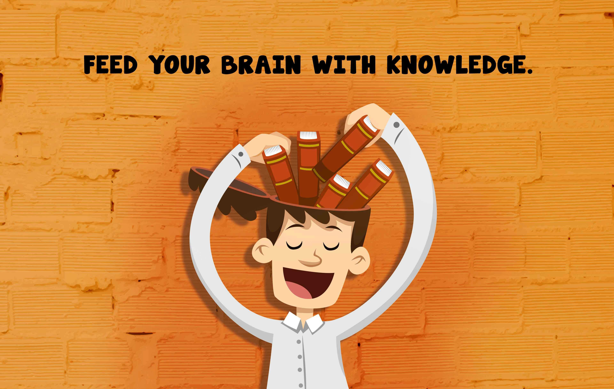

# 🤖 Oracle Cloud Infrastructure Generative AI Professional  

## Study Notes & Summaries  

_A comprehensive guide based on the official Oracle Generative AI Professional Course._  

> 📌 _This is a summary of Oracle University lessons. No personal analysis or opinion is included._

> ⚙️ **Note:**  
> As part of this course, I will implement the Generative AI applications separately using **Databricks Community Edition**, rather than using **Jupyter Notebooks** as shown in the course. All my practical implementations will be stored under the `/GenAI_Projects` folder.

---

## 🏅 Certification

**Oracle Cloud Infrastructure 2025 Generative AI Certified Professional**  
Certified on **[Insert Date After Passing]**  
*Issued by Oracle University*

---

## 📘 Course Overview

- **Platform:** Oracle Learning  
- **Goal:** Understand the architecture, training, inference, and deployment of LLMs, as well as how to use Oracle's Generative AI services (Inference API, Chat, Embeddings, Agents, and Vector DB).

---

## 🧭 Course Structure

### 1. Course Overview

- [x] Course Overview *(9 min)* – ✅ _No notes_

### 2. Fundamentals of Large Language Models

- [ ] Module Introduction *(2 min)* – ✅ _No notes_  
- [ ] Introduction to Large Language Models *(5 min)* – ✅ [See Summary](#introduction-to-large-language-models)  
- [ ] LLM Architectures *(8 min)* – ✅ [See Summary](#llm-architectures)  
- [ ] Prompting and Prompt Engineering *(14 min)* – ✅ [See Summary](#prompting-and-prompt-engineering)  
- [ ] Issues with Prompting *(4 min)* – ✅ [See Summary](#issues-with-prompting)  
- [ ] Training *(6 min)* – ✅ [See Summary](#training)  
- [ ] Decoding *(8 min)* – ✅ [See Summary](#decoding)  
- [ ] Hallucination *(5 min)* – ✅ [See Summary](#hallucination)  
- [ ] LLM Applications *(10 min)* – ✅ [See Summary](#llm-applications)  
- [ ] Skill Check: Fundamentals of Large Language Models – ✅ [See Summary](#skill-check-fundamentals-of-large-language-models)

### 3. OCI Generative AI Service

- [ ] Module Introduction *(1 min)* – ✅ _No notes_  
- [ ] OCI Generative AI *(8 min)* – ✅ [See Summary](#oci-generative-ai)  
- [ ] Demo: OCI Generative AI *(13 min)* – ✅ [See Summary](#demo-oci-generative-ai)  
- [ ] Chat Models *(10 min)* – ✅ [See Summary](#chat-models)  
- [ ] Demo Chat Models *(8 min)* – ✅ [See Summary](#demo-chat-models)  
- [ ] Demo Generative AI Inference API *(8 min)* – ✅ [See Summary](#demo-generative-ai-inference-api)  
- [ ] Demo Config setup for Generative AI Inference API *(6 min)* – ✅ [See Summary](#demo-config-setup-for-generative-ai-inference-api)  
- [ ] Embedding Models *(14 min)* – ✅ [See Summary](#embedding-models)  
- [ ] Demo: Embedding Models *(8 min)* – ✅ [See Summary](#demo-embedding-models)  
- [ ] Prompt Engineering *(12 min)* – ✅ [See Summary](#prompt-engineering)  
- [ ] Customize LLMs with your data *(10 min)* – ✅ [See Summary](#customize-llms-with-your-data)  
- [ ] Fine Tuning and Inference in OCI Generative AI *(12 min)* – ✅ [See Summary](#fine-tuning-and-inference-in-oci-generative-ai)  
- [ ] Dedicated AI Cluster Sizing and Pricing *(11 min)* – ✅ [See Summary](#dedicated-ai-cluster-sizing-and-pricing)  
- [ ] Demo: Dedicated AI Clusters *(7 min)* – ✅ [See Summary](#demo-dedicated-ai-clusters)  
- [ ] Fine-tuning configuration *(10 min)* – ✅ [See Summary](#fine-tuning-configuration)  
- [ ] Demo: Fine-tuning and Custom Models *(7 min)* – ✅ [See Summary](#demo-fine-tuning-and-custom-models)  
- [ ] Demo: Inference using Endpoint *(6 min)* – ✅ [See Summary](#demo-inference-using-endpoint)  
- [ ] OCI Generative AI Security *(5 min)* – ✅ [See Summary](#oci-generative-ai-security)  
- [ ] Skill Check: Generative AI Service – ✅ [See Summary](#skill-check-generative-ai-service)

### 4. RAG using Generative AI Service and Oracle 23ai Vector Search

- [ ] OCI Generative AI Integrations *(7 min)* – ✅ [See Summary](#oci-generative-ai-integrations)  
- [ ] Retrieval Augmented Generation *(4 min)* – ✅ [See Summary](#retrieval-augmented-generation)  
- [ ] Process Documents *(4 min)* – ✅ [See Summary](#process-documents)  
- [ ] Embed and Store Documents *(6 min)* – ✅ [See Summary](#embed-and-store-documents)  
- [ ] Retrieval and Generation *(5 min)* – ✅ [See Summary](#retrieval-and-generation)  
- [ ] Demo: LangChain Basics *(8 min)* – ✅ [See Summary](#demo-langchain-basics)  
- [ ] Conversational RAG *(2 min)* – ✅ [See Summary](#conversational-rag)  
- [ ] Demo: RAG with Oracle Database 23ai *(11 min)* – ✅ [See Summary](#demo-rag-with-oracle-database-23ai)  
- [ ] Skill Check: RAG Using Generative AI Service and Oracle 23ai Vector Search – ✅ [See Summary](#skill-check-rag-using-generative-ai-service-and-oracle-23ai-vector-search)

### 5. Chatbot using Generative AI Agent Service

- [ ] Oracle Generative AI Agent *(18 min)* – ✅ [See Summary](#oracle-generative-ai-agent)  
- [ ] Chatbot Demo using Object Store *(16 min)* – ✅ [See Summary](#chatbot-demo-using-object-store)  
- [ ] Chatbot Demo using Oracle 23ai *(17 min)* – ✅ [See Summary](#chatbot-demo-using-oracle-23ai)  
- [ ] Skill Check: Chatbot Using Generative AI Agent Service – ✅ [See Summary](#skill-check-chatbot-using-generative-ai-agent-service)

---

## 📂 Lesson Notes

---

### 1. Fundamentals of Large Language Models

#### Introduction to Large Language Models  
---

**Key Concepts:**

- **Language Model:**  
  A probabilistic model that predicts the likelihood of words in a sequence, based on a fixed vocabulary.

- **Vocabulary Distribution:**  
  Given a text prefix, the model assigns probabilities to all words in its vocabulary for the next word prediction.

- **Large Language Models (LLMs):**  
  Language models with many parameters. The term "large" is relative—no strict size threshold. Even smaller models like BERT can be called LLMs in some contexts.

- **LLM Capabilities:**  
  - Generate coherent text based on input sequences.  
  - Compute probability distributions over possible next words.  
  - Can be influenced by mechanisms such as prompting or training.

- **Main Mechanisms to Affect LLM Output:**  
  - **Prompting:** Influences output without changing model parameters.  
  - **Training:** Updates model parameters based on new data.

- **Decoding:**  
  The process of generating text from the model’s probability distributions, creating sentences, paragraphs, or documents.

#### 🛠️ Best Practices / Course Focus

- Understand how LLMs are architected internally.  
- Learn how to manipulate output distribution via prompting and training.  
- Master decoding techniques for generating text effectively.  
- Explore extensions of these ideas in research and industry.

#### ✅ Summary

- LLMs predict text by assigning probabilities over vocabulary words.  
- "Large" in LLM refers to the number of parameters, but is not strictly defined.  
- Output can be influenced by prompting (no model change) or training (model update).  
- Decoding transforms probability distributions into meaningful generated text.  
- Upcoming lessons will dive deeper into architecture, prompting, training, and decoding.

#### LLM Architectures  
---

**Key Concepts:**

- **Transformer:**  
  Core building block behind all modern LLMs, introduced in the 2017 paper *Attention Is All You Need*.  
  Enables parallel processing and attention mechanisms.

- **Encoder:**  
  Converts input text into vector representations (embeddings).  
  - Used for understanding, classification, semantic search  
  - Models: BERT, RoBERTa  
  - Produces representations of words and entire sentences

- **Decoder:**  
  Generates text one token at a time, based on prior context.  
  - Used for text generation, dialogue, question answering  
  - Models: GPT-4, LLaMA, Cohere Command  
  - Output is generated iteratively (token by token)

- **Encoder-Decoder (Seq2Seq):**  
  Combines both encoder and decoder blocks.  
  - Used for tasks like translation  
  - Encoder embeds input; decoder generates output sequence

#### 🛠️ Best Practices

- Use **encoders** for embedding/search/classification tasks  
- Use **decoders** for fluent text generation  
- Use **encoder-decoders** for input-to-output sequence tasks like translation  
- Remember that **decoders generate one token at a time**, which makes generation expensive

#### ✅ Summary

- **Encoders → Embedding**  
- **Decoders → Text Generation**  
- **Encoder-Decoder → Sequence-to-Sequence Tasks**

- All built on the **transformer architecture**
- Model choice depends on task needs:
  - **Encoder:** understanding and representation  
  - **Decoder:** generation  
  - **Encoder-Decoder:** transformation

#### Prompting and Prompt Engineering  

---

#### Issues with Prompting  

---

#### Training  

---

#### Decoding  

---

#### Hallucination  

---

#### LLM Applications  

---

#### Skill Check: Fundamentals of Large Language Models  

---

### 2. OCI Generative AI Service

#### OCI Generative AI  

---

#### Demo: OCI Generative AI  

---

#### Chat Models  

---

#### Demo Chat Models  

---

#### Demo Generative AI Inference API  

---

#### Demo Config setup for Generative AI Inference API  

---

#### Embedding Models  

---

#### Demo: Embedding Models  

---

#### Prompt Engineering  

---

#### Customize LLMs with your data  

---

#### Fine Tuning and Inference in OCI Generative AI  

---

#### Dedicated AI Cluster Sizing and Pricing  

---

#### Demo: Dedicated AI Clusters  

---

#### Fine‑tuning configuration  

---

#### Demo: Fine‑tuning and Custom Models  

---

#### Demo: Inference using Endpoint  

---

#### OCI Generative AI Security  

---

#### Skill Check: Generative AI Service  

---

### 3. RAG using Generative AI Service and Oracle 23ai Vector Search

#### OCI Generative AI Integrations  

---

#### Retrieval Augmented Generation  

---

#### Process Documents  

---

#### Embed and Store Documents  

---

#### Retrieval and Generation  

---

#### Demo: LangChain Basics  

---

#### Conversational RAG  

---

#### Demo: RAG with Oracle Database 23ai  

---

#### Skill Check: RAG Using Generative AI Service and Oracle 23ai Vector Search  

---

### 4. Chatbot using Generative AI Agent Service

#### Oracle Generative AI Agent  

---

#### Chatbot Demo using Object Store  

---

#### Chatbot Demo using Oracle 23ai  

---

#### Skill Check: Chatbot Using Generative AI Agent Service  

---
